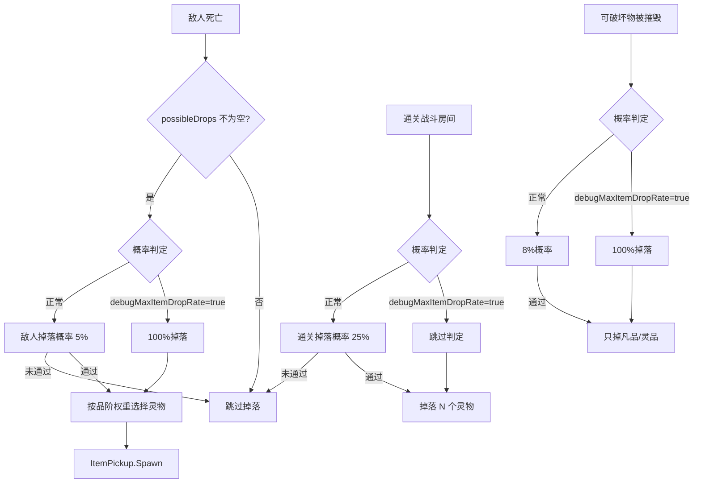
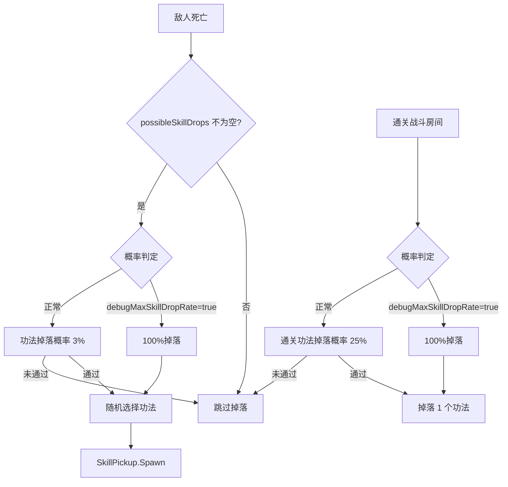

# 掉率系统梳理

> 最后更新：2026-04-17

---

## 一、掉率配置参数（GameConfig.cs）

### 灵物掉率

| 参数 | 默认值 | 说明 |
|------|--------|------|
| `敌人掉落概率` | 0.05 (5%) | 每只敌人死亡时掉落灵物的固定概率 |
| `通关掉落概率` | 0.25 (25%) | 通关战斗房间后额外掉落灵物的概率 |
| `通关额外掉落数` | 1 | 通过概率判定后掉落的灵物数量 |
| `可破坏物掉落概率` | 0.4 (40%) | 可破坏物被摧毁时掉落灵力碎片的概率 |

### 灵物品阶权重

| 品阶 | 权重 | 约占比 |
|------|------|--------|
| 凡品 | 50 | 50% |
| 灵品 | 30 | 30% |
| 玄品 | 15 | 15% |
| 地品 | 4 | 4% |
| 天品 | 1 | 1% |

> 层数越高，高品质比重越大（`RollRarity(floorLevel)` 会动态调整权重）

### 功法掉率

| 参数 | 默认值 | 说明 |
|------|--------|------|
| `功法掉落概率` | 0.03 (3%) | 每只敌人死亡时掉落功法的概率 |
| `通关功法掉落概率` | 0.25 (25%) | 通关战斗房间后额外掉落功法的概率 |

### Debug 开关

| 开关 | 说明 |
|------|------|
| `debugMaxItemDropRate` | 灵物爆率拉满（100%掉落） |
| `debugMaxSkillDropRate` | 功法爆率拉满（100%掉落） |
| `debugMaxDropRate` | 兼容旧接口，同时控制灵物和功法 |

---

## 二、掉落路径总览

### 灵物掉落路径



### 功法掉落路径



---

## 三、各敌人类型掉落能力

| 敌人类型 | 灵物掉落 | 功法掉落 | 掉落池来源 | 特殊规则 |
|----------|----------|----------|------------|----------|
| **EnemyBase**（普通小怪） | ✅ | ✅ | BattleRoom 传入 | 标准概率 |
| **EnemyRanged**（远程弓箭手） | ✅ | ✅ | BattleRoom 传入 | 标准概率 |
| **EnemyCharger**（冲锋型） | ✅ | ✅ | BattleRoom 传入 | 标准概率 |
| **EnemyMage**（AOE法师） | ✅ | ✅ | BattleRoom 传入 | 标准概率 |
| **EnemyElite**（精英怪） | ✅ (×2) | ✅ (25%) | BattleRoom 传入 | 必定掉2个灵物，25%掉功法 |
| **EnemyBoss**（Boss） | ✅ (×3) | ❌ | GameManager 传入 | 必定掉3个灵物 |
| **Destructible**（可破坏物） | ✅ (低品质) | ❌ | BattleRoom 传入 | 只掉凡品/灵品 |

---

## 四、数据传递链

```
Demo1Setup
  ├── itemPool (灵物数据)  ──→  GameManager.itemPool
  └── skillPool (功法数据) ──→  GameManager.skillPool
                                    │
                                    ▼
                              BattleRoom.Initialize(itemPool)
                              BattleRoom.SetSkillPool(skillPool)
                                    │
                    ┌───────────────┼───────────────┐
                    ▼               ▼               ▼
              EnemyBase.Spawn   EnemyRanged.Spawn  EnemyElite.Spawn
              (drops=itemPool)  (drops=itemPool)   (drops=itemPool,
              .SetSkillDrops()  .SetSkillDrops()    skills=skillPool)
                    │               │
                    ▼               ▼
              EnemyCharger.Spawn  EnemyMage.Spawn
              (drops=itemPool)    (drops=itemPool)
              .SetSkillDrops()    .SetSkillDrops()
```

---

## 五、技能拾取系统

### 拾取流程

1. 靠近功法拾取物 → 显示信息提示
2. **短按 F** → 拾取
   - 有空槽位 → 自动装备到第一个空位（Q → E → R）
   - 槽位满 → 弹出选择UI，按 **Q/E/R** 选择替换哪个槽位，按 **Esc** 取消
3. **长按 F（1.5秒）** → 分解获得灵力碎片

### CD 重置

装备新技能后会立即：
- 重置该槽位的充能层数为满
- 重置充能计时器为 0
- 发布 `SkillCooldownUpdate` 事件刷新 HUD 显示

---

## 六、Debug 控制台按钮

| 按钮 | 功能 |
|------|------|
| 💎 灵物爆率拉满 | 所有灵物掉落概率变为 100% |
| 📜 功法爆率拉满 | 所有功法掉落概率变为 100% |

> 两个按钮独立控制，互不影响

---

## 七、已修复问题清单

| # | 问题 | 根因 | 修复 |
|---|------|------|------|
| 1 | 灵物爆率拉满无效 | `Destructible.cs` 和 `BattleRoom.cs` 使用旧接口 `debugMaxDropRate` | 全部改为 `debugMaxItemDropRate` |
| 2 | 功法爆率拉满无效 | `BattleRoom.SpawnSkillReward` 使用旧接口 | 改为 `debugMaxSkillDropRate` |
| 3 | EnemyRanged/Charger/Mage 不掉功法 | 这三个类没有 `possibleSkillDrops` 字段和 `TryDropSkill` 方法 | 补全字段、方法，并在 `OnDeath` 中调用 |
| 4 | BattleRoom 没给 Ranged/Charger/Mage 传功法池 | `StartBattle` 中只给 EnemyBase 调了 `SetSkillDrops` | 所有敌人类型都调用 `SetSkillDrops` |
| 5 | 技能拾取只能替换R槽 | `TryPickup` 硬编码 `lastSlot = 2` | 改为弹出选择UI，玩家按 Q/E/R 选择 |
| 6 | 替换技能后CD显示卡住 | `EquipSkillQ/E/R` 没有发布 CD 更新事件 | 装备后立即调用 `PublishSkillChargeUpdate` |
| 7 | 商店 NullReferenceException | `_shopItems` 数组有 null 元素 | 加 null 检查和 `CalculatePrice` 兜底 |
