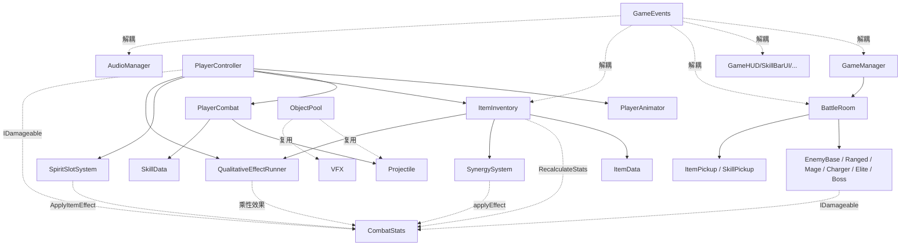

# 🏗️ 程序架构说明

> 本文档面向程序员和AI Agent，详细说明当前工程的代码架构、模块职责、核心接口和设计模式。
> 最后更新：2026-09-02

> ⚠️ **维护约定（务必遵守）**：本文档是程序架构的权威 readme。**任何改动游戏逻辑（新增/删除/重构类、接口、事件、数据流、模块职责、关卡/房间/存档/战斗流程等）后，必须同步更新本文档对应章节**（见 `.cursor/rules` 中「架构文档同步」规则）。不要让本文档再次滞后于代码。

> 📌 **ProjectR迁移基线（2026-09-02）**：
> - ProjectR已全面取代旧产品方向；当前代码仍是旧Demo运行基线，处于“新模块旁路＋Legacy适配”的双轨迁移期。
> - 程序模块、依赖方向、P0～P5拆分和G1～G7删除闸门以 [`docs/game/architecture/程序模块规划.md`](../../../../docs/game/architecture/程序模块规划.md) 为权威。
> - 跨文件改动必须执行 [`docs/game/architecture/变更影响检查.md`](../../../../docs/game/architecture/变更影响检查.md) 的改前／改后代码图检查，并补充Unity引用与Play Mode验证。
> - `Modules/`、Q/E/R模块链和无暮王城双阶段专用流程归入 `M-LEGACY`；仅允许修复与适配，G1～G6通过前不得删除，亦不得新增产品内容。
> - 当前技能系统仍运行 **模块化技能**（Trigger/Effect/Modifier/Universal）；它是Legacy实现现状，不再是ProjectR玩家可见目标系统。
> - **ProjectR P0底座已落地**：新增载体契约、Legacy模块增强适配、`CircuitEvent`因果载荷和8项Editor契约测试；三个运行时开关在P0阶段均关闭，未改动当时的战斗与关卡行为。
> - **ProjectR P1.1术法入口已落地**：`PlayerCombat`三个技能调用点统一经 `ExecuteSkill`路由；关闭载体运行时时保持旧路径，启用时由 `SkillCarrierAction`映射Q／E／R。
> - **ProjectR P1.2充能状态已拆分**：`SkillChargeRuntime`接管Q／E／R当前充能、上限、逐格恢复、冷却缩减和额外充能；`PlayerCombat`保留公开查询和HUD事件兼容门面。
> - **ProjectR P1.3蓄力状态已拆分**：`SkillChargeInputRuntime`接管蓄力槽位、计时、等级阈值和释放快照；移动减速、动画、事件发布及技能执行仍由兼容门面处理。
> - **ProjectR P1.4术法执行编排已拆分**：`SkillEffectExecutor`接管类型分发、蓄力倍率和动画门控编排；`PlayerCombat`通过 `ISkillEffectHost`提供具体Unity副作用，关闭载体开关时仍走Legacy分发体。
> - **ProjectR P1.5立即生效术法已拆分**：`ImmediateSkillEffectRuntime`接管Buff、保命、乾坤倒转和治疗规则；`PlayerCombat`只提供副作用宿主并保留Legacy回退。
> - **ProjectR P1.6场景术法已拆分**：`WorldSkillEffectRuntime`接管持续区域落点／随身判定、诱饵和召唤参数；`PlayerCombat`只提供场景副作用宿主并保留Legacy回退。
> - **ProjectR P1.7位移术法已拆分**：`DashSkillEffectRuntime`接管距离回退、目标点、无敌和路径伤害分支；`PlayerCombat`只提供物理副作用宿主并保留Legacy回退。
> - **ProjectR P1.8范围伤害术法已拆分**：`AreaSkillEffectRuntime`接管落点、半径、伤害来源、首个命中、冻结、槽位修饰和增强追加分支；`PlayerCombat`只提供战斗副作用宿主并保留Legacy回退。
> - **ProjectR P1.9投射物术法已拆分**：`ProjectileSkillEffectRuntime`接管目标覆盖、数量、散射、环绕、墙形排布和增强分支；至此全部术法类型规则均已迁出，具体Unity副作用仍在兼容宿主。
> - **ProjectR P1.10蓄力副作用已拆分**：`SkillChargeEffectCoordinator`接管移速快照／恢复、开始／结束事件和取消顺序；术法状态、规则与副作用协调已完成当前阶段拆分。
> - **ProjectR P1.11普攻入口已拆分**：`MeleeAttackRuntime`接管输入门控、命中窗口、单段判定锁和第三段回馈；具体物理、伤害、动画与VFX仍在兼容宿主。
> - **ProjectR P1.12普攻效果已拆分**：`BasicAttackEffectRuntime`接管近战扇形、连段伤害、转治疗和远程普攻投射参数；`PlayerCombat`只提供碰撞、生命、扣血、事件和实例副作用。
> - **ProjectR P1.13身法命令已拆分**：`EvadeCommandRuntime`接管闪避输入优先、方向回退、动画门控、位移状态和逐格充能；`PlayerController`只提供输入采样、移动、事件和无敌副作用。
> - **ProjectR P1.14三类载体入口已统一**：`WeaponCarrierAction / SkillCarrierAction / MobilityCarrierAction`分别承接普攻、Q／E／R和闪避输入；开关关闭时仍走Legacy路径。
> - **ProjectR P1.15载体已默认接管**：`GameConfig.asset`显式启用载体运行时，武器／术法／身法正常启动即走统一入口，G1通过；回路与生态开关继续关闭。
> - **ProjectR P2.1器灵领域底座已建立**：稳定配置ID、器灵GUID／性格／关系／悟法状态、三种附着布局和回路稳定来源身份已落地；执行回路、存档和UI尚未接线。
> - **ProjectR P2.2可执行回路已建立**：`CircuitRuntime`可调度源／应／化事件，并强制执行深度、同规则／同种类重复、频率和单帧预算；正式规则与战斗接线尚未开始。
> - **ProjectR P2.3三灵编队已建立**：`SpiritLoadoutRuntime`管理最多三只出战器灵与脱战迁灵；附着变化不拥有或清空器灵成长状态，战斗状态和UI尚未接线。
> - **ProjectR P2.4诊断底座已建立**：`CircuitAttributionRecorder`按具体事件分支记录战斗结果来源，`CircuitShadowRecorder`对比Legacy与新回路指标；两者当前均不参与结算。
> - **ProjectR P2.5声明式规则已建立**：规则由事件种类、标签／元素条件和输出数据组成，绑定具体器灵GUID与载体；三只测试器灵闭环已验证且受防爆限制。
> - **ProjectR P2.6回路预览模型已建立**：规则描述快照和 `CircuitPreviewGraphBuilder`输出必然／条件连线、输入／输出断点与闭环；玩家UI尚未制作。
> - **ProjectR P2.7结构化结果旁路已建立**：`StructuredCombatResult`保留请求／实际结算值和可选回路起源，`CircuitCombatResultBridge`写入归因与Shadow但不参与结算。
> - **ProjectR P2.8 Legacy伤害旁路已接线**：`EnemyBase`在玩家伤害实际结算后写入 `RunCombatStats`结构化结果；旧累计接口保留，新局会清空全部诊断状态。
> - **ProjectR P2.9 Legacy生存旁路已接线**：技能／链式／转化／灵泉／保命治疗，以及玩家实际承伤与减伤均按请求／实际值进入结构化结果；生命与防御计算保持原路径。
> - **ProjectR P2.10 Legacy全目标与资源旁路已接线**：全部现有敌人、可破坏物、局内碎片与本局经验已统一进入结构化结果；跨局经济与冷却次数不计为战斗资源。
> - **ProjectR P2.11首批三宠规则已建立**：火花狸、响响鸮、弹弹胶已用稳定ID形成“3次命中→火花→回声→弹射→返还1热度”的受控联动；真实战斗接线前回路开关保持关闭。
> - **ProjectR P2.12真实命中入口已接线**：Legacy实际扣血结果与普攻／主动技能命中在同帧配对后推进首批三宠热度；默认开关关闭，实际回声／弹射伤害尚未生成。
> - **ProjectR P2.13实际弹射结算已接线**：独立回路投射物完成回声与一次额外弹射，按实际命中返还热度并分别记录来源与Shadow；临时三宠尚未替换为真实出战编队。
> - **ProjectR P2.14真实出战编队已接线**：首批三宠从schema v5契匣和出战GUID恢复原实例，缺少完整组合时不创建运行时；新档不会被自动补宠。
> - **ProjectR P2.15单宠三载体原型已接线**：唯一出战火花狸可在武器、Q术法和身法间脱战换挂，分别以连续命中、Q命中和闪避结束启动火花；基础灵息弹和HUD挂件反馈已接通。
> - **ProjectR P2.16三宠单宠路径已接线**：单宠宿主已泛化到响响鸮的延迟复响和弹弹胶的第二目标弹射／身法脉冲；三宠共享真实命中门控、脱战换挂和结构化诊断。
> - **ProjectR P2.17 HUD附着交互已接线**：点击灵宠挂件后可高亮并选择LMB／Q／SPACE，悬停显示当前显化；选择期间屏蔽战斗输入，战斗中拒绝换挂。
> - **ProjectR P3.1永久器灵存档契约已建立**：schema v5保存永久器灵DTO、契匣和出战GUID；转换层排除临时悟法与局内附着，撤离提交尚未接线。
> - **ProjectR P3.2新手初契合同已建立**：schema v6保存新手关卡三选一结果；显式选择才创建1个永久实例并设为出战，重复选择和非空契匣不会被覆盖。
> - **ProjectR P3.3序章恢复合同已建立**：schema v7保存四态序章检查点、首次附着恢复值和灵息弹授予状态；推进幂等且不可跳步，验证战编排尚未接线。
> - **ProjectR P3.4初契选择UI已建立**：三只场景实体通过稳定种族ID注册，悬停显示少量信息，点击后二次确认才提交永久选择。
> - **ProjectR P3.5新手白盒已建立**：`StarterPrologueWhitebox.prefab`串联四段空间，独立 `StarterPrologue`场景接入出生、初契触发与首次附着门；编辑器启动按钮和Build Settings均以该场景为首入口。
> - **ProjectR P3.6新手验证战已建立**：首次附着后生成2近战＋1远程低威胁目标，失败按检查点恢复训练场，胜利写入Completed并开放洞府门。
> - **ProjectR P3.7首批UI美术已接入**：ProjectR专用UI目录保存生成原图和单图标，`ProjectRUITheme`集中向战斗HUD与初契界面提供三宠、五载体和生命图标。
> - **ProjectR P3.8生成式HUD已重做**：HUD框体与扁平图标均由确认原画方向重新生成并切成透明Sprite；生命条、圆形载体槽、键位签、附着挂件与左上出战灵宠列已接入。
> - **ProjectR P3.9首次附着引导已接通**：初契确认或StarterChosen存档恢复后，HUD自动进入不可跳过的LMB／Q／SPACE选择，完成检查点后恢复普通换挂。
> - **ProjectR P3.10两阶段训练已接通**：验证战先生成3个无攻击机制靶，再转入2近战＋1远程；两阶段共用失败检查点恢复与最终完成提交。
> - **关卡层级语义已废弃**：ProjectR不采用线性“层”。`_currentLevel`、`RealmBreakthrough`和相关配表字段暂按Legacy区域序列解释，玩家界面只显示区域与探索进度。
> - 目标主数据流为 `Input → Carrier → Circuit → Combat`、`DungeonTopology → EcologySnapshot → Encounter`、`RunState → ExtractionPayload → PersistentSave`。
> - 关卡默认 Provider 已切为 **Edgar PRO Grid3D 实体地牢桥接原型**；跨局进度使用 **3 个独立 JSON 槽位 + schema v7 永久灵宠／初契序章／技能／模块与关卡阶段状态**。局内 Build 不持久化，大秘境（Rift）与 Build 背包已删除。
> - **V0.4.2 关卡层解耦**：新增 `Core/Level/` 领域层（`RoomType` / `IMapProvider` / `IRoomFactory`），详见 §十。
> - **V0.4.6 UI 方案统一 & 技术栈定调**：全项目 UI 从「UITK + uGUI + IMGUI 三套混用」收敛到**单一 uGUI + TMP**（`UI/UGuiKit.cs` 统一构建库 + 中文动态 TMP 字体）。**后续 UI 方案锁定为 uGUI 全家桶：uGUI + TextMeshPro + DOTween（动效）+ 自定义 Shader（视觉）**；不再新增 UITK / IMGUI 面板。详见 §4.6。
> - **V0.4.1（关卡 A）Edgar PRO Grid3D**：默认 Provider 为 `EdgarMapProvider`，`EdgarDungeonRuntime` 从四套策划 Flow 中按 Seed 选图，经边伸缩与四选三建筑合成后一次生成 13～14 个白膜主体房及走廊；支持随机双向出生、对侧单 Boss、步行进房、门锁、清场解锁与回访状态。详见 §10.4。
> - **V0.4.1 §11.4.8 进度收敛**：`SaveDataV1` schema v3 保存永久技能/模块解锁与累计游玩时间；技能/模块首次实际获取立即幂等登记并写当前槽。回基地/新局清空 Q/E/R、局内模块背包与增强链；`BuildSnapshot`、Build 背包和 `Scripts/Rift/` 已物理删除。旧 v2 Build/遗产数据仅迁移为发现记录。
> - **V0.4.4 去修仙化清理**：物理删除「职业/起始模板选择」（`StartTemplate`/`StartTemplateSelectUI`/`CharacterSelectUITK` + `StartTemplates/` + `法修` 档案），只保留单一主角档案（`PlayerCharacterProfile`/`PlayerCharacterRegistry` + `剑修`）；删除「化身」孤儿 UI（`AvatarSelect`/`GrowthUITK`）与 `avatarCoefficient` 战斗乘区（`StatType.LegacyCoeff` 墓碑保序）；删除「局内灵物」资产（`Data/Items`、`Resources/Items`、`Item_InRun_Config`、`BattleRewardUI` UI）与配表逻辑。`Items/` 仅保留 `ItemRarity`/`ItemCategory` 共享枚举 + 洞府素材（CaveMaterial）管线。

---

## 一、命名空间与项目结构

所有游戏代码统一在 `XianTu` 命名空间下：

```csharp
namespace XianTu { ... }
```

### ProjectR逻辑模块

- `M-INPUT`：输入协调。
- `M-CARRIER`：武器、术法、身法载体执行。
- `M-SPIRIT`：器灵实例、关系、悟法与附着。
- `M-CIRCUIT`：源／应／化事件、因果链与预算。
- `M-COMBAT`：伤害、状态、投射物与召唤结算。
- `M-DUNGEON`：Edgar空间、拓扑、房间和NavMesh。
- `M-ECOLOGY`：区域状态、邻接传播、躁动与迁移。
- `M-ENCOUNTER`：敌人、事件、结契与灾相。
- `M-SAVE`：本局态、撤离载荷、永久档和迁移。
- `M-UI`：HUD、回路预览、邻接情报和战后分析。
- `M-CORE`：生命周期、配置、对象池和组合根。
- `M-LEGACY`：旧模块链、旧UI和无暮王城专用流程。

目录结构会按P0～P5渐进形成，当前目录清单只描述Legacy代码现状。新代码不得继续把器灵、生态、结算实现塞入 `PlayerCombat`、`EdgarMapProvider`或 `GameManager`。

### ProjectR领域与载体契约

- `Core/StableConfigId.cs`：跨运行时和存档使用的大小写敏感稳定配置身份值对象。
- `Core/SpiritSaveContracts.cs`：永久器灵、关系与悟法JsonUtility DTO，以及排除临时悟法／局内附着的领域态转换和容错恢复。
- `Combat/Carriers/CarrierContracts.cs`：`CarrierSlot`、`CarrierContext`、`CarrierResult`、`ICarrierAction`。
- `Combat/Carriers/CombatEnhancementSnapshot.cs`：载体只读增强快照与 `ICombatEnhancementProvider`。
- `Combat/Carriers/SkillCarrierAction.cs`：Q／E／R术法统一入口；委托 `PlayerCombat.UseSkill`门面，由载体开关选择Legacy或P1.4效果执行器。
- `Combat/Carriers/SkillChargeRuntime.cs`：纯C#三槽充能状态机，不依赖Unity对象、UI或Legacy模块。
- `Combat/Carriers/SkillChargeInputRuntime.cs`：纯C#蓄力输入状态机及释放快照。
- `Combat/Carriers/SkillEffectExecutor.cs`：术法分发与倍率编排器，以及隔离具体Unity副作用的宿主接口。
- `Combat/Carriers/ImmediateSkillEffectRuntime.cs`：Buff与治疗规则执行体，以及组件、事件和VFX副作用宿主接口。
- `Combat/Carriers/WorldSkillEffectRuntime.cs`：持续区域与召唤规则执行体，以及场景查询、实例和增强副作用宿主接口。
- `Combat/Carriers/DashSkillEffectRuntime.cs`：位移术法规则执行体，以及物理查询、移动、路径伤害和VFX副作用宿主接口。
- `Combat/Carriers/AreaSkillEffectRuntime.cs`：范围伤害规则执行体、目标快照，以及物理、伤害、元素和增强副作用宿主接口。
- `Combat/Carriers/ProjectileSkillEffectRuntime.cs`：投射物目标、数量与排布规则执行体，以及目标查询、实例和Projectile组件副作用宿主接口。
- `Combat/Carriers/SkillChargeEffectCoordinator.cs`：蓄力会话的移动倍率、恢复、进度事件与取消顺序协调器。
- `Combat/Carriers/MeleeAttackRuntime.cs`：普攻输入和命中时机执行器、命中结果快照及近战副作用宿主接口。
- `Combat/Carriers/BasicAttackEffectRuntime.cs`：近战／远程普攻规则执行体、目标快照及伤害、生命、VFX和投射物副作用宿主接口。
- `Combat/Carriers/EvadeCommandRuntime.cs`：闪避输入、方向、位移与充能执行体，以及动画、事件和无敌副作用宿主接口。
- `Combat/Carriers/DirectCarrierActions.cs`：武器与身法槽位的统一 `ICarrierAction`入口适配；实际规则分别委托普攻和闪避运行时。
- `Combat/Spirit/SpiritDomain.cs`：器灵稳定身份、性格、羁绊、关键关系、载体适应和永久／临时悟法状态。
- `Combat/Spirit/SpiritAttachmentLayout.cs`：最多三只器灵的附着、迁灵和 `1＋1＋1 / 2＋1 / 3＋0`布局识别。
- `Combat/Spirit/SpiritLoadoutRuntime.cs`：三灵出战编队、身份／容量校验、脱战迁灵／移出门控及成长状态保留边界。
- `Combat/Circuit/CircuitRuntime.cs`：源／应／化规则调度、事件记录出口、执行报告及深度／重复／频率／单帧预算保护。
- `Combat/Circuit/FirstSpiritCircuitRuntime.cs`：首批三宠稳定内容ID、热度状态、三段声明式规则、玩家输入续环、预览图和可归因终点事件。
- `Combat/Circuit/FirstSpiritCircuitController.cs`：配对结构化实际扣血与载体命中事件，按开关创建首批三宠场景运行宿主。
- `Combat/Circuit/FirstSpiritCircuitLoadoutProvider.cs`：从永久契匣和出战GUID恢复首批三宠原实例，并建立内容定义的默认局内附着。
- `Combat/Circuit/FirstSpiritBounceProjectile.cs`：不进入Legacy载体命中链的轻量追踪弹射物，依次解析回声目标和一个不同的弹射目标。
- `Combat/Circuit/StarterSpiritCarrierRuntime.cs`：首批三宠单宠在武器／Q术法／身法上的统一启动规则、脱战换挂结果及唯一出战恢复合同。
- `Combat/Circuit/StarterSpiritCarrierController.cs`：配对真实命中，按种族生成火花、复响或弹射结算，授予基础灵息弹，并提供Demo1数字键换挂入口。
- `Combat/Spirit/StarterSpiritChoice.cs`：新手关卡首批三宠一次性选择、永久实例创建与唯一出战写入合同；不拥有UI和关卡流程。
- `Combat/Spirit/StarterPrologueProgression.cs`：初契序章四态幂等检查点、首次附着恢复和验证战完成合同；不拥有场景流程。
- `Combat/Spirit/StarterPrologueTrainingRuntime.cs`：固定三目标验证战的纯状态合同，只接受不同目标并在最后一个有效击败后完成。
- `Combat/Spirit/StarterSpiritChoicePresentation.cs`：三宠对外名字、性格短句、战斗倾向及“浏览→确认→提交”纯状态合同。
- `UI/StarterSpiritChoiceWorldEntity.cs`：正式灵宠场景Prefab的种族身份、点击／悬停事件与聚焦反馈适配器。
- `UI/StarterSpiritChoiceUI.cs`：初契三实体选择、二次确认、永久提交及输入屏蔽界面；只由序章场景显式开启。
- `UI/ProjectRUITheme.cs`：集中提供三宠头像、五载体和状态图标；运行时引用资产位于 `Resources/UI/ProjectR/ProjectRUITheme.asset`，源图位于 `ArtRes/UI/ProjectR/`。
- `UI/ActiveSpiritStatusHUD.cs`：从schema v7出战GUID读取最多3只灵宠，在左上角生成紧凑头像状态列。
- `Core/StarterPrologueSceneBootstrap.cs`：新手独立场景最小装配，只创建玩家、HUD与基础公共系统，不启动Demo1地牢。
- `Core/StarterPrologueMarker.cs`：白盒Prefab的玩家出生、庭院、小坛、训练场和洞府门稳定标记。
- `Core/StarterPrologueChoiceTrigger.cs`：小坛范围触发初契UI，并在选择后恢复单宠载体宿主。
- `Core/StarterPrologueAttachmentGate.cs`：首次附着检查点完成前保持训练场入口碰撞。
- `Core/StarterPrologueEnemySpawnMarker.cs`：白盒中的近战／远程稳定出生角色标记。
- `Core/StarterPrologueTrainingEncounter.cs`：3机制靶→2近战＋1远程的两阶段生成、归属击杀计数、失败场景恢复及胜利存档编排。
- `Core/StarterPrologueTrainingDummy.cs`：无攻击／无掉落的机制展示靶，保留IDamageable、结构化伤害和灵宠显化入口。
- `Core/StarterPrologueCompletionGate.cs`：序章Completed检查点完成后关闭洞府门碰撞实体。
- `Prefabs/Tutorial/StarterPrologueWhitebox.prefab`：四段连续空间、三宠占位实体、训练目标位及流程交互的唯一白盒源。
- `Scenes/StarterPrologue.unity`：实例化白盒Prefab并提供相机、灯光、Runtime根节点的独立新手场景。
- `Resources/Skills/StarterSpiritBolt.asset`：新手基础Q术法“灵息弹”，作为可被灵宠附着且可被后续术法替换的简单投射物。
- `Combat/Circuit/CircuitDiagnostics.cs`：因果链轨迹、伤害／治疗／防御／资源来源聚合，以及Legacy／新回路Shadow容差对照。
- `Combat/Circuit/DeclarativeCircuitRule.cs`：不可执行任意代码的规则定义、标签／元素匹配，以及器灵实例／载体稳定来源绑定。
- `Combat/Circuit/CircuitPreviewGraph.cs`：规则只读描述、静态连接兼容性、断点和闭环分析，作为回路预览UI的数据源。
- `Combat/Circuit/CircuitCombatResultBridge.cs`：Legacy／回路结构化战斗结果，以及按实际结算值写入来源归因、Shadow和只读Sink的旁路桥。
- `Combat/RunCombatStats.cs`：本局累计伤害及伤害、治疗、承伤、防御、资源的结构化Legacy结果缓存；兼容单参数累计接口，并提供全指标Shadow比较。
- `Combat/LegacyCombatResultRecorder.cs`：Unity侧Legacy结算适配器，统一识别玩家攻击者并生成敌人、可破坏物和玩家稳定目标引用。
- `Combat/Circuit/CircuitEvent.cs`：来源、器灵GUID、载体、标签、因果链和深度。
- `Combat/Legacy/LegacyModuleChainAdapter.cs`：将现有 `ChainConfig` 映射为载体增强快照；当前没有运行时消费者。
- `Core/FeatureFlags.cs`：`EnableCarrierRuntime`默认开启并可回退；`EnableCircuitRuntime / EnableEcologyRuntime`默认关闭，生态开关在关卡冻结期间禁止接线。
- `Editor/ProjectR/Tests/ProjectRP0ContractTests.cs`：125项载体、灵宠、回路、首批三宠、单宠三载体、UI主题资源、附着UI映射、首次强制附着、初契展示／确认、序章恢复、白盒Prefab／Scene依赖、验证战状态、真实编队／命中／弹射、来源诊断、结构化结果、Legacy结算旁路及存档测试，可从「ProjectR/开发工具/运行载体与回路契约测试」执行。

### 模块目录结构

```
Assets/1Game/Scripts/
├── Combat/          # 战斗核心（数据结构 + 接口 + 效果）
├── Core/            # 基础架构（管理器 + 配置 + 工具）
│   └── Level/       # V0.4.2 关卡领域层（RoomType / IMapProvider / IRoomFactory）
├── Editor/          # 编辑器扩展（仅Editor环境）
├── Enemy/           # 敌人AI（状态机 + 行为）
├── Items/           # 拾取基础设施 + ItemRarity/ItemCategory 共享枚举 + 洞府素材（局内灵物已于 V0.4.4 删除）
├── LevelDesign/     # 第12章关卡设计（TreeMap 生成 + 配表 + 事件 + Boss 形态 + 导航UI）
├── Modules/         # 模块化技能（Trigger/Effect/Modifier + 链 + 装配）
├── Player/          # 玩家系统（控制器 + 战斗 + 动画）
├── Room/            # 房间实现（战斗/商店/休息/宝箱/事件/准备 + 几何生成）
└── UI/              # UI系统（HUD + 血条 + 面板 + 小地图，统一 uGUI+TMP，构建入口 UGuiKit）
```

---

## 二、核心设计模式

### 2.1 单例模式（MonoBehaviour Singleton）

以下类使用运行时单例，通过 `Instance` 静态属性访问：

| 类 | 文件 | 职责 |
|---|---|---|
| `GameManager` | `Core/GameManager.cs` | 游戏流程管理（层级推进、房间切换） |
| `PlayerController` | `Player/PlayerController.cs` | 玩家移动、闪避、受伤、属性持有 |
| `PlayerResources` | `Core/PlayerResources.cs` | 灵力碎片等资源管理 |
| `ObjectPool` | `Core/ObjectPool.cs` | 通用对象池（特效/投射物复用） |
| `DebugConsole` | `Core/DebugConsole.cs` | Tab 运行时 Debug 控制台：战斗参数、节点直达、事件流程提示及本阶段路线事件直结。 |
| `AudioManager` | `Core/AudioManager.cs` | 全局音效管理（SFX对象池+BGM） |
| `LevelTransition` | `Room/LevelTransition.cs` | 层间传送门过渡动画 |

### 2.2 ScriptableObject 配置模式

以下类使用 `Resources.Load` 懒加载单例：

| 类 | 文件 | 资产路径 |
|---|---|---|
| `GameConfig` | `Core/GameConfig.cs` | `Resources/GameConfig.asset` |
| `AudioConfig` | `Core/AudioConfig.cs` | `Resources/AudioConfig.asset` |
| `MonsterPrefabs` | `Core/MonsterPrefabs.cs` | `Resources/MonsterPrefabs.asset` |

```csharp
// 访问方式
var config = GameConfig.Instance; // 自动 Resources.Load
```

### 2.3 发布/订阅事件系统

`GameEvents` 是一个轻量级的全局事件总线，用于模块间解耦通信：

```csharp
// 订阅
GameEvents.Subscribe<GameEvents.EnemyKilled>(OnEnemyKilled);

// 发布
GameEvents.Publish(new GameEvents.EnemyKilled { Enemy = go, Position = pos });

// 取消订阅（OnDestroy中必须调用）
GameEvents.Unsubscribe<GameEvents.EnemyKilled>(OnEnemyKilled);
```

**重要规则**：
- 所有事件类型定义为 `struct`（值类型，零GC）
- 订阅者必须在 `OnDestroy()` 中取消订阅，否则会导致空引用
- `GameEvents.Clear()` 在场景切换时调用，清空所有订阅

---

## 三、核心接口

### 3.1 IDamageable — 可受伤害接口

```csharp
public interface IDamageable
{
    CombatStats Stats { get; }
    void OnDamage(float damage, Vector3 hitPoint, GameObject attacker);
    void OnDeath();
}
```

**实现者**：
| 类 | 说明 |
|---|---|
| `EnemyBase` | 基础近战敌人 |
| `EnemyRanged` | 远程弓箭手 |
| `EnemyCharger` | 冲锋型敌人 |
| `EnemyMage` | AOE法师 |
| `EnemyBoss` | Boss |
| `EnemyElite` | 精英怪（带词缀） |
| `Destructible` | 可破坏物（木箱/石柱/灵石堆） |

### 3.2 CombatStats — 战斗属性数据

```csharp
[Serializable]
public class CombatStats
{
    float maxHp, currentHp;
    float attackDamage, attackSpeed;
    float critRate, critDamage;
    float damageReduction;
    float moveSpeed, dashCooldown;
    float projectileSpeed;
    int pierceCount;

    float CalculateDamage();          // 计算最终伤害（含暴击判定）
    float TakeDamage(float raw);      // 受伤（含减伤计算）
    void Heal(float amount);          // 治疗
    CombatStats Clone();              // 深拷贝
}
```

**共用者**：玩家（`PlayerController.Stats`）和所有敌人（`EnemyBase.Stats`）共用同一数据结构。

---

## 四、模块详解

### 4.1 Core — 基础架构

| 类 | 职责 | 关键方法 |
|---|---|---|
| `GameManager` | 游戏流程控制 | `StartNewRun()` `SpawnCurrentRoom()` `OnRoomCleared()` `Restart()` `DebugGotoRoom()` |
| `GameConfig` | 全局数值配置（SO） | `ApplyToPlayerStats()` `ApplyToEnemyStats()` `RollRarity(int floor)` `GetDropWeight()` |
| `GameEvents` | 事件总线（静态类） | `Subscribe<T>()` `Publish<T>()` `Unsubscribe<T>()` `Clear()` |
| `ObjectPool` | 对象池 | `Get(prefab, pos, rot)` `Return(obj)` `Return(obj, delay)` |
| `PlayerResources` | 资源管理 | `AddShards(int)` `SpendShards(int)` `SpiritShards` |
| `SaveSystem` / `SaveDataV1` | 3 槽进度持久化、schema 迁移、永久解锁 | `LoadSlot()` `Save()` `UnlockSkill()` `UnlockModule()` |
| `AudioManager` | 音效管理 | `PlaySFX()` `PlayBGM()` `StopBGM()` |
| `AudioConfig` | 音效配置（SO） | 所有AudioClip槽位引用 |
| `MaterialHelper` | 材质创建工具（静态类） | `CreateLit()` `CreateLitTransparent()` `CreateLitEmissive()` `CreateUnlit()` |
| `TopDownCamera` | 俯视角相机 | 平滑跟随玩家 |
| `Demo1Setup` | 场景编排器（瘦 Bootstrap） | 持有配置，按序调用三个类别 Builder |
| `SystemsBuilder` | Systems 类别构建 | 对象池 / GameManager / 顿帧 / 过渡 / EventSystem / 音效 |
| `GameplayBuilder` | Gameplay 类别构建 | 临时地面 / 玩家 |
| `HudBuilder` | UI 类别构建 | GameCanvas + GameHUD + 紧凑五载体槽 |
| `MonsterPrefabs` | 怪物模型配置（SO） | 5种敌人类型的Prefab引用 |

#### 4.1.1 存档与永久解锁数据流（当前schema v7）

```
技能/模块实际获取
  → SaveSystem.UnlockSkill / UnlockModule
  → 当前槽 unlockedSkillIds / unlockedModuleIds 幂等追加
  → 立即 Save 到 save_slot_{0-2}.json

旧 v2 存档加载
  → LegacyBuildSnapshot / LegacyChainSnapshot 墓碑结构反序列化
  → 技能名、模块 id 合并到永久解锁列表
  → 清空旧 Build/遗产字段
  → 补齐关卡A阶段、永久灵宠契匣、出战GUID与初契序章字段并写回 schema v7

永久器灵领域态
  → SpiritSaveMapper 仅提取身份、性格、羁绊、关系、永久悟法与载体适应
  → SaveDataV1.spiritRoster / activeSpiritInstanceGuids
  → 临时悟法与局内载体附着不进入 JSON

新手关卡初契
  → StarterSpiritChoice 显式接收火花狸／响响鸮／弹弹胶之一
  → 创建1个永久实例并写入契匣、唯一出战GUID与starterSpiritSpeciesId
  → StarterPrologueProgression 单调记录已初契／已附着／已完成
  → 正式授予灵息弹并保存首次附着恢复值
  → StarterPrologueTrainingEncounter 生成2近战＋1远程
  → 失败重载独立场景并恢复训练场；胜利存档并开放洞府门
```

- `SaveSlotSelectUI` 纵向显示 3 个槽位，读取、覆盖、删除为独立操作；覆盖和删除均二次确认。
- `NormalizeAndMigrate()` 会补齐旧 JSON 缺失的全部集合字段并将修复结果写回，避免旧槽位加载后因新增集合为 `null` 中断基地系统。
- `CodexUITK` 只展示当前槽已发现内容的详情，未发现项使用匿名占位。
- `GameManager.ClearPlayerLoadout()` 和 `InitModuleSystem()` 负责局外/新局运行态隔离；局内技能、模块背包、增强链不会写成可恢复 Build。
- `ModuleSlotManager.PublishUpdate()` 在链变化后刷新 `SkillBarUI`，保留装备/替换的即时反馈。

### 4.2 Player — 玩家系统

| 类 | 职责 | 关键方法 |
|---|---|---|
| `PlayerController` | 移动+闪避+受伤 | `OnDamage()` `Evade()` `Stats` `Inventory` `SpiritSlots` |
| `PlayerCombat` | 近战连招+技能释放 | `TryAttack()` `TryUseSkill(slot)` `EquipSkill()` `UnequipSkill()` |
| `PlayerAnimator` | 动画状态机 | 优先级系统：Idle < Attack < Skill < Hit < Evade |
| `AnimationEventRelay` | 动画事件中继 | 将Animator事件转发为GameEvents |

**玩家数据持有关系**：
```
PlayerController
├── Stats (CombatStats)          ← 战斗属性
├── Inventory (ItemInventory)    ← 灵物背包
└── SpiritSlots (SpiritSlotSystem) ← 灵物槽位

PlayerCombat
├── _equippedSkills[3] (SkillData) ← Q/E/R技能槽位
├── _skillCharges[3] (int)         ← 技能充能层数
└── _skillChargeCDs[3] (float)     ← 技能充能CD
```

### 4.3 Enemy — 敌人AI

所有敌人实现 `IDamageable`；各类型当前是独立组件，不存在统一的 `EnemyBase` 继承树：

| 类 | 出现层 | 行为特点 |
|---|---|---|
| `EnemyBase` | 第1层起 | 远距追击、近距观察/自由侧移、攻击名额、预警近战与攻击后撤 |
| `EnemyRanged` | 第2层起 | 远程投射物，40%概率后跳闪避 |
| `EnemyCharger` | 第3层起 | 蓄力冲锋，高伤害 |
| `EnemyMage` | 第4层起 | AOE范围魔法，35%概率瞬移 |
| `EnemyBoss` | 最后一层 | 多阶段行为；技能选择由条件配置驱动 |
| `EnemyElite` | 精英房 | 双词缀、攻击名额、受威胁触发的冷却/保底闪避 |

**AI 分层**：

- `DungeonNavMeshRuntime`：Edgar 根节点完成世界旋转、5 倍缩放、事件变体和永夜结果落位后，使用 AI Navigation `NavMeshSurface` 按子节点物理碰撞体构建运行时导航数据；Layout 事件提交后允许移除旧数据并重建，销毁本局地图时同步移除。运行时 `__CombatGate` 使用 carving `NavMeshObstacle` 阻断路径，不触发全图重建。
- `EnemyNavMotor`：运行时为敌人补 `NavMeshAgent`，关闭 Agent 的自动位置/旋转更新，只使用其路径和局部避障结果，实际移动继续交给 `CharacterController`。常规追击/后撤/战术侧移走导航；冲锋、跳跃、闪避、瞬移保留技能直移并在结束时同步 Agent。
- `EnemyCombatCoordinator`：静态轻量协调器，只按目标保存攻击令牌；固定环形站位因表现机械已移除。目标或敌人销毁后惰性清理。
- `EnemyAbilityProfile`：ScriptableObject 技能条件表，声明距离、生命、阶段、昼夜、附近友军、Flag、冷却、概率和使用次数，不包含具体表现代码。
- `EnemyAbilityPlanner`：固定间隔评估规则并选最高优先级能力，记录独立冷却和使用次数。
- `IEnemyAbilityExecutor`：由 `EnemyBoss / EnemyElite` 实现，把通用动作或 `CustomActionKey` 路由到实际技能状态。
- 默认资源位于 `Resources/EnemyAI/Boss_Default.asset` 与 `Elite_Default.asset`。Boss 默认规则包含白昼 P2 `day_crown_sweep` 与永夜 P2 `night_prison_chains`；精英默认规则包含仅在成功闪避后执行的 `elite_counter_lunge`。新增技能优先新增执行动作并配置 Rule，不应在 `Update()` 再复制一套距离 / 血量 / Flag 判断。

精英闪避由 `ComboStepChanged / SkillCastStarted` 和连续受击信号驱动；仅有效威胁参与 40% 判定，并以连续错过 2 次或 10 秒未闪作为保底。闪避路径使用角色胶囊检测和地面投射，中段才进入无敌窗；成功落地后储存一次“闪避反击”，由技能规划器在恢复结束、距离合适时触发预警突进。

普通近战、精英和 Boss 的移动采用距离带：远距离直接追击，进入约 `2.2 × 攻击距离` 后随机选择短暂停顿或带少量前压的自由侧移。该移动没有固定槽位和固定圆周目标，目的仅是打散“持续贴着玩家中心移动”的机械感。

`ConfigDashboard` 作为「ProjectR/配置/运行参数总控」，只展示可编辑且已接入运行时的参数，不再承担配置资产导航、快速上手或术法速查。怪物 AI 页直接修改 `GameConfig.asset`，运行时各敌人 `Start()` 读取对应类型的攻击间隔、预警和战术移动参数；Boss / 精英近战通过 `EnemyAbilityPlanner.SetCooldownOverride` 接收总控值，Boss 通用/昼夜最终技能与精英闪避反击冷却直接保存到对应 Profile。当前配置粒度为全局按怪物类型。

**敌人生命周期**：
```
Spawn → Initialize(hpMul, dmgMul, level, itemPool)
  → Update循环（追踪/攻击/状态机）
  → OnDamage() → 受击闪白+击退+硬直
  → OnDeath() → 死亡缩小动画 → TryDropItem() → Destroy
```

**掉落逻辑**（`EnemyBase.TryDropItem()`）：
1. 检查 `debugMaxDropRate`（debug爆率拉满时100%掉落）
2. 按 `GameConfig.敌人掉落概率`（默认5%）判定是否掉落
3. 调用 `GameConfig.RollRarity(floorLevel)` 按层数权重选择品阶
4. 从 `itemPool` 中筛选对应品阶的灵物，随机选一个
5. 额外3%概率掉落功法（`GameConfig.功法掉落概率`）

### 4.4 Items — 灵物系统

| 类 | 职责 |
|---|---|
| `ItemData` | 灵物数据定义（ScriptableObject）：品阶、分类、属性加成 |
| `SkillData` | 功法数据定义（ScriptableObject）：类型、伤害、CD、充能 |
| `ItemInventory` | 灵物背包管理：持有列表、属性加成计算、质变效果触发 |
| `ItemPickup` | 灵物拾取物：世界空间UI提示、F键拾取、长按分解 |
| `SkillPickup` | 功法拾取物：同上，装备到技能槽位 |
| `SpiritSlotSystem` | 灵物槽位系统：3个槽位，部分针对技能生效 |
| `SynergySystem` | 灵物组合系统：特定组合触发额外效果 |
| `QualitativeEffectRunner` | 质变效果执行器：监听事件，执行各灵物的专属效果 |
| `BillboardUI` | UI朝向组件：让WorldSpace UI部分朝向相机（可调lerpFactor） |

**灵物品阶**（`ItemRarity`）：凡品(Fan) → 灵品(Ling) → 玄品(Xuan) → 地品(Di) → 天品(Tian)

**灵物分类**（`ItemCategory`）：攻伐(Attack) / 护体(Defense) / 身法(Movement) / 异变(Anomaly) / 草药(Herb) / 功法(Skill)（注：丹药 Pill 已于 v0.6 移除，原丹药 SO 归入 Defense/Anomaly）

**质变系统**：同类灵物达到阈值触发质变效果
- 3个 = 小质变
- 5个 = 大质变

**Synergy组合**（10个）：
风火轮、金刚不坏、天人合一、嗜血狂魔、冰火两重天、灵龟护体、疾风骤雨、万毒归宗、铜墙铁壁、暗影刺客

### 4.5 Room — 房间与关卡

| 类 | 职责 |
|---|---|
| `RoomBuilder` | 动态生成房间几何体（地面/墙壁/障碍物/陷阱） |
| `RoomRuntimeController` | 房间 Dormant/Armed/Active/Completed 生命周期、内容快照与 LockPolicy |
| `RoomContentResolver` | 按 Role/District/深度/房间标签/固定 Seed 从 `关卡数据库.asset` 解析内容；只在标签最专用候选中抽取 |
| `CombatRoomContentHandler` | 将战斗/Boss 接到统一生命周期；普通小怪走区域自动组队，Boss走独立条件随机池 |
| `DungeonLevelAuthoringConfig` | 普通小怪池、三分区预算/数量/类别比例、Boss条件池的运行时真源 |
| `DungeonRoomAuthoring` | 房间有效范围、分区和标签的Prefab标记；Scene中显示绿色线框 |
| `DungeonEnemySpawnArea` | Box/Sphere/Capsule/Mesh怪物刷新范围、分类/容量/安全距离与表面采样 |
| `BattleRoom` | 五种刷怪方式、范围/离散点落位、敌人归属、通关判定、掉落奖励 |
| `ShopRoom` | 商店房间：散修商人NPC、灵物/功法展示、购买交互 |
| `RestRoom` | 休息房间：灵泉恢复50%生命 |
| `TreasureRoom` | 宝箱房间：开箱动画+品阶提升 |
| `Destructible` | 可破坏物：受伤→碎裂→掉落碎片 |
| `RoomExitTrigger` | 房间出口触发器：显示传送门提示 |
| `LevelTransition` | 层间过渡：旋转光柱+淡入淡出动画 |

**房间生成流程**：
```
GameManager.SpawnCurrentRoom()
  → RoomFactory 按 RoomType 创建 Handler
  → RoomContentResolver 固定 Seed 解析 RoomContent
  → RoomRuntimeController.Arm()
  → 玩家进入核心区 → Active + 按 LockPolicy 锁门
  → CombatRoomContentHandler 启动 Encounter
  → DungeonLevelAuthoringConfig 按区域预算自动组小怪 / 按Flag抽Boss
  → DungeonEnemySpawnArea 提供合法刷新点（旧Prefab回退EnemySpawn）
  → 清场 → Completed + 解锁；回访读取原状态，不重抽
  → TeleportPlayer()
```

当前关卡 A 每境由 Edgar 一次生成 12 个核心主体房与 1 个断桥后可选房，分为 Outer / Transition / Inner；每局随机选择一侧出生，只激活对侧单 Boss。
几何由 Edgar Prefab 提供；`RoomBuilder` 仅保留给非 Edgar 旧路径。

### 4.6 UI — 界面系统

> **UI 技术栈（V0.4.6 定调 · 权威约定）**：全项目统一 **uGUI 全家桶**——
> **uGUI（Canvas/RectTransform）+ TextMeshPro（所有文本，中文走动态 SDF 字体 `Resources/Fonts/NotoSansSC SDF`）+ DOTween（动效/缓动）+ 自定义 Shader（描边/发光/背景等视觉）**。
> - **不再新增 UITK（UI Toolkit / UIDocument / uxml / uss）或 IMGUI（`OnGUI`）面板**；运行期 `OnGUI` 已清零（仅 Editor 窗口保留 IMGUI）。
> - 统一构建入口 `UI/UGuiKit.cs`：Overlay Canvas / 遮罩 / 面板 / 文本 / 按钮 / 滑条 / 开关 / 滚动 / 卡片 / 网格 + 主题色常量；新面板一律走它，保证中文字体与视觉一致。
> - 历史类名仍带 `UITK` 后缀（如 `BuffBarUITK`/`CodexUITK`）为兼容命名，**实现已是 uGUI+TMP**。
> - 待清理（无消费者）：`Resources/UI/*.uxml/.uss`、`AvatarSelectPanelSettings.asset`、`ChineseFontHelper`、`UIBuiltins`。

| 类 | 职责 |
|---|---|
| `UGuiKit` | **uGUI+TMP 统一构建库**：Canvas/面板/文本/按钮/滑条/开关/滚动/卡片/网格 + 主题色 + 中文 TMP 字体注入 |
| `GameHUD` | 主HUD：血条（带延迟条）、技能CD、闪避充能、连招指示器、敌人计数、区域信息 |
| `EnemyHealthBar` | 敌人头顶血条：WorldSpace Canvas，受伤延迟条 |
| `DamagePopup` | 伤害飘字：世界坐标数字，暴击放大，支持特殊标签 |
| `SkillBarUI` | 技能栏UI：LMB/Q/E/R/SPACE五载体布局；Q/E/R支持拖拽、悬停和CD反馈 |
| `SpiritCircuitHUD` | 灵宠回路HUD：只读出战存档生成槽位挂件，显示热度／短亮线，并提供LMB／Q／SPACE脱战附着选择 |
| `BuffBarUITK` | 状态栏（uGUI+TMP，类名沿用旧后缀）：buff/debuff chip + 鼠标悬停 tooltip |
| `ExtractResultPanel` | 撤离成果面板（uGUI+TMP）：经验/历练/素材明细 + 层深倍率 |
| `RewardPickUI` | 战后 / 商店三选一（技能 或 模块）uGUI+TMP 面板（V0.4.1） |
| `Minimap` | 小地图：房间图标+玩家位置 |

### 4.7 Combat — 战斗核心

| 类 | 职责 |
|---|---|
| `CombatStats` | 战斗属性数据结构（共用于玩家和敌人） |
| `IDamageable` | 可受伤害接口 |
| `HitStop` | 受击顿帧系统（普通/重击/击杀三级） |
| `BurnEffect` | 灼烧DOT效果 |
| `Projectile` | 玩家投射物 |
| `SkillData` | 功法数据定义（ScriptableObject） |

---

## 五、事件列表

以下是 `GameEvents` 中定义的所有事件：

| 事件 | 触发时机 | 主要订阅者 |
|---|---|---|
| `EnemyKilled` | 敌人死亡 | GameManager（奖励碎片）、QualitativeEffectRunner |
| `PlayerDamaged` | 玩家受伤 | GameHUD |
| `PlayerDied` | 玩家死亡 | GameManager、GameHUD |
| `HealthChanged` | 生命值变化 | GameHUD |
| `ItemPickedUp` | 灵物被拾取 | InventoryUI、SynergySystem |
| `SkillEquipped` | 功法装备到槽位 | SkillBarUI |
| `SkillDecomposed` | 功法被分解 | — |
| `RealmBreakthrough` | 境界突破 | GameHUD |
| `RoomCleared` | 房间通关 | GameManager |
| `SkillCooldownUpdate` | 技能CD更新 | GameHUD、SkillBarUI |
| `DashChargeUpdate` | 闪避充能更新 | GameHUD |
| `DashCooldownUpdate` | 闪避CD更新（已废弃） | GameHUD（兼容） |
| `ComboStepChanged` | 连招段数变化 | GameHUD |
| `ComboWindowOpened` | 连招窗口打开 | PlayerController（解锁朝向） |
| `SlashVFXRequested` | 刀光特效请求 | PlayerCombat（VFX生成） |
| `HitVFXRequested` | 打击特效请求 | PlayerCombat（VFX生成） |
| `AttackLungeRequested` | 攻击前冲请求 | PlayerController（位移） |
| `BufferedEvadeRequested` | 缓冲闪避请求 | PlayerController |
| `DamageNumberRequested` | 伤害飘字请求 | DamagePopup |
| `EnemyCountChanged` | 敌人数量变化 | GameHUD |
| `SynergyActivated` | Synergy组合激活 | InventoryUI |
| `QualitativeTriggered` | 灵物质变触发 | InventoryUI |
| `ItemProgressChanged` | 灵物收集进度变化 | InventoryUI |
| `SpiritSlotChanged` | 灵物槽位变化 | SkillBarUI |
| `ResourceChanged` | 资源变化（碎片） | GameHUD |
| `GameWon` | 游戏通关 | GameHUD |

---

## 六、数据流

### 6.1 伤害流

```
玩家攻击 (PlayerCombat.PerformAttack)
  → 扇形范围检测 (Physics.OverlapSphere + 角度判定)
  → IDamageable.OnDamage(damage, hitPoint, attacker)
  → CombatStats.TakeDamage(rawDamage) → 减伤计算
  → 受击反馈（闪白/击退/硬直/顿帧）
  → DamageNumberRequested 事件 → DamagePopup 飘字
  → 若死亡 → OnDeath() → EnemyKilled 事件
```

### 6.2 灵物拾取流

```
敌人死亡 → TryDropItem()
  → 概率判定 (5%) → RollRarity(floorLevel)
  → 实例化 ItemPickup (世界空间)
  → 玩家靠近 → 显示提示UI (BillboardUI)
  → 按F → ItemInventory.AddItem()
  → ItemPickedUp 事件 → 属性重算 + UI更新
  → SynergySystem 检查组合
  → 质变阈值检查 → QualitativeTriggered 事件
```

### 6.3 房间推进流

```
GameManager.StartNewRun()
  → GenerateLevelLayout() (6层 × 2-3房间)
  → SpawnCurrentRoom()
    → BattleRoom.StartBattle() → 生成敌人
    → 玩家战斗 → 所有敌人死亡
    → RoomCleared 事件
    → OnRoomCleared()
      → 层内下一房间？→ SpawnCurrentRoom()
      → 层完成？→ 下一层 → LevelTransition 传送门
      → 全部完成？→ GameWon 事件
```

---

## 七、关键约定

### 7.1 Tag 使用

| Tag | 用途 |
|---|---|
| `Player` | 玩家GameObject |
| `Enemy` | 所有敌人（用于批量查找/清理） |

### 7.2 Layer 使用

在 Unity Project Settings 中维护；旧 `Demo1DataCreator` 自动配置入口已删除。

### 7.3 资源加载

- **ScriptableObject 配置**：`Resources.Load<T>("名称")` — 放在 `Resources/` 目录
- **场景搭建（2026-07-30 重构）**：Demo1 场景按类别拆分节点：
    - `Art`（**场景预置**，非运行时实例化）：`Main Camera`+`TopDownCamera`、`Directional Light`、`Global Volume`（引用 `Assets/RenderSetting/N_VolumeProfile.asset`），美术直接在 Inspector 调参。
    - `Systems` / `Gameplay` / `UI`：分别挂 `SystemsBuilder` / `GameplayBuilder` / `HudBuilder`，运行时生成的对象归到对应节点下；`Demo1Setup`（瘦 Bootstrap）按依赖顺序调度三者。
    - 旧的 `PostProcessSetup`（代码拼 Volume + 随层数变暗/受击暗角脉冲）已删除，后处理改走纯 Unity 默认 Volume+Profile。
- **高度雾（2026-08-13 移除）**：Windows Player 与 Editor 表现无法稳定对齐，`N_VolumeProfile.asset` 已移除 `Meryuhi/Full Screen Fog` Override，`N_RenderData.asset` 中对应 Renderer Feature 已删除。URPFog 嵌入包暂保留供共享资源兼容，游戏管线不再执行高度雾。
- **随机地图间接光（2026-08-14）**：`LevelAPhaseVisuals` 使用 `AmbientMode.Trilight` 分别配置白昼暖灰、永夜蓝绿三色环境光，并在阶段切换后调用 `DynamicGI.UpdateEnvironment()` 刷新 SH。该方案不依赖房间位置与旋转，适配 Edgar 运行时拼图；全局 Reflection Probe 暂未接入。
- **对象池**：特效和投射物通过 `ObjectPool.Get/Return` 管理

### 7.4 材质创建

使用 `MaterialHelper` 静态工具类，自动处理 URP/Standard/Legacy 的 Shader 兼容：

```csharp
var mat = MaterialHelper.CreateLit(Color.red);           // 不透明
var mat = MaterialHelper.CreateLitTransparent(color);     // 半透明
var mat = MaterialHelper.CreateLitEmissive(base, emit);   // 自发光
var mat = MaterialHelper.CreateUnlit(color);               // 无光照
```

### 7.5 命名规范

- **类名**：PascalCase（`PlayerCombat`、`EnemyBase`）
- **公有字段**：中文命名（`玩家最大生命值`）— 仅限 GameConfig 的 Inspector 字段
- **私有字段**：`_camelCase`（`_currentLevel`、`_gameOver`）
- **事件结构体**：PascalCase（`EnemyKilled`、`HealthChanged`）
- **方法**：PascalCase（`TryDropItem()`、`OnRoomCleared()`）

---

## 八、扩展指南

### 添加新敌人类型

1. 创建 `Enemy/EnemyXxx.cs`，继承 `EnemyBase` 或直接实现 `IDamageable`
2. 重写 `Update()` 实现AI行为
3. 重写 `OnDamage()` / `OnDeath()` 自定义反馈
4. 在 `DungeonLevelAuthoringConfig` 的普通小怪池登记类型、分类、成本和权重
5. 若是全新的代码行为类型，再在 `BattleRoom.SpawnEnemy()` 与 `MonsterPrefabs.cs` 添加实现/Prefab槽位

### 添加新灵物

旧灵物系统已归入 `M-LEGACY` 且功能开关关闭，不再新增旧 `ItemData` 内容。

### 添加新功法

P1迁移期间只维护已有 `SkillData` 兼容资产；新增战斗能力应进入载体与器灵契约，不再通过批量Demo数据生成器创建。

### 添加新事件

1. 在 `GameEvents.cs` 中定义新的 `struct`
2. 在发布方调用 `GameEvents.Publish(new YourEvent { ... })`
3. 在订阅方的 `Start/OnEnable` 中 `Subscribe`，`OnDestroy` 中 `Unsubscribe`

### 添加新房间类型（V0.4.2 起）

1. 创建 `Room/XxxRoom.cs`，参考 `RestRoom.cs` 的结构
2. 在 `Core/Level/RoomType.cs` 的 `RoomType` 枚举中添加新类型（**领域枚举，非 Minimap**）
3. 在 `Core/Level/RoomFactory.cs` 的 `Spawn()` switch 中添加分支（**不再改 GameManager**）
4. 如需进入 Edgar 关卡布局：在 `EdgarMapProvider.RebuildFloors()` 配置房型分配；实体内容注入后续由区域节点角色映射到 `RoomType`

---

## 九、架构速查（2026-06-03 由 `docs/game/tech/架构总览` 并入）

### 9.1 模块关系图



### 9.2 命名规范

| 类型 | 规范 | 示例 |
|------|------|------|
| 命名空间 | XianTu | `namespace XianTu` |
| 类名 | PascalCase | `PlayerController` |
| 公共方法 | PascalCase | `AddItem()` |
| 私有字段 | _camelCase | `_moveInput` |
| `[SerializeField]` | camelCase | `[SerializeField] private float moveSpeed` |
| 常量 | UPPER_SNAKE_CASE | `DASH_INVINCIBLE_TIME` |
| 事件结构体 | 嵌套在 `GameEvents` | `GameEvents.EnemyKilled` |
| SO 资产 | 中文名（策划友好） | `火灵珠.asset` |
| `GameConfig` 字段 | 中文名 | `近战攻击范围` |

### 9.3 层级 & 标签

| 名称 | 类型 | 用途 |
|------|------|------|
| Player | Tag | 玩家标识（碰撞检测） |
| Enemy | Tag + Layer | 敌人标识（扇形/AOE 检测；递归设子物体 layer） |
| Default | Layer | 地面、墙壁等环境 |

### 9.4 大文件警告（Demo1 期统计，供拆分参考）

| 文件 | 行数 | 建议 |
|------|------|------|
| `PlayerCombat.cs` | 1500+ | 拆技能实现 + Debug VFX |
| `QualitativeEffectRunner.cs` | 1000+ | 按机制类型拆（焚天/玉碎/御风/剑阵） |
| `PlayerAnimator.cs` | 700+ | 结构清晰，暂不拆 |

### 9.5 已知设计取舍（复查链接）

- 事件类型接近 20 种未分组 → [复查 P2-5](../../../../docs/reviews/2026-04-28-战斗系统阶段性复查.md)
- `IDamageable.OnDamage` 不携带 `isCrit`（下游表现不准）→ [复查 P0-2](../../../../docs/reviews/2026-04-28-战斗系统阶段性复查.md)
- 部分敌人投射物/VFX 走 `CreatePrimitive + new Material`，未走对象池 → [复查 P2-3](../../../../docs/reviews/2026-04-28-战斗系统阶段性复查.md)

### 9.6 v0.6.3 新增类速查

| 类 | 文件 | 职责 |
|---|---|---|
| `BattleRewardUI` | `UI/BattleRewardUI.cs` | 战后三选一灵物卡牌 UITK 面板（GDD §5.6） |
| `AvatarRestriction` | `Player/AvatarRestriction.cs` | 化身初始灵物赋予 + 黑名单掉落过滤（GDD §4.9） |

**v0.6.3 重要修改**：
- `ItemData.configId`：新增字段，对接 `Item_InRun_Config`（与 `SkillData.configId` 对齐）
- `BattleRoom.RollRewardCandidates()`：三选一候选 roll + 黑名单过滤
- `ShopRoom.GenerateShopItems()`：接入 `AvatarRestriction.IsAllowed()` 过滤
- `GrowthUITK`：分支渐进解锁（`SaveData.unlockedGrowthBranches`）
- `SpiritRootEarthController`：订阅 `SkillCastStarted` → 傀儡同步开火
- `EarthPuppetTurret.SyncFire()`：技能同步 AOE 攻击
- `SpiritRootWoodController`：全局种子 99 cap + 不消耗 + `KuRong_Passive` 每层 +0.1% 攻击

### 9.7 V.05 数值公式 + 灵物重构速查

**GDD §13 数值公式**：
- `CombatStats` 战斗乘区字段：`defense` / `damageBonusPercent` / `armorPenPercent` / `skillDamagePercent`（原 `avatarCoefficient` 化身乘区已于 V0.4.4 删除）
- 新方法：`CalcMeleeDamage(targetDef)` / `CalcSkillDamage(targetDef, skillMul)` — 实现 GDD §13 四条伤害公式
- `StatType` 枚举：`Defense` / `LegacyCoeff`（原 `AvatarCoefficient`，V0.4.4 墓碑保序不再聚合）/ `DamageBonusPercent` / `ArmorPenPercent` / `SkillDamagePercent`
- Buff 叠加：`StatusEffectController` / `SpiritRootController` / `ItemInventory.RecalculateStats` 均支持

**GDD §5 灵物重构**：
- `ItemCategory` 重写为 3+1+6：`StatStacking`(0) / `MechanicEnhance`(1) / `MechanicModify`(2) + `Skill`(5) + 洞府素材(6-11)
- 旧类型 `Attack`(20) / `Defense`(21) / `Movement`(22) / `Anomaly`(23) 保留为 `[Obsolete]` 别名
- 旧 30 灵物 SO 全删，新建 20 个（Data/Items/）
- `Item_InRun_Config.csv` 重写 20 行 ×25 列
- `ConfigTables.ItemInRunRow` 字段全更新 + `CsvToJsonImporter.ParseItemInRunRow` 同步

> 注：本节为 Demo1 期架构快照，v0.5.x 新增系统（Cave/Cultivation/SpiritVein/InnerDemon/TribulationTrial/RealmAnomaly 等）详见 [GDD](../../../../docs/game/design/GDD_仙途梦境.md) 与 [CHANGELOG](../../../../docs/game/CHANGELOG.md)。

---

## 十、关卡层解耦（V0.4.2 · Core/Level）

### 10.1 动机

`GameManager` 曾是「上帝对象」：整局流程、关卡布局、房间生成（大 switch）、地图导航、敌人缩放、Boss 形态、存档、Debug 全揽于一身，并把 UI 类的 `Minimap.RoomType` 当成领域模型的「房间类型通用货币」（领域反向依赖 UI）。这使得替换地图系统（如接入杀戮尖塔式地图）或调整关卡流程都要在 `GameManager` 里动刀，牵一发动全身。

V0.4.2 引入 `Core/Level/` 领域层，切出三处**接缝（seam）**，让「地图拓扑」「房间生成」「游戏流程」各自独立、可替换。

### 10.2 三处接缝

| 文件 | 类型 | 职责 |
|---|---|---|
| `Core/Level/RoomType.cs` | `enum RoomType` | **单一真源**的房间类型领域枚举（从 `Minimap` 内嵌枚举提升，成员/整数值保持一致）。`Minimap` 反过来消费它。 |
| `Core/Level/IMapProvider.cs` | 接口 + `MapProviders.Current`（默认 `EdgarMapProvider`） | 地图/拓扑抽象：`StartRun` / `GetFloors` / `GetEnemyScale` / `GetRarityBias` / `GetHasStageReturn` / `TryTriggerRoomEvent` / `MarkCurrentCleared` / `CurrentNodeHasNext` / `TryShowNavigation` / `CurrentActId`。 |
| `LevelDesign/Edgar/EdgarMapProvider.cs` | **当前默认实现** | 提供 12 核心房 + `B0` 可选封藏室布局；随机选择出生端，只标记对侧单 Boss，并固定商店、双事件与双精英节点；根据断桥 Flag 控制 `B0` 通行与昼夜内容类型；按总控规则注册注入事件和条件捷径。导航 UI 返回 false。 |
| `LevelDesign/Edgar/EdgarDungeonRuntime.cs` | Grid3D 运行桥 | 从总控候选池按 Seed / 权重选 LevelGraph，交给 Composer 做图变换，再从本局降落点对实体连接图 BFS 排序；按 Seed 整体旋转，抽取 Prefab `PlayerSpawn`/Bounds，并创建触发器及战斗门锁。游戏和编辑器预览可使用不同求解预算。 |
| `LevelDesign/Edgar/DungeonGenerationProfile.cs` | 地牢生成总控 SO | 保存候选 Layout 及节点语义、图节奏默认阈值、边伸缩、建筑池、特殊叶子房注入与受控捷径规则；缺资产时提供保持当前升降井行为的临时默认值。 |
| `LevelDesign/Edgar/DungeonGraphComposer.cs` | 运行时图合成 | 深克隆选中的 LevelGraph，依次执行指定边插房、建筑按权重无放回抽取和特殊叶子房注入；记录建筑与注入房运行信息，不修改源资产。 |
| `LevelDesign/Edgar/DungeonGraphRhythmValidator.cs` | 静态节奏校验 | 检查连通、Boss 图深度、关键路径连续战斗、事件 / 地标配额、无奖励死胡同与捷径节省边数。 |
| `Editor/DungeonGenerationDashboard.cs` | 冻结中的Legacy关卡编辑器工具 | 菜单入口已隐藏；代码保留用于关卡策划解冻后的重新评估。 |
| `Editor/DungeonFlowAssetBuilder.cs` | Flow 资产构建器 | 重复生成 Layout_B/C/D、Flow 枢纽/连接房与四座建筑白膜，并把权重、边伸缩、建筑池和 C 回环规则写回总控。 |
| `Core/Level/RoomFactory.cs` | `IRoomFactory`+`RoomSpawnContext` | 按 `RoomType` 创建房间；`Landing` 使用无遭遇、无锁门的独立分支，上下文同时携带实体 Prefab 的 District 与 RoomTags。 |
| `Core/Level/RoomRuntimeController.cs` | 房间状态机 | 保存 RoomContent ID、Encounter Seed、门锁/清场状态；驱动 `IRoomContentHandler`，回访不重抽。 |
| `Core/Level/CombatRoomContentHandler.cs` | 战斗 Handler | 把 Battle/Boss/Elite 接到 Encounter；普通小怪消费自动组队方案，Boss 消费独立条件池，并复用 `BattleRoom` 的奖励和清场事件。普通 Battle 及带 `OptionalAnnex` 标签的桥后精英房会按材料插槽生成清场材料。 |
| `LevelDesign/Config/DungeonLevelAuthoringConfig.cs` | 关卡内容配置 SO | 保存小怪池、区域预算/比例和 Boss 条件池；菜单工具以中文编辑，运行时按固定 Seed 解析。 |
| `LevelDesign/Config/LevelDesignAssetDatabase.cs` | 关卡数据库 SO | 保存秘境结构、房间内容、战斗遭遇、剧情事件和首领阶段；替代关卡 CSV/JSON。 |
| `LevelDesign/Edgar/DungeonRoomAuthoring.cs` | Prefab 标记 | 绿色房间有效范围与橙色 Box/Mesh 怪物刷新范围；旧 EnemySpawn 离散点继续兼容。 |

### 10.3 依赖方向

```
GameManager ──> IMapProvider (MapProviders.Current) ──> [EdgarMapProvider] ──> EdgarDungeonRuntime / DungeonGeneratorGrid3D
                                                                       ├─> Resources/LevelDesign/EdgarGrid3D
                                                                       ├─> ConfigDatabase.MapStructures
                                                                       └─> LevelDesignDirector（仅 Flag/状态重置 + Boss 形态解析）
GameManager ──> IRoomFactory ──> [RoomFactory] ──> RoomRuntimeController ──> IRoomContentHandler
                                                                  └─> RoomContentResolver / ConfigDatabase
CombatRoomContentHandler ──> BattleRoom ──> 关卡数据库 Asset / DungeonLevelAuthoringConfig
                                          └─> DungeonEnemySpawnArea / EnemySpawn fallback
BattleRoom / ShopRoom ──> MapProviders.Current.GetRarityBias()   // 原本各自抄一份 reach-in，已收口
Minimap ──> RoomType (领域枚举)                                    // 反转：UI 依赖领域，不再相反
```

`GameManager` 不再直接 `using`/调用 `LevelDesign.LevelDesignDirector` / `ConfigDatabase`；房间稀有度偏移（原先 GameManager/BattleRoom/ShopRoom 三处重复）统一走 `MapProviders.Current.GetRarityBias()`。

### 10.4 如何替换地图系统

接入新地图时：

1. 新写一个 `class MyMapProvider : IMapProvider`（实现拓扑生成 + 导航 UI + 数值查询）；
2. 在启动处（如 `Demo1Setup` / `GameManager.Awake`）赋值 `MapProviders.Current = new MyMapProvider();`
3. 游戏流程代码（`GameManager` / 房间 / `Minimap`）**一行不改**。

#### 当前现状（V0.4.1 关卡 A 试接）：Edgar PRO Grid3D（默认 `EdgarMapProvider`）

- **第三方包**：完整 Edgar PRO 位于 `1Game/1Pack/ScriptPackage/Edgar/`；游戏逻辑引用其 Runtime API，不修改第三方包源码。
- **游戏侧资源**：`WhiteboxLevelGraph` 为 Layout_A；`Flows/Layout_B～D` 为中央辐射、大环寻宝和商店必经三套 13 节点图，其中 `B0` 始终为断桥后可选封藏室。`RoomTemplates` 是唯一模板根，`Generated` 保存基础节点白膜，`FlowRooms / FlowBuildings` 保存 Flow 枢纽、连接房与建筑变体。
- **白膜构建器**：`Editor/EdgarWhiteboxBuilder.cs`代码暂时保留，但菜单入口已随关卡策划冻结隐藏。
- **地牢生成总控**：`Resources/LevelDesign/EdgarGrid3D/地牢生成总控.asset` 是 Layout / EdgeExpansion / BuildingPool / Injection / Shortcut / Validation 的运行时真源。A/B/C/D 当前等权启用；布局、伸缩边和建筑结果都由当局 Seed 复现。
- **`DungeonGraphComposer`**：选图后、Edgar 生成前深克隆 Graph、Room 与 Connection；先把命中的 `A→B` 边替换为 `A→连接房→B`，再把四座候选建筑按权重无放回固定到三个槽，最后注入标签兼容且有空闲门的叶子房。运行地图清理时统一销毁临时 ScriptableObject。
- **`EdgarDungeonRuntime`**：运行时显式构造 `DungeonGeneratorGrid3D`；生成根统一缩放 5 倍，从本局降落点对实体 Room/Corridor 连接做 BFS 排序，再按 Seed 追加 `0 / 90 / 180 / 270°` 根节点整体旋转。实际落点从房内多个 `PlayerSpawn` 稳定抽取；随后遍历生成态 `Doors` 校验门槛通行体积。默认游戏预算仍为 64 次 / 10 秒，编辑器预览显式使用 32 次 / 0.5 秒，避免坏图长时间回溯。
- **`EdgarMapProvider`**：`StartRun/OnEnterRealm` 用同一 Seed 解析所选 Layout 的正反起点、Boss、事件、商店、精英、地标和可选分支，不再在业务分支中固定判断节点名。`B0` 开局生成但默认封锁；桥门对象同步影响碰撞、NavMesh 与世界标签。建筑与注入房运行信息在生成后用于地标/事件显示；捷径额外支持限定 Layout。`DebugCompleteLayoutEvent` 可从任意房间把本阶段路线事件写成正式完成结果，并复用场景落位、记录与导航刷新链路；`RequiredBossCount=1`。
- **`GameManager`**：首房获取 Edgar 落点后进入；后续由 `EdgarRoomTrigger` 激活未清房。普通清场只解锁实体门；对侧单 Boss 清理后调用 `SpawnLevelCompletePortal`。Edgar 生成/落点失败直接抛错。
- **内容解析**：`RoomSpawnContext` 从实体 Prefab 携带 `DungeonRoomAuthoring.District / RoomTags`，`RoomContentResolver` 先严格匹配 Role、District、图深度和全部有效标签，再只保留标签数量最多的最专用候选按权重抽取；非 Edgar 路径才回退按索引估算 District。`RoomRuntimeState` 保存内容 ID、固定 Encounter Seed、选定 Boss ID 与材料点是否已经生成。
- **小怪自动组队**：`DungeonLevelAuthoringConfig` 为普通小怪登记 Melee/Ranged/Charger/Mage、战斗分类、成本、权重和允许分区；区域预设统一控制预算、数量、MaxAlive、三类比例和波数。精英怪暂不进入自动池；旧 EnemySquad 配表与手工组队回退已移除。
- **Boss 条件池**：按 District、实体 Prefab `RoomTags` 与 Content 兼容标签的归一化并集、RequiredFlags/BlockedFlags 和权重筛选；固定房间 Seed 抽取后写入 `RoomRuntimeState.SelectedBossID`，Boss 形态由同一 `关卡数据库.asset` 解析。
- **Prefab 刷新范围**：每个主体白膜有中央近战、后场远程、侧翼法术 3 个 `DungeonEnemySpawnArea`；`BattleRoom` 按分类、权重、容量、玩家距离和点间距采样，并按 `DoorHandlerGrid3D` 的真实门宽/方向拒绝门道保留区；失败时回退至少 6 个同样受门道检查的 `EnemySpawn` 离散点。`BossSpawn` 继续独立使用。
- **中文制作入口**：`LevelDesignAuthoringWindow`菜单入口已隐藏；解冻前不继续编辑旧关卡配置。
- **新手模板**：`Data/LevelDesign/Templates/新手怪物与首领模板.asset` 可覆盖恢复一套可运行的基础生成配置；房间制作工具从统一基础库的 `RoomTemplates/Generated/Rooms/WB_Outer_Battle.prefab` 另存复制，预置连接点、内容点、有效范围与 `DungeonEnemySpawnArea`。
- **奖励**：`EnableWorldDrops=true`；`BattleRoom.OnRoomCleared` 直接生成技能/模块掉落，敌人技能/材料掉落恢复。`GameManager.OnRoomCleared` 不再调用 `RewardPickUI.TryShow`，常驻 Edgar 地牢换房时也不清理旧房掉落。
- **普通房材料点**：战斗与端点候选模板各写入两个 `Material` 插槽；实际普通战斗房清场时按 Encounter Seed 调 `CaveMaterialPool.SpawnDeterministic`，真实地板投射失败直接报错。普通怪/精英/Boss 的概率材料掉落继续作为额外来源。
- **实体事件结果**：`EventOption.SceneResult` 支持 `OpenRoute / Power / Seal`；`DungeonEventSceneObject` 让正式 Prefab 声明选项后启用或移除的对象。白膜事件房已放置通路封锁、供能标记、危险物和封存标记，RewardID 2001～6003 已映射为真实材料或本局战斗属性效果。
- **Story Template**：`StoryTemplateRuntime` 内置通路处理、设施供能、危险封存三组首版目录；第 1 层按 Run Seed 选择，向 `BossFlagSet` 写入模板 Flag，并由 `EdgarMapProvider` 保证 `O1/I1` 之一承载必选事件、另一槽无放回抽取辅助事件。`LevelDesignDirector.ApplyBossPhase` 在既有 BossPhase 后叠加模板选择结果对应的 HP/攻击/移速修正。
- **图节奏校验与预览**：`DungeonGraphRhythmValidator` 的默认阈值由总控持有；编辑器窗口除批量校验节点语义和节奏外，还可随机抽 Flow 在 Scene 生成临时地牢、同 Seed 重生成或清除。A/B/C/D 当前均通过连续战斗上限 3 等静态规则。
- **当前边界**：四套 13 房基础 Flow、38% 单连接房伸缩、四选三建筑、Prefab 标签、远距安全降落、整图旋转、材料采集、四事件双阶段闭环和单 Boss 已接。当前建筑白膜仍复用同一两门几何，C 的回环先用双向受控通道；横厅、纵厅、L 形、专用实体闭环、探索地图和多 Flow 真人 Playtest 仍未完成。非 Boss 撤离本轮暂缓。

> **回退资产**：`SilveruaMapProvider`、`StsMapScreen` 与 `1Game/StsMap/` 暂时保留，但 `GameManager.Awake` 和 `MapProviders.Current` 已不再默认引用它们。待 Edgar 区域主流程 Playtest 通过后物理删除。
