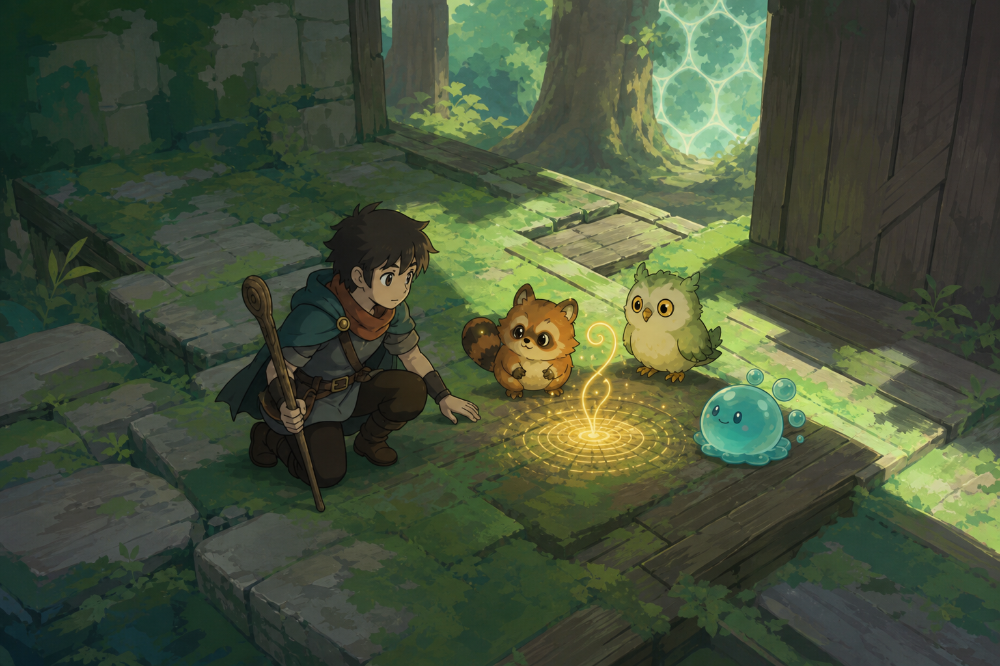
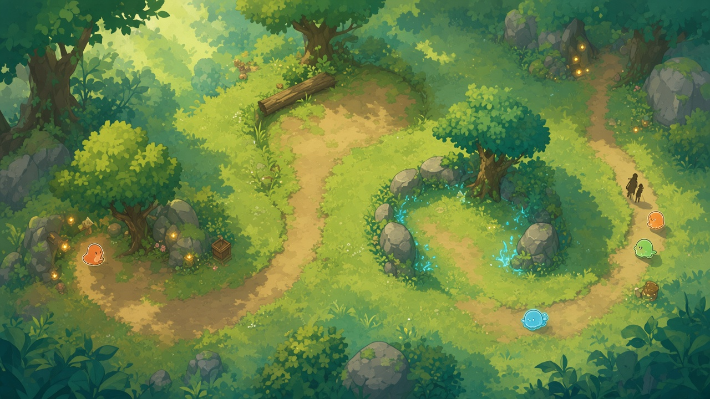
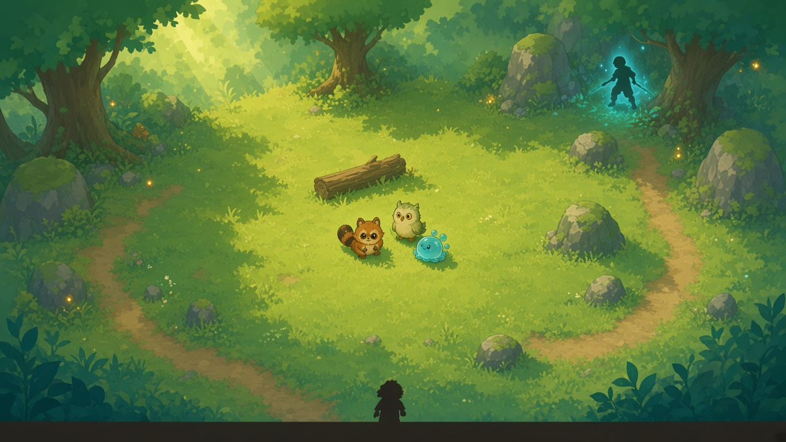
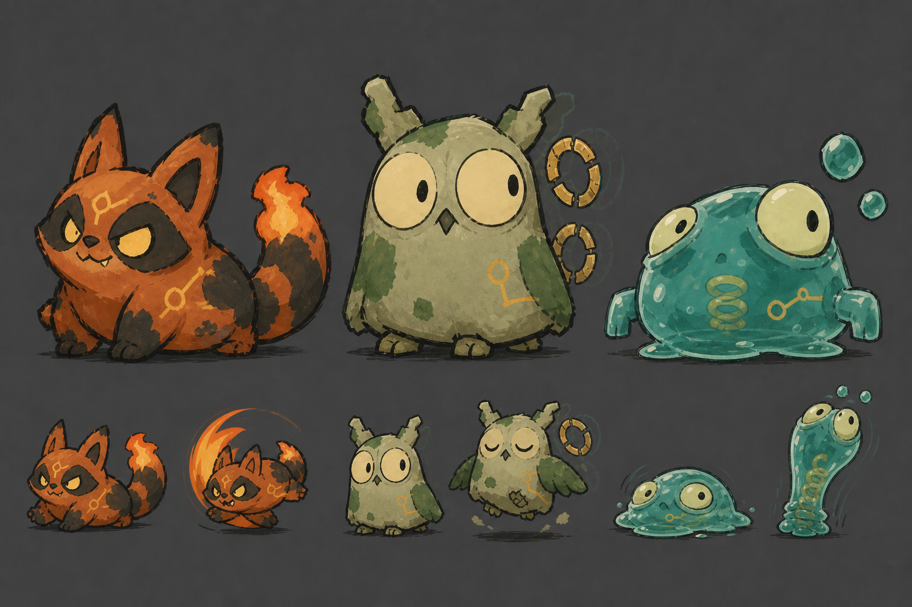

# ProjectR 美术风格基准

> 状态：场景背景与三宠方向已确认；主角全部旧设定与候选已撤回，等待重新设计  
> 基准日期：2026-09-04  
> UI追加：2026-09-08  
> 初契序章场景追加：2026-09-09  
> 用途：后续场景概念图、角色立绘、灵宠图与UI插画生成时作为共同提示词前缀
> 世界依据：[ProjectR 世界设定](../设定_ProjectR世界与主角.md)



## 初契序章场景概念基准





- **旧布局色稿**只保留“暖绿→局部青蓝→暖绿”的色彩关系，不再冻结四段空间或S形主路径；V5空间以[初契序章关卡策划](../levels/新手关_初契序章.md)为权威。
- **游戏镜头氛围图**冻结暖光林间空地、圆润苔石、宽松植物块面、局部异常青蓝和中央战斗留白；后续Unity实机优先对照这张图的明暗层级与可读路径。
- 图中所有人形均为比例占位，不是主角、照料员或失控者设计；三宠造型仍以本页“三宠美术基准”为权威。
- 两张图均为概念参考，不直接作为运行时背景贴图。

### Unity旧实现回退

- `Babylon/Assets/1Game/Prefabs/Tutorial/StarterPrologueLayoutV3.prefab`与原白盒Prefab只保留为回退版本，不再作为精确空间权威。
- [V5白盒范围俯视图](../../../../Babylon/Assets/1Game/ArtRes/Blockout/V5Guides/StarterPrologueLayoutV5_BlockoutGuide_TopDown.png)仅用于手工施工：绿色会合点、蓝色教学通道、橙色低坡、黄色救援空地和红色战斗空地都是`EditorOnly`无碰撞范围线，不是正式地表或配色。
- [LayoutV3俯视验证图](../../../../Babylon/Assets/1Game/ArtRes/References/StarterPrologueLayoutV3_TopDown.png)只用于核对四区连接、路径净宽和流程点，不覆盖上方氛围图的美术方向。
- V5须先新建纯白盒验证林间会合点、教学通道、低坡揭示、两个功能空地和家园转场；通过前不迁移现有环境V10。旧绿色墙块与直边地台不得直接美化为正式建筑围墙。
- [环境占位V1俯视图](../../../../Babylon/Assets/1Game/ArtRes/References/StarterPrologueEnvironmentV1_TopDown.png)记录第一批自然资源接入：Garden景观石、普通冬青、沿阶草和地表材质可继续评估；竹子、樱花、日式建筑与灯笼不得进入ProjectR序章。
- V1圆冠树使用无碰撞程序几何与ProjectR平涂材质，只验证树冠剪影和通路遮挡，不是正式树木资产；连续草地底景同样不参与NavMesh。
- [环境占位V2俯视图](../../../../Babylon/Assets/1Game/ArtRes/References/StarterPrologueEnvironmentV2_TopDown.png)进一步验证暖黄绿主光、软阴影、椭圆泥土路径和失控区局部亮青短痕；[失控区实机图](../../../../Babylon/Assets/1Game/ArtRes/References/StarterPrologueEnvironmentV2_Combat.png)用于核对异常范围。
- V2亮青只允许围绕失控宿主、武器和近地短痕出现；不得铺满战斗区，也不得形成可交互机关的视觉语法。椭圆泥土片仍是程序占位，不能直接作为正式地表美术。
- [环境占位V3俯视图](../../../../Babylon/Assets/1Game/ArtRes/References/StarterPrologueEnvironmentV3_TopDown.png)以Kenney CC0低面数树替换程序圆冠树，并以三条不规则带状Mesh替换椭圆泥块；[V3失控区实机图](../../../../Babylon/Assets/1Game/ArtRes/References/StarterPrologueEnvironmentV3_Combat.png)用于检查树冠遮挡与道路透明度。
- Kenney资源来源、子集范围和许可证见`Babylon/Assets/1Game/ArtRes/ThirdParty/KenneyNatureKit/`。三档鼠尾草绿和深木褐是ProjectR适配，不沿用原包薄荷绿。
- V3树木只作为低成本布局基线：轮廓可以保留，但正式阶段须增加更柔和的树冠层次与轻微风动；半透明道路带须由正式地表混合替代。
- [环境占位V4俯视图](../../../../Babylon/Assets/1Game/ArtRes/References/StarterPrologueEnvironmentV4_TopDown.png)与[救援入口实机图](../../../../Babylon/Assets/1Game/ArtRes/References/StarterPrologueEnvironmentV4_RescueApproach.png)冻结道路中心清楚、边缘与首尾渐隐的表现原则。
- V4软布、水壶和圆木只承担“照料员途中突遭事故”与视线分段，不得发光、交互或被误读为战利品。首次附着门不得恢复红色实体墙表现。
- [环境占位V5俯视图](../../../../Babylon/Assets/1Game/ArtRes/References/StarterPrologueEnvironmentV5_TopDown.png)、[救援区实机图](../../../../Babylon/Assets/1Game/ArtRes/References/StarterPrologueEnvironmentV5_Rescue.png)和[失控区实机图](../../../../Babylon/Assets/1Game/ArtRes/References/StarterPrologueEnvironmentV5_Combat.png)冻结“低矮草石提示碰撞、入口留空、中央净空”的软边界原则。
- 草石环不得做成等距花坛或实体围墙；正式组合应扩大尺寸和形状差异、减少重复Renderer，同时保持现有碰撞轮廓。
- [HIGHLANDS环境V6俯视图](../../../../Babylon/Assets/1Game/ArtRes/References/StarterPrologueEnvironmentV6_Highlands_TopDown.png)与[出生区实机图](../../../../Babylon/Assets/1Game/ArtRes/References/StarterPrologueEnvironmentV6_Highlands_GameStart.png)记录当前付费资产接入基线：使用包内森林模型和贴图，但不沿用Built-in Shader、Demo光照、天空、后处理或交互系统。
- HIGHLANDS当前通过`ArtRes/Materials/Tutorial/HighlandsAdapted/`中的ProjectR URP材质落地；树木、草蕨、灌木、花菇、岩石和圆木可继续使用，营地建筑与女巫屋不自动进入世界设定。
- V6仍是正式垂直切片前的资产筛选版：后续先降低重复小物Renderer、增加轻微统一风动并重做地表层次，不因已购资产而改变序章路径、战斗净空或轻松自然幻想方向。
- [HIGHLANDS环境V7俯视图](../../../../Babylon/Assets/1Game/ArtRes/References/StarterPrologueEnvironmentV7_Highlands_TopDown.png)与[出生区实机图](../../../../Babylon/Assets/1Game/ArtRes/References/StarterPrologueEnvironmentV7_Highlands_GameStart.png)冻结包内苔藓纹理作为当前统一地表基线；地表应柔和连续，不能恢复Garden时期密集重复的黄褐草叶图案。
- `Env_AnomalyTrace_VisualOnly_*`只允许以短小、半透明青色残留出现在宿主附近；不得组成箭头、法阵、攻击预警或需要玩家处理的节点。
- V8使用`ProjectR/Environment/StylizedFoliageWind`统一树叶、灌木、草与蕨类风动；树冠风幅低于低草，摆动只提供呼吸感，不允许压过角色动作、敌人轮廓和预警特效。
- V9的家园外缘补给与回家终点劳作陈设已随V5布局废弃；只有照料员事故现场的少量掉落物可以作为候选迁移，仍须低于角色、三宠和敌人的视觉层级。
- 陈设密度遵守负空间原则：失控战斗区中央不放生活道具，序章主路两侧只在叙事节点形成局部密度峰值，其余区域保持视觉休息。
- V10的`Environment_Art_V10/Global + 四个功能区`只作为旧实现的资源回收层级；未来若从中迁移资产，仍按区域和职责挂接，不恢复`Environment_Dressing_V*`平行堆叠方式。
- 外部Prefab自带LOD时保持其原生LODGroup；当前阶段不为无LOD资产补自动LOD。风动材质优先GPU Instancing并取消静态合批，静态地表与普通道具继续使用静态批处理。

## 三宠美术基准



- 共用粗黑手绘轮廓、块面平涂、轻微不对称与“憨怪但友善”的表情语言。
- 火花狸采用干燥焦毛、尖锐耳尾和暖色火焰，动作倾向前冲。
- 回声鸮采用哑光羽壳、圆眼与延迟轮廓／破环，动作倾向悬停。
- 弹弹胶采用透明叠色、湿润高光、内部弹簧和气泡，必须展示压扁与拉伸。
- 三宠保持同一世界观，但不得复用相同眼型、躯干结构和材质表现。

## 核心方向

- 二维动画截图感，不做写实3D、厚涂绘本或高密度奇幻概念图。
- 角色使用清晰深色线稿、平涂色块和少量赛璐璐阴影。
- 背景使用更松的手绘笔触、大块色面和清晰明暗分组，细节弱于角色。
- 自然环境优先；建筑只作为被植物覆盖的简化木石遗迹，不使用固定地域的传统建筑符号。
- 主色为苔藓绿、青绿、木褐和暖灰，以黄绿色斜向阳光及少量金色灵光建立焦点。
- 画面保留安静留白与明确行动路径，不堆满瓶罐、装饰、碎叶和微小纹理。

## 主角（待重新设计）

主角的种族、背景、身份、性格、能力来源、比例、服装和视觉钩子当前全部未定。V1～V8生成图仅作为被否决的探索草稿保留，不在本文件引用，也不能作为后续生图、建模或叙事依据。

主角重新设计前，不从“见习寻路者”“路生民”“三孔护腕”“折叠路径标片”或任何既有候选继续细化。后续应先确认人物背景，再单独建立角色提示词与美术基准。

## 天赋树UI画风

- **当前唯一美术权威**：`Assets/1Game/ArtRes/UI/ProjectR/References/SpiritTalentTree_ApprovedArtV1.png`。后续天赋树资源、布局和实机验收均直接与此图对照。
- `SpiritTalentTree_BaseV1.png`、`SpiritTalentTree_RoundCuteV2.png`及此前实机截图只保留为过程稿，不再覆盖权威图。
- 必须保留权威图的大幅左下灵宠插画、左侧三宠纵向页签、`3→6→6→3`疏密节奏、右侧独立详情卡、顶部成长信息和底部图例；不得只提取配色后套回旧12节点网格。
- 普通节点使用饱满双圆环，关键节点使用短尖、圆角的四向十字星，终极节点使用同源的放大环星，不为每个效果发明一种外轮廓。
- 灵宠可提高头脸与尾巴的圆润比例，但不得变成幼儿化吉祥物；保持动作倾向和物种剪影。
- 暖杏橙、柔和鼠尾草绿与灰青色区分路线，深可可色承担文字和轮廓；减少脏污、尖锐笔触和深黑压迫感。
- 《暗喻幻想》只参考非对称排版、选中态动势和插画破框原则，不复制其高噪声拼贴、字体或具体资产。

## 通用生成提示词

```text
An original ProjectR fantasy scene rendered like a clean high-quality 2D animated film frame.
Characters use confident dark line art, simple rounded silhouettes, flat cel-shaded color blocks,
minimal facial features and only one restrained shadow tone. Do not infer or generate the protagonist
from this shared environment prompt; use a separate approved character brief once one exists.

The background is a loose hand-painted 2D animation background with broad visible brush blocks,
simplified planar moss, timber and stone shapes, restrained detail, slightly rough painted edges,
clear value grouping and a strong diagonal yellow-green sunlight shape. Nature dominates and
reclaims a few simple wooden or stone ruins. Use moss green, turquoise, muted brown, warm gray and
small golden spirit-light accents. Keep open negative space and a readable path through the scene.

Friendly spirits use tiny rounded animation shapes with stable silhouettes and simple expressions.
Original world and character designs, gentle natural fantasy, calm wonder with a small mystery.
```

## 通用负向提示词

```text
no photorealism, no realistic 3D render, no painterly storybook micro-detail, no dense concept-art
clutter, no ornate historical architecture, no pagodas, no talismans, no calligraphy, no fixed
real-world cultural costume, no realistic adult anatomy, no long limbs, no detailed muscles,
no complex belts or layered armor, no heavy cape, no thick realistic hair strands, no soft
oil-painted face, no grim darkness, no oversized mascot body, no UI, no text, no logo
```

## 场景追加模板

### 初契序章

```text
Beginner prologue environment in one continuous reclaimed woodland path, seen from a playable
three-quarter elevated camera close to a Hades-like gameplay composition without copying Hades.
The route moves through four readable beats: a warm open home-edge trail, a droplet-shaped rescue
clearing under a canopy opening, a slightly lower oval combat clearing framed by rounded mossy
rocks and a leaning tree, then a narrow path curving back toward tiny warm home lights.

Keep the terrain broad and playable, with clear negative space around the rescue tableau and combat
zone. Use shrubs, rounded stones, loose grass planes, one fallen log, simple timber-and-stone steps,
three tiny golden natural lights, and only a few non-interactive caretaker supplies. The abnormal
area remains daylight woodland: localized cool turquoise-blue traces press into grass tips and
ground marks around the distant threat, while the rest stays moss green and yellow-green.

Any humans are tiny anonymous scale silhouettes without readable costume, face, species or hero
design. Friendly spirits may appear only as three tiny rounded color silhouettes. No interface,
labels, arrows or written annotations.
```

### 序章构图规则

- 路径在游戏镜头下占画面宽度约四分之一到三分之一，边缘植物形成软边界，中央不铺满细节。
- 暖光从左上或右上斜切主要行动区，失控青蓝只作为局部第二光色，不把全场染蓝。
- 林间会合点和教学通道以较暗、受控的构图开场；越下低坡后画面明显变亮变宽，救援空地提供角色构图留白，失控区提供椭圆战斗净空。
- 前景树冠只压画面边角；中景地表与石块建立路径；远景树群使用层叠大轮廓，不抢角色层级。
- 所有木石构件保持无地域性的圆角简化形态，并由苔藓或植物覆盖，不形成可识别传统建筑。

### 序章最小环境资源包

1. **地表**：2～3种可拼接草地／土路块，1种柔边混合材质，1组低频地面色差。
2. **边界**：3种圆润苔藓石、3种低矮灌木、2种树冠遮挡块、1棵倒木和1棵斜树地标。
3. **路径构件**：无地域性的低矮木石踏步与少量朽木边缘，不制作大门、桥或房屋。
4. **氛围**：金色自然微光、低密度尘粒、轻雾和黄绿色斜向光束。
5. **异常层**：青蓝武器流光、草叶受压色和短地痕；三者共用一套颜色与强度语法。
6. **事件道具**：布包、小水壶、软垫各1种，只作静态叙事，不提供交互或掉落。

下一阶段进入Unity时，优先评估 `Assets/URPBaseSample/Scenes/Garden/` 的
`GardenTerrain_Graph`、`MossRock_Graph`、SSS植被、`Fireflies_Prefab`和尘粒。
只拆用自然组件，不搬入完整Garden场景、日式建筑、樱花、竹子或灯笼。
Unity官方Sample在正式发行前需确认Companion License；当前仅作为候选资源记录。

后续生成应同时参考本页图片与提示词。若角色和背景发生冲突，以“角色清晰线稿／背景概括笔触”的层级关系为准。
