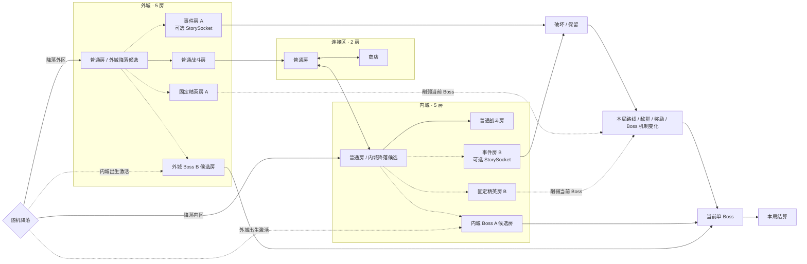

# 关卡 A：地图情报与分支结构草案

> **状态**：`草案`  
> **内容层级**：仅描述事件、地图依赖和随机约束，不包含世界观、美术与正式命名。  
> **权威性**：最小完整体验边界已同步 GDD；具体事件内容仍为草案。  
> **对应可视化**：Cursor Canvas `roguelite-story-events-branches.canvas.tsx`（后续地图情报链）、`level-a-time-events.canvas.tsx`（首测事件分支）与 `random-map-template.canvas.tsx`（可刷新 12 房随机地图模板）

## 1. 内容规模

- 每轮只激活 1 个 Boss：外城出生对应内城 `Boss A`，内城出生对应外城 `Boss B`。
- 2 个全局时间状态：`昼`、`夜`；每局独立随机，轮内不可切换。
- 2 个出生区：`外城`、`内城`；玩家出生后仍可往返两个城区。
- `出生区 × 昼夜`形成 4 种运行组合：出生区决定对侧 Boss，昼夜统一修饰本局环境。
- 4 个区域状态内容池：`外昼`、`外夜`、`内昼`、`内夜`。
- 2 个固定精英房：外城 `精英怪 A`、内城 `精英怪 B`；昼夜只替换其环境与敌群配置。
- 基础地图为 12 房：普通 6、精英 2、事件 2、商店 1、Boss 1。
- 外城与内城各 5 房、连接区 2 房；两处 Boss 候选建筑保持在区域远侧，安全降落房从出生区普通候选房中独立抽取。
- 2 个事件房，其中 1 个承担本轮主要事件；两个事件槽分别随机抽取不同事件，所有事件都在本局结算。
- 事件内容与空间布局解耦：两个事件房可以使用同一个空间 Prefab，但必须通过各自的 `EventSocket` 注入不同 `EventId`。
- 2 个可选事件地点：`地点 A`、`地点 B`，均占用事件房内的 `StorySocket`。
- 休息点、军械库、装备 A、跨局可破坏物、跨轮情报链与完整结局条件暂不进入首测。
- 首测 Boss A/B 使用共享材料掉落。

## 2. 核心流程

```text
进入秘境
  → 随机出生区、该区降落房、房内安全出生点、昼夜与对侧 Boss
  → 生成 12 房地图并显示本局 Story Manifest
  → 战斗、收集材料、形成局内 Build
  → 在主要事件中选择破坏 / 保留
  → 路线、敌群、奖励或 Boss 机制在本局立即变化
  → 击败当前单 Boss，生成最终出口并按通关结算
  → 或通过显式主动 / 特殊撤离口提前离开，按阶段返回结算
```

再次进入时重新生成地图、昼夜、Boss 与事件；不读取上局普通事件状态。局内 Build 仍按现行规则清空。

## 3. 地图与依赖



## 4. 固定与随机边界

### 固定

- 策划图使用布局局部坐标表达“外城—连接区—内城”和关键建筑关系；实际世界可将整张地图共同旋转。
- 即使暂不使用美术主题，玩家也应通过左右区域轴、连接区商店、上下支路、门数和来路方向判断当前区域与返程方向。
- 至少一条内外区可通路线。
- 12 房运行时配额：普通 6 / 精英 2 / 事件 2 / 商店 1 / Boss 1。
- 外城与内城各保留一处区域远侧 Boss 候选建筑；未激活者转为普通地标房，不承担固定出生职责。
- 商店保持在连接区；事件总体位于各城区上侧分支，精英总体位于下侧分支，允许距离和局部节点位置小幅变化。
- 击败当前单 Boss 是标准通关门槛；非 Boss 离开方式属于主动 / 特殊撤离，不算通关。

### 随机

- 玩家先随机降落在外城或内城，再从该区 2～3 个普通候选房和房内 2～4 个安全 `PlayerSpawn` 中抽取实际位置。
- 每局的`昼 / 夜`独立于出生区随机。
- `出生区 × 昼夜`决定本轮运行组合：外昼、外夜、内昼或内夜。
- 两个固定精英房的敌群、奖励与昼夜环境变体。
- 两个事件槽的空间模板与事件内容分别随机；同一空间模板可重复，但同局两个事件 `EventId` 不重复。
- 主要事件的类别与破坏 / 保留结果；关键建筑在布局局部坐标中的关系不变，全部本局生效。
- 地点 A、地点 B 是否作为本轮事件地点出现。
- 普通房连接、敌群与事件；不独立 Roll 无条件捷径。
- 普通房与关键建筑可在本分区小幅改变距离、角度或前后次序；整图可刚性旋转但不镜像，事件 / 精英在局部坐标中不得互换相对侧。
- 相同布局的普通房或事件房可以重复出现，但连接语境不能形成完全对称、无法判断返程方向的镜像段。

### 路线约束

- 两个精英房必须位于可绕行支路，不得封锁跨区必经路线或 Boss 路线。
- 降落点不得与当前对侧 Boss 直邻。
- 关键建筑在布局局部坐标中的相对方向不能因 Seed 或整图旋转颠倒；单房可按 Doorway 约束局部旋转。
- 玩家不必仅凭房间外形识别精确节点，但必须能判断所在区域、主路 / 上侧事件支路 / 下侧精英支路，以及连接区和 Boss 的大致方向。
- 地点 A/B 未生成时，不得生成指向不存在房间的确定路标。
- 不生成只用于缩短步行距离的随机捷径；新增地图边必须来自本局通路事件，且不能被误当成免费撤离口。

## 5. 内外城 × 固定昼夜

### 5.1 出生区与本局状态

- **出生区**：外城或内城，决定本局在哪一区抽取降落房以及激活哪个对侧 Boss；具体出生房与房内落点继续随机。
- **本局时间**：昼或夜独立随机。
- 每次进入都重新生成 12 房地图，不继承上局拓扑、可破坏物或门状态。
- 重复进入的基础驱动力来自材料刷取与局外成长；事件只增加本局变化。
- 玩家可以在内外城之间移动，但本轮中途没有昼夜切换点，时间状态不会改变。
- `出生区 × 本轮时间`形成四种运行组合：

| 运行组合 | 路线与环境差异 | 当前 Boss |
|---|---|---|
| 外城出生 × 昼 | 外城普通候选房起步；视野清晰、巡逻活跃、机关显式 | 内城远侧 Boss A |
| 外城出生 × 夜 | 外城普通候选房起步；视野受限、伏击增加、隐藏入口显现 | 内城远侧 Boss A |
| 内城出生 × 昼 | 内城普通候选房起步；视野清晰、巡逻活跃、机关显式 | 外城远侧 Boss B |
| 内城出生 × 夜 | 内城普通候选房起步；视野受限、伏击增加、隐藏入口显现 | 外城远侧 Boss B |

### 5.2 首测内容预算

基础地图为 12 个主体房：

- **外城 5 房**：普通、精英、事件与 Boss 候选。
- **连接区 2 房**：普通战斗与商店。
- **内城 5 房**：普通、精英、事件与 Boss 候选。
- 两个 Boss 候选建筑只激活一个；出生区普通候选房叠加 `Landing`，同侧未激活 Boss 房转为普通地标，运行时合计 12 房。

首测不承诺 1.5 倍总内容池，也不要求每个房间制作昼夜完整版本；先验证最小骨架是否形成完整体验。

### 5.3 跨局事件（首测暂缓）

首测不做跨局事件，原因是其额外要求关卡级状态、结果槽、消费时机、生成失败兜底和入口提示，会干扰对核心体验的判断。

若后续恢复，只采用单个一次性 Pending：

```text
本局确认选择
  → 写入同一关卡的 Pending
  → 玩家再次实际进入该关卡
  → 结果成功落位后消费
```

停留在选关界面、刷新预览、退出或地图生成失败都不消费；不恢复强制“下一局相反昼夜”的双轮周期。

### 5.4 可破坏事件

可破坏事件的本质是制造本局可预期变化：

```text
生成主要事件
  → 即时变体：本局立刻改变路线 / Boss 机制 / 精英与奖励
  → 玩家从变化后的当前地图继续探索
  → 击败当前单 Boss
  → 退出后清空普通事件状态
```

- 玩家必须主动确认“破坏”或“维持”才结算；未发现、未交互或直接离开都不默认写入“维持”分支。
- 交互前预览本局风险、收益与影响对象；确认后必须立即产生地图或战斗反馈。
- 两个事件房各自生成本局事件，不读取上局结果槽。
- 已领取奖励、永久情报和关卡外成长不会回滚；永久故事变化必须使用独立故事 Flag，不能复用普通一次性修饰。

### 5.5 首批可破坏事件候选

昼夜与事件采用正交规则：

- **事件因果**：只由破坏 / 保留决定，规则稳定且可预测。
- **昼夜修饰**：统一改变视野、敌群与隐藏入口，不改写事件因果。

**通路事件 A**
- 强拆会在事件房附近开放高风险支路并生成守路精英；保留则维持安全长路并生成稳定奖励。

**供能事件 B**
- 本局选择能源核心或供能宝箱，并立即关闭或保留当前 Boss 的护盾。主要供能事件生成在 Boss 所在区域。

**封存事件 C**
- 本局选择释放追猎精英获得高价值掉落，或调查封存对象取得路线情报。

每局有 2 个事件房并抽取 1 个主要事件；三类系统全部使用本局模板。

两个事件房分别从兼容池无放回抽取事件：空间布局先按门拓扑生成，事件再按区域、Socket 和故事标签注入。同一事件房 Prefab 可在地图中重复使用，但同局不得得到相同 `EventId`；事件定义不得永久写死在房间 Prefab 中。

### 5.6 本局状态提示

`Story Manifest` 只显示本局已生成内容，例如：

> 本局为夜间；主要事件位于内城；当前目标为 Boss A。若完成供能事件，可在本局关闭 Boss 护盾。

生成后由 `Story Manifest` 更新为“本轮可执行”或“本轮未生成”，不能让玩家在不存在的地点中空搜。

## 6. 解密事件与收益

解密必须作用于实体地图，例如开门、形成事件路线、出现宝箱或生成高难战斗，不能只在菜单中阅读文字后领取奖励。

### 6.1 一级解密

- **预计时间**：30～60 秒。
- **结构**：单房观察、隐藏通道、1～2 次机关操作。
- **失败规则**：可立即重试，不锁死本轮。
- **奖励**：普通宝箱、一次模块三选一、恢复资源，或与关键物回程绑定的单向门。

### 6.2 二级解密

- **预计时间**：2～4 分钟。
- **结构**：本轮跨内外城；在出生区观察或取物，到另一城区执行。
- **奖励**：高品质宝箱、定向模块或永久情报。
- **高风险分支**：可以不开宝箱，改为生成精英怪 E；击败后获得更高品质奖励。

### 6.3 三级解密（首测暂缓）

- **暂缓原因**：依赖跨轮状态、结果保底和关键物持久化，会干扰最小完整体验验证。
- **后续结构**：跨城区、可选地点与关键物共同参与；恢复前需单独评审跨局消费语义。
- **奖励**：唯一模块、关键物或完整结局条件。
- **额外挑战**：可生成高难精英怪 F；击败后获得第二奖励箱。

### 6.4 可采用的题型

参考《遗迹 2》的结构原则，但不复制具体谜题：

- 可搬运资源只能激活有限数量的门；移动资源会关闭原路径。
- 中央机关的状态直接控制周边实际房门。
- 一侧状态用于观察或改变信息，另一侧状态用于执行或领取结果。
- 环境中存在隐藏垂直通路、假墙或可错过的移动平台。
- 收集证据后进行选择：正确处理获得宝箱，错误或主动挑战则生成精英怪。

### 6.5 复杂度与奖励约束

1. 解密步骤越多、跨越状态和房间越多，奖励越稳定且越独特。
2. 一级解密不得投放唯一奖励；三级解密不能只给普通宝箱。
3. 玩家在投入主要步骤前，应能判断奖励类型或风险等级。
4. 关键前置未生成时，必须明确显示本轮不可完成，禁止无效搜索。
5. 唯一奖励取得后，重复解密改为通用高品质奖励。

## 7. 情报链 A（后续草案，不进入首测）

### 情报 A 的来源

- 击败外城固定精英怪 A；或
- 完成对应的外城事件。

外区精英怪是高收益快捷来源，但不是唯一来源。

### 情报 A 的通用文案

> 若本轮外区出现地点 A，前往该地点的指定交互位置取得关键物 A。若地点 A 未出现，本轮无法推进该步骤。

### 后续

1. 本轮生成地点 A：前往地点 A。
2. 持有情报 A：隐藏交互可识别。
3. 取得关键物 A。
4. 将关键物 A 带到已生成的处理点 A `StorySocket`。
5. 完成处理 A并写入持久状态。

完成后，后续轮次无需再次等待地点 A。

## 8. 情报链 B（后续草案，不进入首测）

### 情报 B 的来源

- 击败内城固定精英怪 B；或
- 完成对应的内城事件。

### 情报 B 的通用文案

> 若本轮内区出现地点 B，前往该地点的指定交互位置取得情报 C。若地点 B 未出现，本轮无法推进该步骤。

### 情报 C 的通用文案

> 若本轮固定地点 C 出现交互点 C，按情报完成交互并取得关键物 B。若交互点 C 未出现，本轮无法推进该步骤。

### 后续

1. 在地点 B 取得情报 C。
2. 等待地点 C 的 StorySocket 命中交互点 C。
3. 取得关键物 B。
4. 关键物 B 跨轮次保留，用于最终处理。

## 9. 精英怪与 Boss

### 精英怪 A/B

- 每轮固定生成 2 个：外城精英怪 A、内城精英怪 B。
- 玩家可以绕过。
- 不影响当前 Boss 的可达性。
- 单体强度明显高于小怪、综合强度略低于 Boss；伤害压力可以接近 Boss，但耐久更低、机制更少且没有完整多阶段。
- 单场聚焦 1 个核心机制与 1 个辅助机制，可带少量协同小怪，不以大量杂兵堆难度。
- 击败后提供高价值奖励；若位于当前 Boss 所在区域，可移除其一个局部机制。
- 精英未击败时，对应事件仍可提供情报。

### Boss A / Boss B

- 每轮固定存在 1 场：外城出生激活内城 Boss A，内城出生激活外城 Boss B。
- 击败当前 Boss 后判定标准通关，并在 Boss 房生成或启用最终出口。
- Boss A 与 Boss B 是两套不同核心战斗，但都不因昼夜替换完整版本。
- 出生区同侧 Boss 候选建筑转为普通地标房；安全降落房从该区普通候选房中独立抽取，离开后再进入正常战斗节奏。
- 供能主要事件生成在当前 Boss 区域并控制其护盾等单一机制。
- 首测 Boss A/B 使用共享材料掉落。
- 不击败 Boss 的离开方式统一视为主动 / 特殊撤离：不发 Boss 奖励，不推进要求 Boss 击杀的故事条件，按阶段返回档位结算。

## 10. 首测结算

击败当前单 Boss 后生成最终出口，并结算本局材料、局外成长与 Boss 故事进度。若通过显式主动 / 特殊撤离口提前离开，则不算通关，也不结算 Boss 奖励与 Boss 故事进度。

多结局、完整结局、关键物 A/B 与持久处理状态均暂缓，待本局事件与重复材料刷取通过 Playtest 后恢复评审。

## 11. 提示与保底

1. 情报必须使用“若……出现”的条件句。
2. 生成完成后读取本轮 `Story Manifest`：
   - 对应地点存在：显示区域级提示；
   - 对应地点不存在：显示“本轮未出现”。
3. 未获得前置情报时，地点可以生成，但隐藏交互不高亮。
4. 玩家确认破坏 / 维持后，本局结果必须立即可见；未交互不默认结算。
5. 精英怪不能成为关键情报的唯一来源。
6. 不以“新手不知道可以重刷”作为随机目标的平衡手段；首测 Boss A/B 使用共享材料掉落。

## 12. 与现行 GDD 的对齐

本草案已与 GDD 的最小完整体验边界对齐：

- 12 房：普通 6 / 精英 2 / 事件 2 / 商店 1 / Boss 1；
- 每局只激活出生区对侧 Boss；
- 出生区、降落房与房内安全点分层抽取；关键建筑保持布局局部坐标中的相对关系，整图可共同旋转但不镜像；
- 击败 Boss 后生成最终出口并按通关结算；非 Boss 撤离按阶段返回结算；
- 外城与内城各 1 个固定精英房；
- 2 个事件房与 1 个商店；
- 相同空间 Prefab 可复用；两个事件槽独立抽取不同事件；
- 休息点、军械库、装备 A 和跨局事件暂缓；
- 每轮地图重新生成，局内 Build 按现行规则清空。

本文件中的多轮情报链与三级解密保留为后续草案，不属于首测实现范围。

## 13. 待确认

- 12 房下的单局时长、构筑成型速度与材料密度。
- Boss A / Boss B 首测是否只共享材料，还是连其他奖励也完全共享。
- 两个固定精英是否过多；是否需要降为每局 1 个。
- 首批通路 / 供能 / 封存事件各制作几个本局变体。
- 精英怪对当前 Boss 的影响采用“移除机制”还是“降低机制强度”。
- 何时重新评审休息点、军械库与装备 A。
- 只有在本局事件验证通过后，才评审单个 `PendingNextVisitModifier` 的跨局试验。

