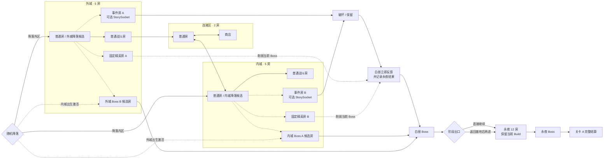

# 关卡 A：无暮王城 · 双阶段地图与分支草案

> **状态**：`草案`  
> **内容层级**：描述关卡 A 的局部故事、白昼 / 永夜阶段、事件依赖和随机约束。  
> **权威性**：双阶段流程与提示规则已同步 GDD；具体夜态房间变体、敌群和事件后果仍为草案。  
> **对应可视化**：Cursor Canvas `roguelite-story-events-branches.canvas.tsx`（后续地图情报链）、`level-a-time-events.canvas.tsx`（首测事件分支）与 `random-map-template.canvas.tsx`（可刷新 12 房随机地图模板）

## 0. 局部故事

无暮王城曾截留死者残留的力量来维持永恒白昼。最后一次加冕仪式失控后，城市被困在两个阶段：白昼仍重复守卫、供能与加冕秩序；永夜则显露亡者收容设施和被掩盖的历史。玩家进入本关是为了取得通往后续区域的王冠碎片，而非在这里解决整部游戏的最终矛盾。

白昼摄政者坚持牺牲死者维持城市；永夜引渡者主张终止循环，即使城市因此灭亡。两者都具有可理解立场。玩家在白昼对通路、供能与危险封存物的处理，会在永夜成为可见后果；击败永夜 Boss 后，本关地方故事闭环。

## 1. 内容规模

- 关卡由两个顺序阶段组成：首次固定为`白昼`，完成后反转为`永夜`；不是一张地图内实时切换。
- 每阶段只激活 1 个 Boss：外城出生对应内城 `Boss A`，内城出生对应外城 `Boss B`。
- 2 个出生区：`外城`、`内城`；玩家出生后仍可往返两个城区。
- `出生区 × 当前阶段`形成 4 种运行组合：出生区决定对侧 Boss，阶段统一修饰环境、敌池与关键模块。
- 4 个区域状态内容池：`外昼`、`外夜`、`内昼`、`内夜`。
- 2 个固定精英房：外城 `精英怪 A`、内城 `精英怪 B`；昼夜只替换其环境与敌群配置。
- 基础地图为 12 房：普通 6、精英 2、事件 2、商店 1、Boss 1。
- 外城与内城各 5 房、连接区 2 房；两处 Boss 候选建筑保持在区域远侧，安全降落房从出生区普通候选房中独立抽取。
- 2 个事件房，其中 1 个承担本轮主要事件；事件先在白昼产生即时反馈，最多两个选择结果可在永夜落位。
- 事件内容与空间布局解耦：两个事件房可以使用同一个空间 Prefab，但必须通过各自的 `EventSocket` 注入不同 `EventId`。
- 2 个可选事件地点：`地点 A`、`地点 B`，均占用事件房内的 `StorySocket`。
- 休息点、军械库、装备 A、任意数量持久开关、跨多轮情报链与完整世界结局暂不进入首测。
- 首测 Boss A/B 使用共享材料掉落。

## 2. 核心流程

```text
首次进入无暮王城（白昼）
  → 随机出生区、该区降落房、房内安全出生点与对侧 Boss
  → 生成白昼 12 房地图并显示本阶段 Story Manifest
  → 战斗、收集材料、形成局内 Build
  → 事件立即改变白昼内容，并记录最多两个永夜结果
  → 击败白昼 Boss，提交阶段并生成阶段出口
  → 选择直接追入永夜（保留当前 Build）
      或返回基地（安全结算，下次从永夜重新构筑）
  → 进入永夜，使白昼结果落位并在左下角持续回顾
  → 击败永夜 Boss，生成最终出口并完成关卡 A
```

白昼完成后，关卡状态固定为永夜，直到永夜完成。永夜死亡或返回基地不会要求重打白昼；下次入口传送门会列出上次变化并明确提示“本次将从永夜阶段继续”。直接从白昼进入永夜时不清空 Build；经基地再次进入时仍按现行规则清空并重新构筑。两种进入方式都从原出生区安全降落端重新落地，不从白昼 Boss 房原地续跑。永夜通关后清除本轮结果并把下一次挑战重置为白昼。

## 3. 地图与依赖



## 4. 固定与随机边界

### 固定

- 策划图使用布局局部坐标表达“外城—连接区—内城”和关键建筑关系；实际世界可将整张地图共同旋转。
- 即使暂不使用美术主题，玩家也应通过左右区域轴、连接区商店、上下支路、门数和来路方向判断当前区域与返程方向。
- 至少一条内外区可通路线。
- 12 房运行时配额：普通 6 / 精英 2 / 事件 2 / 商店 1 / Boss 1。
- 阶段顺序固定为`白昼 → 永夜`；白昼完成后关卡停留在永夜，永夜完成后本轮地方故事闭环并重置为下一循环的白昼。
- 外城与内城各保留一处区域远侧 Boss 候选建筑；未激活者转为普通地标房，不承担固定出生职责。
- 商店保持在连接区；事件总体位于各城区上侧分支，精英总体位于下侧分支，允许距离和局部节点位置小幅变化。
- 击败白昼 Boss 是阶段推进门槛；击败永夜 Boss 才是完整通关门槛。非 Boss 离开方式属于主动 / 特殊撤离，不算通关。

### 随机

- 玩家先随机降落在外城或内城，再从该区 2～3 个普通候选房和房内 2～4 个安全 `PlayerSpawn` 中抽取实际位置。
- 时间阶段不随机；首次固定白昼，完成后固定反转为永夜。
- `出生区 × 当前阶段`决定运行组合：外昼、外夜、内昼或内夜。
- 两个固定精英房的敌群、奖励与昼夜环境变体。
- 两个事件槽的空间模板与事件内容分别随机；同一空间模板可重复，但同局两个事件 `EventId` 不重复。
- 主要事件的类别与处理结果；当前阶段立即反馈，最多两个结果延续到永夜。
- 地点 A、地点 B 是否作为本轮事件地点出现。
- 普通房连接、敌群与事件；不独立 Roll 无条件捷径。
- 普通房与关键建筑可在本分区小幅改变距离、角度或前后次序；整图可刚性旋转但不镜像，事件 / 精英在局部坐标中不得互换相对侧。
- 相同布局的普通房或事件房可以重复出现，但连接语境不能形成完全对称、无法判断返程方向的镜像段。

### 路线约束

- 两个精英房必须位于可绕行支路，不得封锁跨区必经路线或 Boss 路线。
- 降落点不得与当前对侧 Boss 直邻。
- 关键建筑在布局局部坐标中的相对方向不能因 Seed 或整图旋转颠倒；单房可按 Doorway 约束局部旋转。
- 玩家不必仅凭房间外形识别精确节点，但必须能判断所在区域、主路 / 上侧事件支路 / 下侧精英支路，以及连接区和 Boss 的大致方向。
- 地点 A/B 未生成时，不得生成指向不存在房间的确定路标。
- 不生成只用于缩短步行距离的随机捷径；新增地图边必须来自本局通路事件，且不能被误当成免费撤离口。

## 5. 内外城 × 白昼 / 永夜双阶段

### 5.1 出生区与本局状态

- **出生区**：外城或内城，决定本阶段在哪一区抽取降落房以及激活哪个对侧 Boss；具体出生房与房内落点继续随机。
- **当前阶段**：首次固定白昼；白昼 Boss 完成后提交为永夜。昼夜不会在当前 12 房中实时切换，只通过阶段出口重新加载反转状态。
- 白昼与永夜复用同一次生成的 `Layout Seed`、出生区、激活 Boss 候选建筑、12 节点拓扑、整图旋转和关键建筑位置；主要替换全局色彩、天空、主光、后处理、敌人池和少量关键模块。
- 玩家从白昼直接进入永夜时保留当前 Build；若返回基地或在永夜死亡，下次仍从永夜开始，但局内 Build 按现行规则重新构筑。
- 进入永夜时固定重新降落在已保存出生区的安全端点；只复用地图关系与直接续战的玩家 Build，不复用白昼 Boss 房中的玩家位置和房间遭遇状态。
- `出生区 × 当前阶段`形成四种运行组合：

| 运行组合 | 路线与环境差异 | 当前 Boss |
|---|---|---|
| 外城出生 × 白昼 | 外城普通候选房起步；视野清晰、巡逻活跃、机关显式 | 内城远侧“最后摄政官” |
| 外城出生 × 永夜 | 保留外城出生关系；视野受限、伏击增加、隐藏入口显现 | 内城远侧“无暮王残念” |
| 内城出生 × 白昼 | 内城普通候选房起步；视野清晰、巡逻活跃、机关显式 | 外城远侧“最后摄政官” |
| 内城出生 × 永夜 | 保留内城出生关系；视野受限、伏击增加、隐藏入口显现 | 外城远侧“无暮王残念” |

### 5.2 首测内容预算

基础地图为 12 个主体房：

- **外城 5 房**：普通、精英、事件与 Boss 候选。
- **连接区 2 房**：普通战斗与商店。
- **内城 5 房**：普通、精英、事件与 Boss 候选。
- 两个 Boss 候选建筑只激活一个；出生区普通候选房叠加 `Landing`，同侧未激活 Boss 房转为普通地标，运行时合计 12 房。

首测不要求每个房间制作完整昼夜版本。目标为 70%～80% 主体几何复用：整体调整色彩与光照，白昼 / 永夜各使用一组敌人池，只对关键地标、Boss 房及受事件影响的少量模块制作状态变体；门、主路径碰撞与 Doorway 合同默认不变。

### 5.3 阶段状态与消费时机

首测只保存双阶段闭环需要的最小状态：当前阶段、白昼是否完成、用于复现当前地图的 Layout Seed / 旋转、出生区与 Boss 节点、最多两个待落位结果及其回顾文案，以及永夜是否完整通关。

```text
白昼确认选择并立即反馈
  → 白昼 Boss 通关时提交阶段结果
  → 直接进入或下次实际进入永夜
  → 结果成功落位并持续显示回顾
  → 永夜通关后清除
```

停留在选关界面、刷新预览、退出或地图生成失败都不切换阶段，也不消费结果。永夜死亡不会清除已提交结果，下次仍从永夜继续；只有永夜 Boss 完整通关才清除并重置白昼。

### 5.4 MVP 事件链

完整昼夜循环固定包含 1 个 Layout 与 1 个 Strength 事件。出生区侧事件节点在白昼承载 1004，另一侧事件节点在永夜承载 1006；未到阶段的节点按普通战斗房使用。

**1004 · 断裂巡礼桥（白昼 / Layout）**

1. 进入后生成 3 名桥卫与 1 名队长；清场取得钥匙才开放机构选择。
2. 稳定开启：白昼立即开桥，永夜继续开放。
3. 临时放桥并破坏机构：白昼开桥，永夜桥面坍塌并恢复封锁。
4. 保持封锁：不改变支路。标准 Boss 主路不受三种选择影响。

**1006 · 禁卫召集阵（永夜 / Strength）**

1. 摧毁阵心：立即迎战 `2 近战 + 1 远程 + 1 队长`；清场后 Boss 两次召唤均失败。
2. 破坏外环：Boss 每次只召 1 名禁卫队长。
3. 保持完整：Boss 每次召 `2 近战 + 1 远程`。

同一事件房 Prefab 通过 EventID 激活桥梁或召集阵变体。所有结果都必须同步模型和碰撞；永夜死亡后恢复已提交的 Flag、完成态与场景终态。

### 5.6 阶段状态提示

进入永夜后，HUD 左下角长期显示“上次行动”，最多两条，例如：

> 上次行动  
> · 东侧闸门已被强拆  
> · 内殿核心已被取走

提示持续到永夜通关，不额外使用三秒摘要、强制镜头或重复对白。若玩家经基地再次进入，入口传送门显示：

> 无暮王城当前处于永夜  
> 上次造成的变化：东侧闸门已被强拆；内殿核心已被取走  
> 本次将从永夜阶段继续

直接从白昼阶段出口进入永夜时不再弹入口确认，加载完成后直接显示左下角回顾。

## 6. 解密事件与收益

解密必须作用于实体地图，例如开门、形成事件路线、出现宝箱或生成高难战斗，不能只在菜单中阅读文字后领取奖励。

### 6.1 一级解密

- **预计时间**：30～60 秒。
- **结构**：单房观察、隐藏通道、1～2 次机关操作。
- **失败规则**：可立即重试，不锁死本轮。
- **奖励**：普通宝箱、一次模块三选一、恢复资源，或与关键物回程绑定的单向门。

### 6.2 二级解密

- **预计时间**：2～4 分钟。
- **结构**：本轮跨内外城；在出生区观察或取物，到另一城区执行。
- **奖励**：高品质宝箱、定向模块或永久情报。
- **高风险分支**：可以不开宝箱，改为生成精英怪 E；击败后获得更高品质奖励。

### 6.3 三级解密（首测暂缓）

- **暂缓原因**：依赖跨轮状态、结果保底和关键物持久化，会干扰最小完整体验验证。
- **后续结构**：跨城区、可选地点与关键物共同参与；恢复前需单独评审跨局消费语义。
- **奖励**：唯一模块、关键物或完整结局条件。
- **额外挑战**：可生成高难精英怪 F；击败后获得第二奖励箱。

### 6.4 可采用的题型

参考《遗迹 2》的结构原则，但不复制具体谜题：

- 可搬运资源只能激活有限数量的门；移动资源会关闭原路径。
- 中央机关的状态直接控制周边实际房门。
- 一侧状态用于观察或改变信息，另一侧状态用于执行或领取结果。
- 环境中存在隐藏垂直通路、假墙或可错过的移动平台。
- 收集证据后进行选择：正确处理获得宝箱，错误或主动挑战则生成精英怪。

### 6.5 复杂度与奖励约束

1. 解密步骤越多、跨越状态和房间越多，奖励越稳定且越独特。
2. 一级解密不得投放唯一奖励；三级解密不能只给普通宝箱。
3. 玩家在投入主要步骤前，应能判断奖励类型或风险等级。
4. 关键前置未生成时，必须明确显示本轮不可完成，禁止无效搜索。
5. 唯一奖励取得后，重复解密改为通用高品质奖励。

## 7. 情报链 A（后续草案，不进入首测）

### 情报 A 的来源

- 击败外城固定精英怪 A；或
- 完成对应的外城事件。

外区精英怪是高收益快捷来源，但不是唯一来源。

### 情报 A 的通用文案

> 若本轮外区出现地点 A，前往该地点的指定交互位置取得关键物 A。若地点 A 未出现，本轮无法推进该步骤。

### 后续

1. 本轮生成地点 A：前往地点 A。
2. 持有情报 A：隐藏交互可识别。
3. 取得关键物 A。
4. 将关键物 A 带到已生成的处理点 A `StorySocket`。
5. 完成处理 A并写入持久状态。

完成后，后续轮次无需再次等待地点 A。

## 8. 情报链 B（后续草案，不进入首测）

### 情报 B 的来源

- 击败内城固定精英怪 B；或
- 完成对应的内城事件。

### 情报 B 的通用文案

> 若本轮内区出现地点 B，前往该地点的指定交互位置取得情报 C。若地点 B 未出现，本轮无法推进该步骤。

### 情报 C 的通用文案

> 若本轮固定地点 C 出现交互点 C，按情报完成交互并取得关键物 B。若交互点 C 未出现，本轮无法推进该步骤。

### 后续

1. 在地点 B 取得情报 C。
2. 等待地点 C 的 StorySocket 命中交互点 C。
3. 取得关键物 B。
4. 关键物 B 跨轮次保留，用于最终处理。

## 9. 精英怪与 Boss

### 精英怪 A/B

- 每轮固定生成 2 个：外城精英怪 A、内城精英怪 B。
- 玩家可以绕过。
- 不影响当前 Boss 的可达性。
- 单体强度明显高于小怪、综合强度略低于 Boss；伤害压力可以接近 Boss，但耐久更低、机制更少且没有完整多阶段。
- 单场聚焦 1 个核心机制与 1 个辅助机制，可带少量协同小怪，不以大量杂兵堆难度。
- 击败后提供高价值奖励；若位于当前 Boss 所在区域，可移除其一个局部机制。
- 精英未击败时，对应事件仍可提供情报。

### Boss A / Boss B

- 每阶段固定存在 1 场：Boss 建筑仍位于出生区对侧，但身份按阶段决定。
- 击败白昼 Boss 后生成阶段出口，可直接进入永夜或返回基地；击败永夜 Boss 后才生成最终出口并判定完整通关。
- 白昼固定为“最后摄政官”，在 50% 生命召 2 名普通禁卫；永夜固定为“无暮王残念”，在 70% / 35% 生命读取召集阵结果。当前只冻结召唤差异，其他技能允许后续调整。
- 出生区同侧 Boss 候选建筑转为普通地标房；安全降落房从该区普通候选房中独立抽取，离开后再进入正常战斗节奏。
- 禁卫召集阵位于永夜事件节点并直接控制 Boss 的召唤编组。
- 昼夜 Boss 使用共享材料掉落。
- 不击败 Boss 的离开方式统一视为主动 / 特殊撤离：不发 Boss 奖励，不推进要求 Boss 击杀的故事条件，按阶段返回档位结算。

## 10. 首测结算

击败白昼 Boss 后只完成第一阶段：直接进入永夜时保留当前 Build 与携带物；返回基地则按阶段返回结算，并保存永夜阶段与回顾结果。永夜死亡或返回后仍从永夜继续。击败永夜 Boss 后生成最终出口，才结算完整通关与本关故事进度。

多结局、完整结局、关键物 A/B 与持久处理状态均暂缓，待本局事件与重复材料刷取通过 Playtest 后恢复评审。

## 11. 提示与保底

1. 情报必须使用“若……出现”的条件句。
2. 生成完成后读取本轮 `Story Manifest`：
   - 对应地点存在：显示区域级提示；
   - 对应地点不存在：显示“本轮未出现”。
3. 未获得前置情报时，地点可以生成，但隐藏交互不高亮。
4. 玩家确认处理方式后，白昼即时结果必须可见；提交到永夜的结果必须在对应物件、路线、敌群、奖励或 Boss 压力中落位，未交互不默认结算。
5. 精英怪不能成为关键情报的唯一来源。
6. 不以“新手不知道可以重刷”作为随机目标的平衡手段；首测 Boss A/B 使用共享材料掉落。

## 12. 与现行 GDD 的对齐

本草案已与 GDD 的最小完整体验边界对齐：

- 12 房：普通 6 / 精英 2 / 事件 2 / 商店 1 / Boss 1；
- 每局只激活出生区对侧 Boss；
- 出生区、降落房与房内安全点分层抽取；关键建筑保持布局局部坐标中的相对关系，整图可共同旋转但不镜像；
- 白昼 Boss 后生成阶段出口，永夜 Boss 后生成最终出口；非 Boss 撤离按阶段返回结算；
- 外城与内城各 1 个固定精英房；
- 2 个事件房与 1 个商店；
- 相同空间 Prefab 可复用；当前两个事件槽按阶段分别承载桥梁与召集阵；
- 休息点、军械库、装备 A 和跨多轮情报链暂缓；
- 直接从白昼进入永夜保留当前 Build；经基地再次进入则清空局内 Build，但继续永夜阶段。

本文件中的多轮情报链与三级解密保留为后续草案，不属于首测实现范围。

## 13. 待确认

- 12 房下的单局时长、构筑成型速度与材料密度。
- 昼夜 Boss 是否只共享材料，还是连其他奖励也完全共享。
- 两个固定精英是否过多；是否需要降为每局 1 个。
- 下一批 Strength / Layout 事件各制作几个本局变体。
- 巡礼桥支路的正式高价值目标，以及开启后是否要真实缩短跨区距离。
- “最后摄政官 / 无暮王残念”除召唤外的技能差异。
- 何时重新评审休息点、军械库与装备 A。
- 正式双 Volume、昼夜 Boss 招式差异和关键房间状态模块分别采用何种资产配置。

