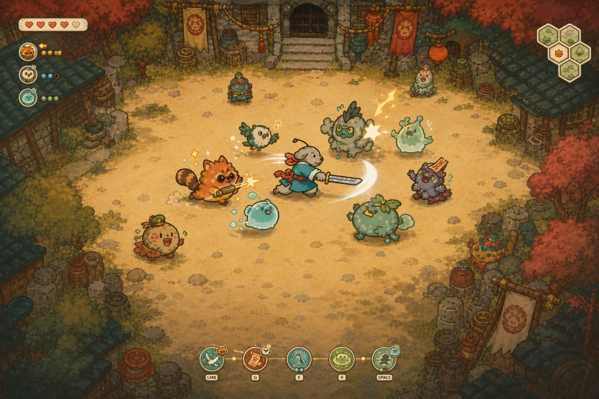

# 战斗HUD视觉基准

> 状态：已确认  
> 确认日期：2026-09-03  
> 适用范围：ProjectR战斗HUD与灵宠回路反馈

## 视觉方向

- 轻松、温暖的手绘国漫气质，使用简洁轮廓、圆润造型与低压迫感配色。
- HUD保持紧凑，主要信息贴近屏幕边缘，中央战斗区域尽量无遮挡。
- 面板采用暖色浅底、细描边和轻量装饰，不使用厚重金属框或手游式大按钮。

## 布局基准

- 左上：紧凑生命状态，下方纵向排列出战灵宠头像与少量状态点。
- 右上：小型蜂巢探索地图。
- 底部中央：`LMB / Q / E / R / SPACE`五个动作槽位。
- 动作图标是槽位主体；灵宠只作为附着在槽位边缘的小头像挂件。
- 回路平时弱化，仅在触发时显示细连接线、流动火花和短暂高亮。

## 落地约束

- 实际实现尺寸可在本图基础上微调，但不得回到遮挡战斗区域的大型HUD。
- 冷却使用细环，充能和热度使用少量圆点，不长期显示说明文字。
- 本图是布局与风格权威参考，不是可直接切图上线的最终美术资源。

## 灵宠树状天赋界面

### 双层入口

- 局内升级仍使用当前紧凑三选一卡片，只回答“这一级选什么”，不强迫玩家每次浏览整棵树。
- 地点完成后的安全阶段，可以点击左上灵宠头像或三选一卡片中的“查看天赋树”打开完整界面。
- 家园可以从灵宠详情进入同一界面的局外只读版本，用于查看永久开放范围和下一层里程碑；家园中不能预先点亮本局节点。

### 低保真布局

- 采用约 `980×620` 的居中大面板，保留四周半透明战斗背景，不做全屏场景切换。
- 沿用第五／六版的非对称位置关系：灵宠插画位于左下、三宠页签位于左缘、成长网络由左向右展开、终极节点位于右侧弧线、详情区固定在最右。
- 顶部显示当前灵宠、局内等级、经验进度、可用点数和永久开放层级；标题可使用一处斜切笔触，但不得让全部内容同时倾斜。
- 中部按18节点网络布局：`3个流派起点 → 6个普通分叉 → 3个纯路线关键节点＋3个跨路线融合节点 → 3个互斥终极节点`。
- 四个阶段只使用淡色成长区域引导，不绘制刚性表格列；分支可以弯曲，但连接线不得交叉成无法追踪的线团。
- 不使用拖拽、无限画布、缩放或小地图。
- 右侧：节点详情，显示名称、短说明、当前实际数值、前置节点、永久开放条件，以及对当前附着动作是否生效。
- 底部：`重选本局天赋`、`确认`和返回；重选只在安全阶段可用。

### 节点视觉语法

- **普通节点**：统一圆点／圆环，用于流派起点、数值调整和小机制，共9个。
- **关键节点**：统一圆角十字星，用于机制质变和路线融合，共6个；跨路线节点使用双色填充和两个前置入口。
- **终极节点**：放大的环形十字星核心，内部使用该灵宠的显化剪影，共3个。
- 锁定、永久开放、可点和已点状态只改变描边、填充与连接线，不改变基础形状。
- 常态只显示极淡的全网连接；选中节点时高亮其祖先、当前节点和可达后继，避免18节点网络产生视觉噪声。

### 节点状态

- **未开放**：低饱和灰色，显示明确里程碑，不隐藏节点。
- **永久开放但前置未满足**：暗色轮廓，并高亮缺失的连接线。
- **本局可点**：暖黄色细光圈。
- **本局已点亮**：使用对应灵宠主题色和短促手绘亮纹。
- **当前附着下暂不生效**：保留已点亮状态，增加小型断线标记；允许玩家在安全阶段改附或重选。
- **同宠其他终极节点**：一个终极点亮后，其余两个显示互斥锁，不消耗点数。

### 交互约束

- 默认选中本次升级新开放的第一个节点，键鼠与手柄都能按固定四列导航。
- 悬停只显示短说明，右侧详情再展示数值和来源，避免节点上堆字。
- 点亮前显示连接线预览；确认后立即刷新HUD与回路预览。
- 不显示“推荐最强路线”、战力评分或红点催促。
- 第一版沿用现有暖色浅底、细描边与三宠头像资源；正式树枝框、节点底图和亮纹在交互尺寸验证后再生成。

## 实现状态

- 2026-09-03第一批已落地：底部五动作紧凑布局、暖色轻量面板、独立键位签、技能冷却数字、真实出战灵宠挂件、火花狸3点热度与联动短亮线。
- P2.15已让唯一出战火花狸的挂件随武器／Q术法／身法换挂实时移动，并复用3点显示武器热度；数字键入口仅用于Demo1原型。
- P2.16已将实时挂件迁移扩至首批三种初契灵宠；只有火花狸显示热度点，响响鸮与弹弹胶等待各自正式状态符号。
- P2.17已支持点击灵宠挂件进入附着选择，LMB／Q／SPACE高亮并在悬停时显示当前灵宠的效果说明；选中后挂件迁移到目标槽位。
- P3.7已建立 `Assets/1Game/ArtRes/UI/ProjectR/`专用目录和集中主题资产；首批生成的五动作图标、三宠头像与生命图标已替换文字占位，并复用于初契资料和二次确认界面。
- P3.8已纠正“只生成图标、HUD框体仍由代码绘制”的偏差：生命条、圆形动作框、锁定／激活框、键位签、灵宠状态框和回路连接线均已生成、透明化并接入。
- 三宠和动作图标已重做为更接近参考的小尺寸扁平符号；左上出战灵宠状态列已接入，底部五槽总宽已明显收紧。
- 实机二次校准采用84参考像素圆形槽、102像素中心间距和60×64灵宠状态框；冷却使用圆形生成Sprite，不得退回方形黑色遮罩。
- 现有线性小地图不扩写为蜂巢外观；地图系统解冻并提供真实邻接数据后再替换。
- P2.20B后，ProjectR统一动作路径不再创建旧模块装配UI与角色旁Proc条；M键改为只读灵宠回路总览，Legacy回退关闭统一动作开关后仍可恢复。三宠拖拽改附和正式视觉精修完成前不宣告G5全部完成。
- P2.20C后，回路总览可拖拽三宠到五个动作槽，并在悬停时预演三种附着结构；提交后节点归属和HUD挂件同步刷新。当前仍是功能基线，正式插画、连接动画、手柄焦点和战斗中的待接动作提示归后续精修。
- P2.20D已补战斗中的待接动作提示：技能栏上方显示火花蓄势、火花待响响鸮或复响待弹弹胶及剩余秒数，下一动作槽使用青绿色描边。当前文字尺寸与颜色是功能基线，随HUD手感录屏统一精修。
- 2026-09-08已落地灵宠天赋界面功能骨架：地点完成后仍先展示三选一，安全阶段可从“查看整棵树”或左上出战灵宠头像进入当前12节点树；已支持三宠页签、节点状态、详情、前置、永久开放里程碑、终极互斥、点亮和免费重选。
- P2.19D2后，单宠高阶节点采用明确的单宠适配效果，详情区显示“以单宠适配效果生效”；悬停短说明和手柄焦点表现仍待精修。
- 正式结构已迁移为三宠各18节点自由网络，旧12节点布局只作为历史原型记录。
- 天赋树唯一美术权威为 `Assets/1Game/ArtRes/UI/ProjectR/References/SpiritTalentTree_ApprovedArtV1.png`；第六、七版及旧实机图只保留为过程记录。
- P2.19C2已将圆润视觉语言接入当前可玩12节点：浅色圆角面板、左侧灵宠头像页签、左下灵宠插画、圆形普通节点、圆角十字星关键节点、环星终极节点、三路线主题色、真实前置连线和选中路径聚焦均由运行时组件生成；升级三选一同步改为浅色圆角样式。
- 运行时视觉组件按节点层级和前置关系构建，不依赖固定4列×3行背景图；正式18节点数据冻结后可继续扩展节点数量与多前置连线。
- P2.19C3已把程序化近似底板升级为资源化还原：接入独立纸张面板、三宠各12个透明机制图标、右侧选中图标、三条路线名称和放大的节点命中区；生成图白底／棋盘格已在导入阶段清理。
- P2.19C3旧实机图不再作为验收基准。P2.19C4按权威图接入大幅火花狸插画、完整三宠页签、粗路线树干、双层普通节点和18槽视觉骨架；12个真实节点继续驱动交互，其余6槽明确显示“未开放”，等待P2.19E正式数据。
- 当前纠偏实机状态归档为 `References/SpiritTalentTree_ImplementedApprovedV1.png`，后续每次精修都必须与 `SpiritTalentTree_ApprovedArtV1.png` 并排验收。
- P2.19E1后，火花狸18个槽均由真实节点、完整前置连线和3列×6行正式图标图集驱动；响响鸮与弹弹胶仍保留6个“未开放”槽，直到各自18节点内容冻结。
- P2.19E2后，响响鸮与弹弹胶也已替换全部“未开放”槽；三宠页签均使用18个真实节点、完整图标图集和对应的大幅左下灵宠插画。
