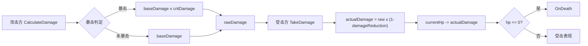

# ⚔️ 战斗系统 — 程序文档

## 属性体系（CombatStats）

所有战斗实体（玩家/敌人）共用 `CombatStats` 数据类：

| 属性 | 字段 | 默认值 | 说明 |
|------|------|--------|------|
| 最大生命 | maxHp | 100 | 灵物可加成 |
| 当前生命 | currentHp | 100 | — |
| 攻击力 | attackDamage | 10 | 灵物可加成 |
| 攻击速度 | attackSpeed | 1.0 | 倍率，影响射击间隔 |
| 暴击率 | critRate | 0.05 | 0~1 |
| 暴击伤害 | critDamage | 1.5 | 倍率 |
| 减伤 | damageReduction | 0 | 0~1 |
| 移速 | moveSpeed | 6 | 单位/秒 |
| 闪避CD | dashCooldown | 1.5 | 秒 |
| 投射物速度 | projectileSpeed | 15 | 单位/秒 |
| 穿透次数 | pierceCount | 0 | 0=不穿透 |

---

## 伤害计算流程



### 公式

```
暴击判定：Random.value < critRate
暴击伤害：damage = attackDamage * critDamage
实际伤害：actual = rawDamage * (1 - damageReduction)
```

---

## 普通攻击

- **输入**：鼠标左键（按住连射）
- **射击间隔**：`baseAttackInterval / attackSpeed`（默认 0.3s / 1.0 = 0.3s）
- **投射物**：从 FirePoint 发射，沿瞄准方向飞行
- **碰撞**：触发器检测，命中后调用 `IDamageable.OnDamage()`
- **穿透**：`pierceCount > 0` 时命中后不销毁，继续飞行
- **灼烧**：如果玩家持有灼烧灵物，投射物命中后附加 `BurnEffect`

---

## 技能系统（纯 CD 模型）

### Demo1 实现

- 仅 Q 槽位，支持两种技能类型：
  - **AreaDamage**：鼠标指向位置释放范围伤害（如落石术）
  - **Projectile**：发射技能投射物

### 技能伤害公式

```
skillDamage = baseDamage + attackDamage * damageScaling
```

### 范围伤害检测

```csharp
Physics.OverlapSphere(targetPos, skill.aoeRadius, LayerMask.GetMask("Enemy"))
```

---

## 闪避系统

| 参数 | 值 | 说明 |
|------|-----|------|
| 闪避距离 | 5 单位 | — |
| 闪避持续 | 0.2 秒 | — |
| 无敌帧 | 0.15 秒 | 闪避开始时触发 |
| 冷却时间 | 1.5 秒 | 可被灵物减少 |

- 闪避方向：优先使用移动输入方向，无输入时使用瞄准方向
- 闪避期间不接受移动输入

---

## 灼烧效果（BurnEffect）

- **结算间隔**：0.5 秒
- **每次伤害**：`dps * 0.5`
- **叠加规则**：取较高 DPS，刷新持续时间
- **默认持续**：3 秒

---

## 敌人 AI（EnemyBase）

### 状态机（简化版）

```
if 距离 <= attackRange → 攻击
else if 距离 <= detectRange → 追踪
else → 待机
```

| 参数 | 默认值 |
|------|--------|
| 检测范围 | 12 |
| 攻击范围 | 1.5 |
| 攻击间隔 | 1.5s |
| 基础血量 | 30 |
| 基础攻击 | 5 |
| 移速 | 3 |

### 难度缩放（GameManager 控制）

```
enemyCount = baseCount + level * countPerLevel
hpMultiplier = 1 + level * 0.3
dmgMultiplier = 1 + level * 0.2
```
