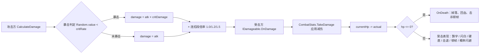
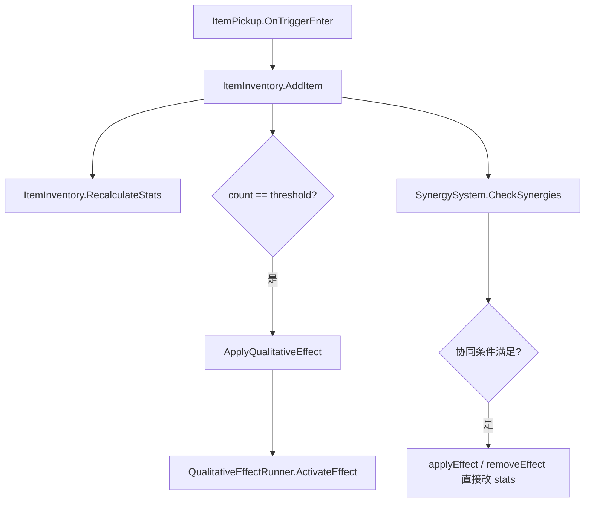

# ⚔️ 战斗系统 — 程序文档

> **文档版本**：2026-04-28（与 Demo1 当前代码对齐）
> **配套复查**：[2026-04-28-战斗系统阶段性复查](../../reviews/2026-04-28-战斗系统阶段性复查.md)
> 注：旧版本本文件描述的"普攻 = 投射物，按住连射"已废弃；当前为**近战三段连招**模型。

---

## 0. 目录

1. [属性体系（CombatStats）](#1-属性体系combatstats)
2. [伤害结算流程](#2-伤害结算流程)
3. [近战三段连招](#3-近战三段连招)
4. [动画优先级与霸体系统](#4-动画优先级与霸体系统)
5. [输入缓冲与连招窗口](#5-输入缓冲与连招窗口)
6. [闪避系统](#6-闪避系统)
7. [功法（技能）系统](#7-功法技能系统)
8. [灼烧 / DoT](#8-灼烧--dot)
9. [打击感（HitStop / Lunge / Knockback）](#9-打击感hitstop--lunge--knockback)
10. [敌人 AI 概览](#10-敌人-ai-概览)
11. [质变与协同的运行时机制](#11-质变与协同的运行时机制)
12. [已知问题与需要重构的点](#12-已知问题与需要重构的点)

---

## 1. 属性体系（CombatStats）

所有战斗实体（玩家 / 敌人）共用 `CombatStats` 数据类。位置：`Babylon/Assets/1Game/Scripts/Combat/CombatStats.cs`。

| 分类 | 字段 | 默认值 | 说明 |
|------|------|--------|------|
| 生命 | maxHp | 100 | 灵物可加成 |
| 生命 | currentHp | 100 | — |
| 攻击 | attackDamage | 10 | 灵物可加成（绝对值 + 百分比） |
| 攻击 | attackSpeed | 1.0 | **动画播放速度倍率**（攻击间隔 ≈ 动画长度 / attackSpeed） |
| 攻击 | critRate | 0.05 | 0~1 |
| 攻击 | critDamage | 1.5 | 暴击倍率 |
| 防御 | damageReduction | 0 | 0~1，**多源 Clamp01** |
| 移动 | moveSpeed | 6 | 单位 / 秒 |
| 移动 | dashCooldown | 1.5 | 闪避充能恢复时间（秒） |
| 投射物 | projectileSpeed | 15 | 单位 / 秒 |
| 投射物 | pierceCount | 0 | 0=不穿透 |

> **注意**：当前实现里 `attackSpeed` 不会改变"攻击间隔"，而是直接修改 `Animator.speed`，使三段连招动画整体加速 / 减速。攻击间隔 = 动画时长 / attackSpeed。

---

## 2. 伤害结算流程

### 2.1 总览



### 2.2 公式

```text
普攻基础伤害   = attackDamage（含灵物加成）
暴击判定       = Random.value < critRate
暴击伤害       = damage × critDamage
连招段倍率     = GameConfig.第一段/第二段/第三段伤害倍率（默认 1.0/1.2/1.5）
最终输出伤害   = damage × 连招段倍率

减伤后伤害     = rawDamage × (1 − Mathf.Clamp01(damageReduction))
```

### 2.3 已知问题

`CalculateDamage` 内部判暴击但 **不外抛 isCrit**，下游飘字 / 焚天 / 剑阵 / 御风 / 元素爆发 拿不到这个信息：
- 飘字暴击靠 `EnemyBase.OnDamage` 用 `actual > damage * 0.9f && damage > stats.attackDamage` 来"猜"
- 质变机制类伤害（焚天等）直接 `attackDamage * x` 计算，**永远不会暴击**

> 详见 [复查 P0-2](../../reviews/2026-04-28-战斗系统阶段性复查.md#p0-2-暴击信息丢失下游表现不准)。建议引入 `DamageInfo` 结构体在伤害链中传递。

---

## 3. 近战三段连招

代码：`Babylon/Assets/1Game/Scripts/Player/PlayerCombat.cs`、`PlayerAnimator.cs`

### 3.1 输入与动画

- **输入**：鼠标左键 → `PlayerAnimator.RequestAttack(attackSpeed)`
- **动画**：三段 `Attack1 / Attack2 / Attack3`，由 `AttackTrigger + AttackIndex` 切换
- **播放速度**：`animator.speed = Mathf.Clamp(attackSpeed, 0.5f, 3f)`

### 3.2 判定参数（GameConfig）

| 字段 | 默认值 | 说明 |
|------|-------|------|
| 近战攻击范围 | 2.5 | 扇形检测半径（OverlapSphere） |
| 近战攻击角度 | 120° | 扇形角度（120 = 面前 120° 扇形） |
| 第一段伤害倍率 | 1.0 | × CombatStats.attackDamage |
| 第二段伤害倍率 | 1.2 | |
| 第三段伤害倍率 | 1.5 | |

### 3.3 判定流程

1. 动画到达"判定窗口开"帧，触发 `OnHitWindowOpen` 事件，置 `_attackHitWindowOpen = true`
2. `PlayerCombat.CheckMeleeHit` 在 `Update` 中持续检查窗口标记
3. 命中检测：
   - `Physics.OverlapSphere(origin, meleeRange, enemyLayer)`
   - 角度过滤：`Vector3.Angle(forward, dirToTarget) <= meleeAngle * 0.5f`
   - **每段攻击只判定一次**（用 `_lastHitComboStep + _hasHitThisSwing` 防重复）
4. 命中即调用 `IDamageable.OnDamage`，并附加灼烧（若灵物提供 `GetTotalBurnDPS()`）、播放打击 VFX
5. 通知 `QualitativeEffectRunner.OnPlayerAttackHit()`（焚天计数）
6. 动画到达"判定窗口关"帧，触发 `OnHitWindowClose`，置标记为 false

### 3.4 攻击中行为

- **朝向锁定**：每段攻击触发时 `_aimLocked = true`，攻击过程中不跟随鼠标
- **连招窗口期间短暂解锁**：动画事件 `OnComboWindowOpen` 发布 `ComboWindowOpened`，`PlayerController` 临时解除 `_aimLocked`
- **移动**：`priority >= Attack` 时 `speedMul = 0`（**完全锁死**），仅靠前冲位移脉冲移动
- **霸体**：`_superArmor = true`，轻击受击不打断，但伤害仍然结算

### 3.5 攻击前冲（Lunge）

每段攻击触发瞬间发布 `AttackLungeRequested`：

| 段 | LungeSpeed | LungeDuration |
|----|-----------|---------------|
| 第 1 段 | 4 单位/秒 | 0.12 s |
| 第 2 段 | 5 单位/秒 | 0.12 s |
| 第 3 段 | 7 单位/秒 | 0.12 s |

`PlayerController.OnAttackLunge` 接收后：
- `_attackLungeVelocity = aimDirection × LungeSpeed`
- `_attackLungeTimer = LungeDuration`
- 速度按 `*= 0.85f` 每帧衰减

---

## 4. 动画优先级与霸体系统

代码：`Babylon/Assets/1Game/Scripts/Player/PlayerAnimator.cs`

### 4.1 优先级表（参考 Hades）

| 优先级 | 状态 | 数值 | 备注 |
|-------|------|------|------|
| Die | 死亡 | 100 | 不可被任何东西打断 |
| Evade | 闪避 | 50 | **可打断除死亡外的一切**（核心：给玩家最大操控感） |
| HeavyHit | 重击受击 | 40 | 可打断攻击 / 技能霸体（Boss 攻击等） |
| Skill | 技能 | 30 | 拥有霸体 |
| Attack | 攻击 | 20 | 拥有霸体；同优先级可连招 |
| LightHit | 轻击受击 | 10 | 不打断攻击 / 技能（霸体生效） |
| None | 空闲 | 0 | Idle / Run，可被任何动作打断 |

### 4.2 关键打断规则

| 规则 | 行为 |
|------|------|
| 死亡可打断一切 | 任何状态都可被覆盖 |
| 闪避优先级最高（除死亡） | 任何状态都可被闪避覆盖 |
| 攻击 / 技能中拥有霸体 | 轻击受击不打断（仍然扣血） |
| 重击受击可打断攻击 / 技能 | 用于 Boss 大招 |
| 同优先级攻击可互相过渡 | 即三段连招 |
| 闪避中不可被攻击 / 技能 / 受击打断 | 闪避必须播完（与 Hades 一致） |

### 4.3 安全兜底

`PlayerAnimator.Update` 包含：
- **状态超时兜底** `STATE_TIMEOUT = 3.0s` / `SKILL_TIMEOUT = 2.0s`：动画事件丢失时强制 `ForceReturnToIdle`
- **Animator 状态检测**：每帧比对 `Animator.GetCurrentAnimatorStateInfo(0)`，若代码层优先级仍为 Attack/Skill/Evade/Hit 但 Animator 已离开对应状态，则立即重置（防止动画事件丢失导致卡死）

---

## 5. 输入缓冲与连招窗口

### 5.1 缓冲窗口

```text
INPUT_BUFFER_TIME = 0.25s（250 ms）
```

包含：
- **攻击缓冲**：闪避 / 受击 / 连招上限段时按下左键 → `_attackBufferTimer = 0.25s`
- **闪避缓冲**：充能耗尽时按 Space → `PlayerAnimator.BufferEvade()` → `_evadeBufferTimer = 0.25s`

### 5.2 缓冲消费时机

每个动作结束时（`OnAttackEnd / OnEvadeEnd / OnHitEnd / OnSkillEnd`）调用 `TryConsumeInputBuffer()`：
1. **优先消费闪避缓冲**（哈迪斯：闪避优先级最高）
2. 然后消费攻击缓冲（沿用之前缓存的 `_attackSpeed`）

### 5.3 连招窗口

由动画事件控制：
- `OnComboWindowOpen` 设 `_canCombo = true`，发布 `ComboWindowOpened`（让玩家可调整朝向）
- `OnComboWindowClose` 设 `_canCombo = false`
- 第三段攻击中再按左键不会跳到第四段，会走攻击缓冲，结束后自动开始新一轮第一段

### 5.4 连招重置

`_comboResetTimer` 倒计时：
- 攻击中设 `1.5s`
- 攻击结束后设 `0.4s`（给玩家一小段时间继续接连招）
- 计时归零 → `ResetCombo()`

---

## 6. 闪避系统

代码：`Babylon/Assets/1Game/Scripts/Player/PlayerController.cs`

### 6.1 参数（来源 GameConfig）

| 字段 | 默认值 | 说明 |
|------|-------|------|
| 闪避距离 | 5 单位 | — |
| 闪避持续时间 | 0.2 s | 移动相速 = 25 单位 / 秒 |
| 闪避充能层数 | 2 | 多层充能 |
| 闪避冷却时间 | 1.5 s | 每层独立恢复 |
| `DASH_INVINCIBLE_TIME` | **0.3 s** | 比闪避持续时间更长，覆盖落地一小段 |

### 6.2 行为

- **方向**：优先 `_moveInput`，无输入时用 `_aimDirection`
- **同帧拦截攻击**：闪避输入会设置 `_dashRequestedThisFrame = true`，`PlayerCombat.HandleMeleeAttack` 同帧检查到则跳过攻击输入
- **打断当前动作**：通过 `PlayerAnimator.PlayEvade()` 调用 `Animator.CrossFade("Evade", 0.05f)` 强制切换（不依赖 Trigger，避免被过渡吞掉）
- **充能耗尽时缓冲**：见 5.1
- **副作用**：调用 `QualitativeEffectRunner.OnPlayerDash`（御风残影）和 `OnPlayerDashForFireTrail`（火墙协同）

### 6.3 闪避中

- 不接受移动输入（`_isDashing == true` 时跳过 `HandleMovementInput`）
- 不接受攻击 / 技能 / 受击打断
- 全程无敌（`_invincible = true`，定时器 0.3s）

---

## 7. 功法（技能）系统

代码：`Babylon/Assets/1Game/Scripts/Combat/SkillData.cs`、`PlayerCombat.cs`

### 7.1 槽位

| 按键 | 槽位 |
|------|------|
| Q | skillQ |
| E | skillE |
| R | skillR |

> 与旧版"仅 Q 槽位"已废弃。Demo2 中 W 槽位的设计也已统一到 E/R。

### 7.2 技能类型（SkillType）

| 类型 | 说明 | 关键参数 |
|------|------|---------|
| AreaDamage | 范围伤害（落石术） | `aoeRadius` |
| Projectile | 投射物（御剑术、烈焰掌） | `projectilePrefab / projectileSpeed / projectileCount / spreadAngle` |
| Dash | 位移（土遁术、缩地成寸） | `dashDistance / leaveTrail` |
| Buff | 增益（金钟罩） | `vfxDuration` |
| Heal | 治疗（回春术） | `healAmount / healScaling` |
| Summon | 召唤（傀儡术） | `summonDuration / summonDamage` |

### 7.3 充能层 + CD

```text
基础充能上限 = SkillData.maxCharges (1~3)
实际充能上限 = 基础 + 灵物提供的 chargeBonus
单层恢复时间 = SkillData.chargeTime > 0 ? chargeTime : cooldown
              × (1 - SpiritSlotSystem.GetSkillCooldownReduction(slot))
```

每个槽位独立维护 `_skillCharges / _skillMaxCharges / _skillRechargeTimer / _skillRechargeDuration`，由 `PlayerCombat.UpdateCooldowns` 每帧推进。

### 7.4 蓄力系统（SkillData.canCharge）

```text
按下技能键 → 开始蓄力 → 计时器 += dt × (1 + SpiritSlot.GetSkillChargeSpeedBonus)
松开按键 → 释放：
  Lv1 (默认)        伤害 × 1.0,  范围 × 1.0
  Lv2 (≥ chargeLv2Time = 0.5s)   伤害 × chargeLv2DamageMultiplier (默认 1.5),  范围 × chargeLv2RadiusMultiplier (默认 1.0)
  Lv3 (≥ chargeLv3Time = 1.5s)   伤害 × chargeLv3DamageMultiplier (默认 2.5),  范围 × chargeLv3RadiusMultiplier (默认 1.3)
```

蓄力期间：
- 玩家移速 × `chargeMoveSpeedMultiplier`（默认 0.4）
- 闪避 / 死亡会取消蓄力
- 灵物 `chargeDamageBonusPercent` 提供额外蓄力伤害加成（仅 Lv2/3 生效）

### 7.5 技能伤害公式

```text
基础伤害   = SkillData.baseDamage + attackDamage × damageScaling
蓄力倍率   = GetChargeDamageMultiplier(level) × (1 + SpiritSlot.GetSkillChargeDamageBonus)
最终伤害   = 基础伤害 × 蓄力倍率
```

### 7.6 范围伤害检测

```csharp
Physics.OverlapSphere(targetPos, skill.aoeRadius * radiusMul, LayerMask.GetMask("Enemy"))
```

> 与第 12 节 P2 一并：建议改 `OverlapSphereNonAlloc` 减少 GC。

### 7.7 释放速度

```text
castSpeed = SkillData.castSpeed > 0.01 ? SkillData.castSpeed : GameConfig.技能释放速度
animator.speed = Clamp(castSpeed, 0.5f, 3f)
```

### 7.8 元素修饰词条系统（设计规格，Demo1+ 待实现）

> **设计来源**：GDD 6.5 功法×灵物机制交互，方案 A（槽位限定触发）
> **当前状态**：框架尚未实现，本节为实施前的技术规格

#### 7.8.1 核心思路

灵物放入某个技能的槽位后，不仅提供数值加成，还可以激活"元素修饰词条"，改变技能的执行行为（而非仅改数值）。

```
当前（纯数值）：火灵珠 → 灼烧 DPS +5 → 任何攻击附带灼烧
目标（机制修饰）：火灵珠放在落石术槽位 → 落石变陨石，落点留火焰地带 3s，对已燃烧目标引爆 ×1.5
```

**触发条件（方案 A）**：
- 灵物必须在**该技能下方的 2 个灵物槽**中（非背包）
- 灵物的 `modTag` 匹配技能 `modifierDefs[i].requiredTag`
- `modifierDefs[i].requiredCount` 满足槽内该 tag 灵物数量

#### 7.8.2 需要新增的数据字段

**`ItemData.cs`（新增）**：

```csharp
[Header("元素修饰标签")]
public ItemModTag modTag = ItemModTag.None;
// ItemModTag 枚举：None / Fire / Ice / Thunder / Wind / Pierce / Life
```

**`SkillData.cs`（新增）**：

```csharp
[System.Serializable]
public class SkillModifierDef
{
    public ItemModTag requiredTag;
    public int requiredCount = 1;           // 槽内至少几件该 tag 的灵物

    [Header("修饰行为")]
    public bool leaveZone;                  // 落点/位置留下元素地带
    public float zoneDuration = 3f;
    public float zoneDamageMultiplier = 0.3f;   // × attackDamage
    public bool detonateExisting;           // 引爆目标身上已有的元素状态
    public float detonateMultiplier = 1.5f;
    public bool addThunderStrike;           // 追加额外雷击
    public float thunderStrikeDmgMul = 0.6f;
    public bool scatterProjectiles;         // 落点散射投射物
    public int scatterCount = 4;
    public string modifiedName;             // 技能名称变体（HUD 显示）
}

// 在 SkillData 中追加
public SkillModifierDef[] modifierDefs;
```

#### 7.8.3 `SpiritSlotSystem` 新增查询

```csharp
// 返回当前槽位中所有激活的修饰定义
public List<SkillModifierDef> GetActiveModifiers(SkillSlot slot, SkillData skill)
{
    var result = new List<SkillModifierDef>();
    if (skill.modifierDefs == null) return result;

    // 统计该槽位内各 tag 数量
    var tagCounts = new Dictionary<ItemModTag, int>();
    foreach (var item in GetItemsInSlot(slot))
    {
        if (item.modTag != ItemModTag.None)
            tagCounts.TryGetValue(item.modTag, out var c);
            tagCounts[item.modTag] = c + 1;
    }

    // 检查每条 modifierDef
    foreach (var def in skill.modifierDefs)
    {
        if (tagCounts.TryGetValue(def.requiredTag, out var count)
            && count >= def.requiredCount)
        {
            result.Add(def);
        }
    }
    return result;
}
```

#### 7.8.4 `PlayerCombat.CastAreaSkill` 注入点

```csharp
void CastAreaSkill(SkillData skill, SkillSlot slot, float radiusMul, float dmgMul)
{
    var pos = GetTargetPosition();
    var hits = Physics.OverlapSphere(pos, skill.aoeRadius * radiusMul, enemyLayer);
    float damage = CalculateSkillDamage(skill, dmgMul);

    // 基础伤害结算（现有）
    foreach (var hit in hits)
        hit.GetComponent<IDamageable>()?.OnDamage(damage, pos, transform);

    // --- 新增：修饰词条注入 ---
    var mods = _spiritSlots.GetActiveModifiers(slot, skill);
    foreach (var mod in mods)
    {
        if (mod.leaveZone)
            SpawnElementZone(pos, skill.aoeRadius * radiusMul, mod, damage);

        if (mod.detonateExisting)
            DetonateElementStatus(hits, mod.detonateMultiplier, damage);

        if (mod.addThunderStrike)
            SpawnThunderStrike(pos, skill.aoeRadius * radiusMul,
                               damage * mod.thunderStrikeDmgMul);

        if (mod.scatterProjectiles)
            ScatterProjectiles(pos, mod.scatterCount, damage * 0.4f);

        if (!string.IsNullOrEmpty(mod.modifiedName))
            ShowSkillNamePopup(mod.modifiedName);  // HUD 显示技能变体名
    }
    // --- 结束 ---

    PlaySkillVFX(skill, pos);
}
```

同理，`CastProjectileSkill` / `CastDashSkill` / `CastBuffSkill` 都在末尾加同样的"修饰词条注入"块。

#### 7.8.5 实施顺序建议

1. 先在 `ItemData` + `SkillData` 加字段（30 分钟）
2. 实现 `SpiritSlotSystem.GetActiveModifiers`（30 分钟）
3. 在 `CastAreaSkill` 加注入点，实现 `SpawnElementZone`（2 小时）
4. 配置落石术的 `modifierDefs`（Inspector 填表，15 分钟）
5. 测试"火灵珠放落石槽位 → 陨石效果"
6. 验证可行后，按 7.8.1 第一批交互表逐条实现其余组合

> 预计 Demo1+ 里用 1~2 个开发日可以把第一批 5 个交互全部跑通。

---

## 8. 灼烧 / DoT

代码：`Babylon/Assets/1Game/Scripts/Combat/BurnEffect.cs`

| 项 | 当前值 |
|----|-------|
| 结算间隔 | 0.5 s |
| 每跳伤害 | `dps × 0.5` |
| 默认持续 | 3 s（`PlayerCombat / Projectile` 调用时传入） |
| 焚天附加灼烧 | 持续 4 s，DPS = `_fireBurstDamage * 0.3` |

### 8.1 调用路径

| 来源 | 传入 DPS | 持续 |
|------|---------|------|
| 近战命中（`PlayerCombat.CheckMeleeHit`） | `inventory.GetTotalBurnDPS()`（玩家所有灵物总和） | 3 s |
| 投射物命中（`Projectile.OnTriggerEnter`） | 初始化时传入的 `_burnDPS`（当前 `CastProjectileSkill` 始终传 0） | 3 s |
| 焚天冲击波 | `_fireBurstDamage * 0.3f` ≈ 4.5 | 4 s |

### 8.2 叠加规则

**当前实现**：`Apply` 直接覆盖最新 DPS，刷新持续时间。

> ⚠️ 这与"取较高 DPS"的常见预期不符。多个独立来源（普攻总值、焚天、未来火墙）相互覆盖，结果取决于调用顺序。详见 [复查 P0-3](../../reviews/2026-04-28-战斗系统阶段性复查.md#p0-3-burneffect-叠加规则与文档相反)。

### 8.3 飘字

DoT 命中走专用飘字：橙色 + 🔥 标签（`IsBurn = true`），不走 `OnDamage` → 不触发硬直 / 击退。

---

## 9. 打击感（HitStop / Lunge / Knockback）

### 9.1 顿帧（HitStop）

代码：`Babylon/Assets/1Game/Scripts/Combat/HitStop.cs`，单例。

| 类型 | 当前 timeScale | 当前 duration | 触发时机 |
|------|---------------|--------------|---------|
| Normal | 0.05 | 0.05 s | `EnemyBase.OnDamage` 等普通受击 |
| Heavy | 0.02 | 0.10 s | （目前未触发，预留） |
| Kill | 0.01 | 0.12 s | `EnemyBase.OnDeath` 等击杀 |

实现：协程修改 `Time.timeScale` + `Time.fixedDeltaTime`，等 `WaitForSecondsRealtime` 后恢复。

> ⚠️ 当前 `normalHitTimeScale = 0.05` 接近"完全停帧"，体感偏卡。建议参见 [复查 P1-2](../../reviews/2026-04-28-战斗系统阶段性复查.md#p1-2-顿帧参数过重)。

### 9.2 攻击前冲

见 3.5。

### 9.3 击退

`EnemyBase.OnDamage` / `EnemyRanged.OnDamage` / `EnemyCharger.OnDamage` 在受击时：

```csharp
Vector3 knockback = (transform.position - attacker.transform.position).normalized * 0.5f; // 远程 / 冲锋为 0.3f
_cc.Move(knockback);
```

幅度统一较小（0.3 / 0.5 单位），目的是"标记受击"而非真正击飞。

### 9.4 受击表现

- 闪白：`SetAllRenderersColor(Color.white)`，0.1 s 后恢复
- 硬直：`_stunTimer = 0.3s`，期间不行动（攻击预警 / Strafe / 闪避优先于硬直，参见各自代码）
- 概率闪避：30%（血量 < 50% 时升至 50%；远程恒定 40%）

---

## 10. 敌人 AI 概览

| 敌人 | 文件 | 关键特征 | 状态字段 |
|------|------|---------|---------|
| 基础近战 | `EnemyBase.cs` | 追踪 + Strafe + 攻击预警 + 概率闪避 | `_aiState (枚举) + _isPreparing + _isDodging + _stunTimer + _hitFlashTimer` |
| 远程弓箭手 | `EnemyRanged.cs` | Kite + 红色预警线 + 投射物 + 概率后跳 | `_isWarning + _isDodging + _stunTimer + _hitFlashTimer` |
| 冲锋 | `EnemyCharger.cs` | 蓄力 + 范围预警 + 撞击 | `ChargerState (枚举) + _stunTimer + _hitFlashTimer` |
| 法师 | `EnemyMage.cs` | 魔法弹 + 爆炸 | （未在本次复查范围） |
| 精英 | `EnemyElite.cs` | 强化版基础敌人 | （未在本次复查范围） |
| Boss | `EnemyBoss.cs` | 多阶段 + 特殊技能 | （未在本次复查范围） |

### 10.1 难度缩放（GameManager 控制）

```text
enemyCount     = baseCount + level × countPerLevel
hpMultiplier   = 1 + level × 0.3
dmgMultiplier  = 1 + level × 0.2
```

### 10.2 概率闪避

| 敌人 | 闪避概率 | 闪避 CD |
|------|---------|---------|
| 基础近战 | 30%（血量 < 50% 时 50%） | 3 s |
| 远程 | 40% | 4 s |
| 冲锋 | 无 | — |

### 10.3 已知问题

> 三种敌人 AI 三套写法，没有共同基类。详见 [复查 P2-2](../../reviews/2026-04-28-战斗系统阶段性复查.md#p2-2-敌人-ai-状态散落没有共同基类)。

---

## 11. 质变与协同的运行时机制

### 11.1 数据流



### 11.2 当前已实现的质变效果

| 灵物 | 数量 | 效果 ID | 实现位置 |
|------|------|--------|---------|
| 火灵珠 | 5 | 焚天 | `QualitativeEffectRunner.TriggerFireBurst`（每 5 次攻击释放火焰冲击波 + 灼烧） |
| 火灵珠 | 8 | （焚天大成）| `ItemInventory` 直接 `attackDamage *= 1.5; critDamage += 0.5` ⚠️ |
| 玉佩 | 5 | 玉碎 | `QualitativeEffectRunner.TriggerJadeShield`（致命伤害免疫 + 击退，CD 60s） |
| 风灵珠 | 5 | 御风 | `QualitativeEffectRunner.SpawnPhantom`（闪避后留残影自动攻击） |
| 锈铁飞剑 | 5 | 剑阵 | `QualitativeEffectRunner.UpdateSwordOrbit`（3 把飞剑环绕 + 1s 一次 AOE） |
| 锈铁飞剑 | 8 | （万剑归宗）| `attackDamage *= 1.3; pierceCount += 3` ⚠️ |
| 回灵丹 | 5 | 涅槃 | `QualitativeEffectRunner.TryNirvana`（死亡时消耗丹药复活 + 3s 无敌） |
| 寒冰玉髓 | 4 | 冰封领域 | （仅描述，效果未实现） |
| 血珊瑚 | 5 | 血祭 | （仅描述，效果未实现） |
| 破镜碎片 | 3 | 照妖真眼 | `critDamage += 0.5` ⚠️ |
| 灵藤草 | 4 | 灵藤缠身 | `maxHp *= 1.2; currentHp = maxHp` ⚠️ |
| 星辰尘 | 2 | 星移斗转 | `moveSpeed *= 1.15; attackSpeed *= 1.15` ⚠️ |
| 引魂灯 | 2 | 摄魂夺魄 | `critRate += 0.15; attackDamage *= 1.2` ⚠️ |

> ⚠️ 标记的"直接改 `_playerStats` 的乘性效果"会被下一次 `RecalculateStats` 覆盖，详见 [复查 P0-4](../../reviews/2026-04-28-战斗系统阶段性复查.md#p0-4-质变乘法效果在重算时丢失)。

### 11.3 当前已实现的 Synergy 组合

参见 [`docs/game/design/隐藏组合表.md`](../design/隐藏组合表.md) 的"已实现"小节。共 10 个：风火轮、金刚不坏、天人合一、嗜血狂魔、冰火两重天、灵龟护体、疾风骤雨、万毒归宗、铜墙铁壁、暗影刺客。

### 11.4 协同效果机制部分

`QualitativeEffectRunner` 还运行三个协同附带的机制效果：

| 效果 | 触发协同 | 行为 |
|------|---------|------|
| 火墙 | 风火轮 | 冲刺起点→终点之间生成持续 2s 的火墙，0.5s 一跳，伤害 5 |
| 嗜血 | 嗜血狂魔 | 击杀敌人后激活 5s：攻速 ×2，每秒掉血 2（最低保留 1 HP，不会因嗜血死亡） |
| 元素爆发 | 天人合一 | 每 30s 随机触发火/冰/风/雷 AOE，半径 5，伤害 = 25 + atk × 0.4 |

---

## 12. 已知问题与需要重构的点

汇总自 [2026-04-28 阶段性复查](../../reviews/2026-04-28-战斗系统阶段性复查.md)：

### 12.1 P0（影响正确性）

- **属性多源覆盖**：`ItemInventory` / `SpiritSlotSystem` / `SynergySystem` / 质变效果 都改 `_playerStats`，每次 `RecalculateStats` 把后三者的乘性效果清掉
- **暴击信息不外抛**：飘字、机制类伤害（焚天 / 剑阵 / 御风 / 元素爆发）拿不到 isCrit
- **`BurnEffect` 直接覆盖 DPS** 而非"取较高"
- **`damageReduction` 多源 Clamp01** 后溢出无任何提示
- **`DamageFlash` 协程并发** 可能让 `_invincible` 提前关闭

### 12.2 P1（体验数值）

- 攻击中 `speedMul = 0` 偏卡
- `HitStop normalHitTimeScale = 0.05` 接近完全停帧
- 三段连招倍率 1.0 / 1.2 / 1.5 偏平
- 普通敌人受击硬直 0.3 s + 玩家攻击霸体 → 难度偏低
- 闪避无敌帧 0.3 s + 2 层充能 → 玩家几乎可滚出所有攻击
- GDD 设计的灵力 / 五种共鸣资源系统未实现

### 12.3 P2（架构维护）

- 敌人 AI 状态散落，6 个文件 6 套写法
- 大量运行时 `GameObject.CreatePrimitive + new Material`
- `Physics.OverlapSphere` 全部 GC 版本
- `GameEvents` 事件类型已 20 种且未分组
- `PlayerCombat.cs` 1500+ 行，技能 + Debug VFX 混在一起

---

## 13. 引用

- 代码根目录：`Babylon/Assets/1Game/Scripts/`
- 配套文档：
  - [程序架构说明（权威·随代码）](../../../Babylon/Assets/1Game/Docs/程序_架构说明.md)
  - [灵物系统](灵物系统.md)
  - [GDD](../design/GDD_仙途梦境.md) · [CHANGELOG](../CHANGELOG.md) · [开发待办](../design/开发待办.md)
- 阶段性复查：[2026-04-28 战斗系统阶段性复查](../../reviews/2026-04-28-战斗系统阶段性复查.md)
- 注：本文为 Demo1 期战斗机制深档；v0.5.x 新系统见 GDD / CHANGELOG。
