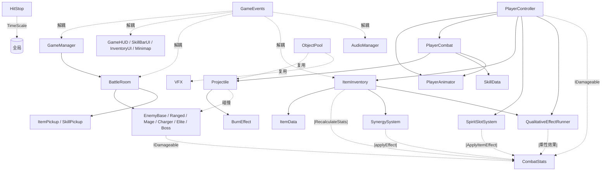

# 💻 架构总览

> **文档版本**：2026-04-28（与 Demo1 当前代码对齐）
> **配套复查**：[2026-04-28-战斗系统阶段性复查](../../reviews/2026-04-28-战斗系统阶段性复查.md)

---

## 1. 代码结构

```text
Babylon/Assets/1Game/Scripts/
├── Core/                              # 核心框架（不依赖具体玩法）
│   ├── Demo1Setup.cs                  # 场景快速搭建器（运行时生成所有对象）
│   ├── GameManager.cs                 # 游戏流程：境界推进、胜负判定
│   ├── GameConfig.cs                  # 全局配置 ScriptableObject
│   ├── GameEvents.cs                  # 事件总线（泛型，零 GC）
│   ├── ObjectPool.cs                  # 对象池（投射物 / VFX 复用）
│   ├── TopDownCamera.cs               # 俯视角相机跟随
│   ├── PostProcessSetup.cs            # 后处理（Bloom / Vignette 脉冲）
│   ├── MaterialHelper.cs              # 材质创建工具（URP / Built-in fallback）
│   ├── MonsterPrefabs.cs              # 怪物预制体管理
│   ├── PlayerResources.cs             # 玩家资源（灵力碎片，预留）
│   ├── DebugConsole.cs                # 运行时 Debug 控制台（Tab 呼出）
│   ├── AudioManager.cs                # 音频管理器（事件驱动）
│   └── AudioConfig.cs                 # 音效配置 ScriptableObject
│
├── Combat/                            # 战斗数据 & 通用机制
│   ├── CombatStats.cs                 # 战斗属性数据类
│   ├── IDamageable.cs                 # 可受伤害接口
│   ├── SkillData.cs                   # 功法数据 ScriptableObject
│   ├── Projectile.cs                  # 投射物（玩家用）
│   ├── BurnEffect.cs                  # 灼烧 DoT
│   └── HitStop.cs                     # 顿帧反馈（单例）
│
├── Player/                            # 玩家系统
│   ├── PlayerController.cs            # 移动 / 瞄准 / 闪避 / 受伤
│   ├── PlayerCombat.cs                # 三段连招 + 三槽位技能 + 蓄力 + Debug VFX
│   ├── PlayerAnimator.cs              # 动画优先级 / 霸体 / 输入缓冲 / 连招窗口
│   └── AnimationEventRelay.cs         # 动画事件中继（转发到 PlayerAnimator）
│
├── Items/                             # 灵物 & 协同系统
│   ├── ItemData.cs                    # 灵物 ScriptableObject
│   ├── ItemInventory.cs               # 背包 + 整体重算
│   ├── SpiritSlotSystem.cs            # 6 个槽位（Q/E/R 各 2 个）
│   ├── SynergySystem.cs               # 协同组合（10 个）
│   ├── QualitativeEffectRunner.cs     # 质变效果运行器（焚天 / 玉碎 / 御风 等）
│   ├── ItemPickup.cs                  # 灵物拾取物
│   └── SkillPickup.cs                 # 功法拾取物
│
├── Enemy/                             # 敌人 AI
│   ├── EnemyBase.cs                   # 基础近战（追踪 + Strafe + 攻击预警）
│   ├── EnemyRanged.cs                 # 远程弓箭手（Kite + 红色预警线）
│   ├── EnemyMage.cs                   # 法师（魔法弹 + 爆炸）
│   ├── EnemyCharger.cs                # 冲锋（蓄力 + 范围预警）
│   ├── EnemyElite.cs                  # 精英怪
│   ├── EnemyBoss.cs                   # Boss（多阶段）
│   └── EnemyProjectile.cs             # 敌人投射物
│
├── Room/                              # 房间系统
│   ├── RoomBuilder.cs                 # 房间构建器（地板 / 墙壁 / 装饰）
│   ├── BattleRoom.cs                  # 战斗房间（波次 / 奖励）
│   ├── ShopRoom.cs                    # 商店（NPC / 购买 / 出售）
│   ├── RestRoom.cs                    # 休息房间（回血泉水）
│   ├── TreasureRoom.cs                # 宝箱房间
│   ├── UpgradeRoom.cs                 # 升级房间
│   ├── LevelTransition.cs             # 关卡过渡（传送门）
│   ├── RoomExitTrigger.cs             # 房间出口触发器
│   └── Destructible.cs                # 可破坏物
│
├── UI/                                # UI 系统
│   ├── GameHUD.cs                     # 主 HUD（血条 / 境界 / CD / 消息）
│   ├── SkillBarUI.cs                  # 技能栏 + 灵物槽位（拖拽 / 悬停提示）
│   ├── InventoryUI.cs                 # 背包面板
│   ├── Minimap.cs                     # 小地图
│   ├── DamagePopup.cs                 # 伤害飘字
│   └── EnemyHealthBar.cs              # 敌人头顶血条
│
└── Editor/                            # Editor 工具
    ├── Demo1DataCreator.cs            # 一键创建灵物 / 功法 / 配置数据
    ├── GameConfigEditor.cs            # GameConfig 自定义 Inspector
    ├── ConfigDashboard.cs             # 配置面板
    └── ToolSearchWindow.cs            # 工具搜索窗口
```

---

## 2. 模块关系图



---

## 3. 设计原则

### 3.1 数据驱动

- **灵物 / 功法**使用 `ScriptableObject` 定义，策划可在 Inspector 直接配置
- 新增 0 代码：右键 → Create → 仙途梦境 → 灵物数据 / 功法数据
- 全局参数集中在 `GameConfig`（中文字段，策划友好）

### 3.2 事件解耦

- 模块通过 `GameEvents` 通信，避免直接引用
- 事件类型使用 `struct`，零 GC 分配
- 支持订阅 / 取消订阅 / 触发，场景切换时自动清理

> ⚠️ 当前事件类型已接近 20 种且未分组，详见 [复查 P2-5](../../reviews/2026-04-28-战斗系统阶段性复查.md#p2-5-gameevents-事件类型已接近-20-种且未分组)。

### 3.3 接口抽象

- `IDamageable` 统一伤害处理，玩家和敌人共用
- `CombatStats` 数据类统一属性管理

> ⚠️ `IDamageable.OnDamage` 不携带 `isCrit`，详见 [复查 P0-2](../../reviews/2026-04-28-战斗系统阶段性复查.md#p0-2-暴击信息丢失下游表现不准)。

### 3.4 对象池

- 投射物和特效使用 `ObjectPool` 复用，避免频繁 GC

> ⚠️ 当前部分敌人投射物（`EnemyRanged.FireProjectile`）和质变 / 协同 VFX 直接走 `GameObject.CreatePrimitive + new Material`，未走对象池。详见 [复查 P2-3](../../reviews/2026-04-28-战斗系统阶段性复查.md#p2-3-大量运行时-gameobjectcreateprimitive--new-material)。

### 3.5 动画状态管理

`PlayerAnimator` 实现 Hades 风格的优先级矩阵：
- 闪避可打断一切（除死亡）
- 攻击 / 技能拥有霸体
- 250ms 输入缓冲
- 状态超时兜底（3s / 技能 2s）+ 动画事件丢失自动修复

---

## 4. 命名规范

| 类型 | 规范 | 示例 |
|------|------|------|
| 命名空间 | XianTu | `namespace XianTu` |
| 类名 | PascalCase | `PlayerController` |
| 公共方法 | PascalCase | `AddItem()` |
| 私有字段 | _camelCase | `_moveInput` |
| `[SerializeField]` | camelCase | `[SerializeField] private float moveSpeed` |
| 常量 | UPPER_SNAKE_CASE | `DASH_INVINCIBLE_TIME` |
| 事件结构体 | PascalCase（嵌套在 `GameEvents` 中） | `GameEvents.EnemyKilled` |
| ScriptableObject 资产 | 中文名（策划友好） | `火灵珠.asset` |
| `GameConfig` 字段 | 中文名 | `近战攻击范围` |

---

## 5. 层级 & 标签

| 名称 | 类型 | 用途 |
|------|------|------|
| Player | Tag | 玩家标识，用于碰撞检测 |
| Enemy | Tag + Layer | 敌人标识，用于扇形 / AOE 检测；递归设置子物体 layer |
| Default | Layer | 地面、墙壁等环境 |

---

## 6. 文件大小警告

| 文件 | 当前行数 | 建议 |
|------|---------|------|
| `PlayerCombat.cs` | 1500+ | 拆分技能实现 + Debug VFX，详见 [复查 P2-6](../../reviews/2026-04-28-战斗系统阶段性复查.md#p2-6-playercombatcs-已超-1500-行技能实现--debug-vfx-全部混在一起) |
| `QualitativeEffectRunner.cs` | 1000+ | 后续按"机制类型"拆分（焚天 / 玉碎 / 御风 / 剑阵 等） |
| `PlayerAnimator.cs` | 700+ | 当前结构清晰，暂不拆分 |

---

## 7. 引用

- [战斗系统](战斗系统.md) — 属性、伤害、连招、技能、闪避、打击感
- [灵物系统](灵物系统.md) — 背包、槽位、协同、质变
- [GDD](../design/GDD_仙途梦境.md)
- [开发路线图](../design/开发路线图.md)
- 阶段性复查：[2026-04-28 战斗系统阶段性复查](../../reviews/2026-04-28-战斗系统阶段性复查.md)
