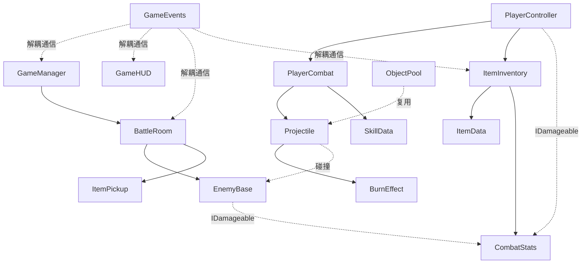

# 💻 架构总览

## 代码结构

```
Assets/1Game/Scripts/
├── Core/                        # 核心框架（不依赖具体玩法）
│   ├── GameEvents.cs            # 全局事件系统（泛型，解耦通信）
│   ├── ObjectPool.cs            # 对象池（投射物/特效复用）
│   ├── GameManager.cs           # 游戏流程管理（境界推进、胜负判定）
│   ├── TopDownCamera.cs         # 俯视角相机跟随
│   └── Demo1Setup.cs            # 场景快速搭建器（运行时自动生成所有对象）
├── Combat/                      # 战斗系统
│   ├── CombatStats.cs           # 战斗属性数据类（生命/攻击/防御/移动）
│   ├── IDamageable.cs           # 可受伤害接口
│   ├── SkillData.cs             # 功法数据 ScriptableObject
│   ├── Projectile.cs            # 投射物（灵力弹、技能投射物）
│   └── BurnEffect.cs            # 灼烧 DoT 效果
├── Player/                      # 玩家
│   ├── PlayerController.cs      # 移动/瞄准/闪避
│   └── PlayerCombat.cs          # 普攻 + 技能释放
├── Items/                       # 灵物系统
│   ├── ItemData.cs              # 灵物数据 ScriptableObject
│   ├── ItemInventory.cs         # 灵物背包（属性叠加计算）
│   └── ItemPickup.cs            # 场景拾取物
├── Enemy/                       # 敌人
│   └── EnemyBase.cs             # 基础敌人 AI
├── Room/                        # 房间
│   └── BattleRoom.cs            # 战斗房间（波次管理）
└── UI/
    └── GameHUD.cs               # HUD 界面
```

---

## 模块关系图



---

## 设计原则

### 1. 数据驱动
- 灵物和功法使用 **ScriptableObject** 定义，策划可在 Inspector 中直接配置
- 新增灵物/功法 **零代码**：右键 → Create → 仙途梦境 → 灵物数据/功法数据

### 2. 事件解耦
- 模块间通过 **GameEvents** 通信，避免直接引用
- 事件类型使用 struct，零 GC 分配
- 支持订阅/取消订阅/触发，场景切换时自动清理

### 3. 接口抽象
- **IDamageable** 接口统一伤害处理，玩家和敌人共用
- **CombatStats** 数据类统一属性管理

### 4. 对象池
- 投射物和特效使用 **ObjectPool** 复用，避免频繁 GC

---

## 命名规范

| 类型 | 规范 | 示例 |
|------|------|------|
| 命名空间 | XianTu | `namespace XianTu` |
| 类名 | PascalCase | `PlayerController` |
| 公共方法 | PascalCase | `AddItem()` |
| 私有字段 | _camelCase | `_moveInput` |
| SerializeField | camelCase | `[SerializeField] private float moveSpeed` |
| 常量 | UPPER_SNAKE | `DASH_INVINCIBLE_TIME` |
| 事件结构体 | PascalCase（嵌套在 GameEvents 中） | `GameEvents.EnemyKilled` |
| ScriptableObject | 中文名（策划友好） | `火灵珠.asset` |

---

## 层级 & 标签

| 名称 | 类型 | 用途 |
|------|------|------|
| Player | Tag | 玩家标识，用于碰撞检测 |
| Enemy | Tag + Layer | 敌人标识，用于技能 AOE 检测 |
| Default | Layer | 地面、墙壁等 |
