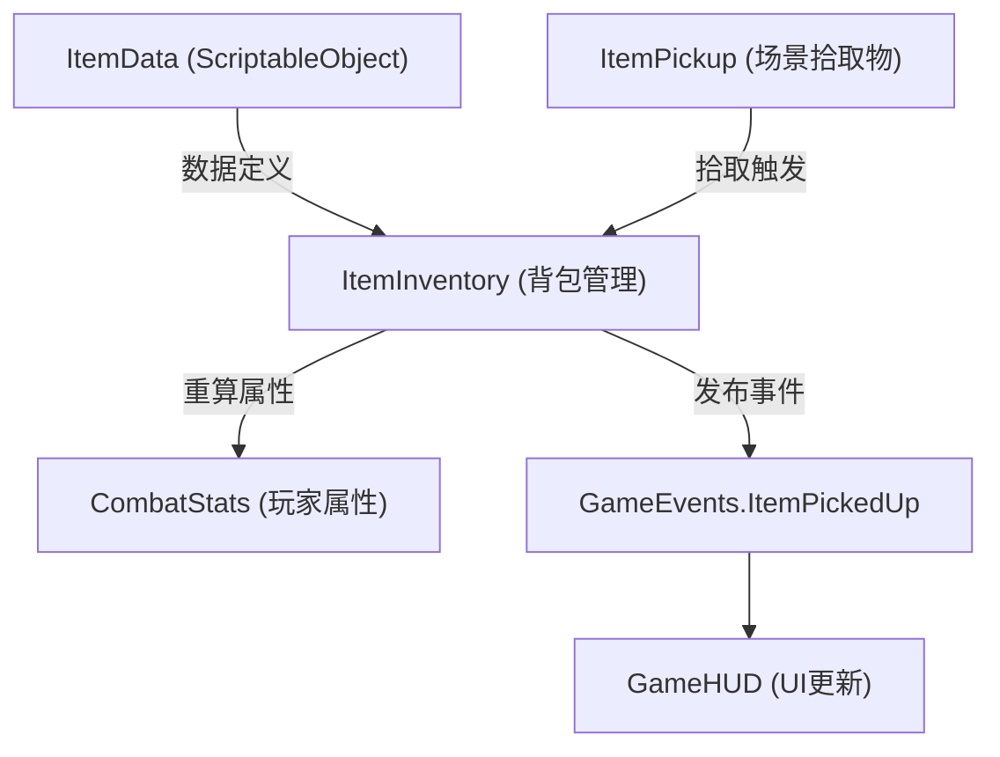

# 🔮 灵物系统 — 程序文档

## 架构概览



---

## 数据层：ItemData（ScriptableObject）

### 创建方式
Unity 编辑器中：右键 → Create → **仙途梦境** → **灵物数据**

### 字段说明

| 分类 | 字段 | 类型 | 说明 |
|------|------|------|------|
| 基础 | itemName | string | 灵物名称 |
| 基础 | description | string | 描述文本 |
| 基础 | icon | Sprite | 图标 |
| 基础 | rarity | ItemRarity | 品阶（凡/灵/玄/地/天） |
| 基础 | category | ItemCategory | 分类（攻伐/护体/身法/异变/丹药/功法） |
| 叠加 | stackable | bool | 是否可叠加 |
| 叠加 | qualitativeThresholds | int[] | 质变阈值（如 [3, 5]） |
| 效果 | attackBonus | float | 攻击力绝对加成 |
| 效果 | attackBonusPercent | float | 攻击力百分比加成 |
| 效果 | maxHpBonus | float | 最大生命绝对加成 |
| 效果 | maxHpBonusPercent | float | 最大生命百分比加成 |
| 效果 | moveSpeedBonusPercent | float | 移速百分比加成 |
| 效果 | damageReductionBonus | float | 减伤绝对加成 |
| 效果 | critRateBonus | float | 暴击率加成 |
| 效果 | attackSpeedBonusPercent | float | 攻速百分比加成 |
| 效果 | pierceBonus | int | 穿透次数加成 |
| 效果 | projectileSpeedBonusPercent | float | 投射物速度百分比加成 |
| 特殊 | burnDamagePerSecond | float | 灼烧 DPS |
| 特殊 | freezeChance | float | 冻结概率 |
| 特殊 | healOnKill | float | 击杀回复 |

---

## 逻辑层：ItemInventory

### 核心职责
1. 管理灵物持有列表（`Dictionary<ItemData, int>`）
2. 每次灵物变化时 **重算所有属性**
3. 检测质变阈值
4. 提供特殊效果查询（灼烧总 DPS、冻结概率、击杀回复）

### 属性计算算法

```
RecalculateStats() 流程：

1. 记录当前血量比例
2. 重置所有属性为基础值
3. 遍历所有灵物，累加绝对值和百分比
4. 应用公式：最终值 = (基础值 + 绝对加成) * (1 + 百分比加成)
5. 恢复血量比例（防止加血上限后血量比例变化）
6. 发布 HealthChanged 事件
```

### 属性计算公式

```
attackDamage    = (base + flatBonus) * (1 + percentBonus)
maxHp           = (base + flatBonus) * (1 + percentBonus)
moveSpeed       = base * (1 + percentBonus)
damageReduction = clamp01(base + flatBonus)
critRate        = clamp01(base + flatBonus)
attackSpeed     = base * (1 + percentBonus)
pierceCount     = base + flatBonus
projectileSpeed = base * (1 + percentBonus)
```

### 质变检测

```csharp
// 每次 AddItem 时检查
foreach (int threshold in item.qualitativeThresholds)
{
    if (count == threshold)
    {
        // 触发质变！
        // TODO: 具体质变效果实现
    }
}
```

---

## 表现层：ItemPickup

### 场景拾取物行为
- **浮动动画**：上下 bob + 旋转
- **品阶颜色**：根据 rarity 设置材质颜色 + 自发光
- **自动拾取**：SphereCollider 触发器，玩家进入范围自动拾取
- **拾取半径**：1.5 单位

### 工厂方法
```csharp
// 在指定位置生成灵物拾取物
ItemPickup.Spawn(itemData, position);
```

---

## 扩展指南

### 新增灵物属性效果
1. 在 `ItemData` 中添加新字段
2. 在 `ItemInventory.RecalculateStats()` 中添加累加逻辑
3. 在 `CombatStats` 中添加对应属性（如需要）

### 新增特殊效果（如冻结、连锁等）
1. 在 `ItemData` 中添加效果参数字段
2. 在 `ItemInventory` 中添加查询方法（如 `GetFreezeChance()`）
3. 在 `Projectile.OnTriggerEnter()` 或 `PlayerCombat` 中使用查询结果

### 新增质变效果
1. 在 `ItemInventory.AddItem()` 的质变检测处添加具体逻辑
2. 建议使用策略模式或委托，避免大量 if-else
